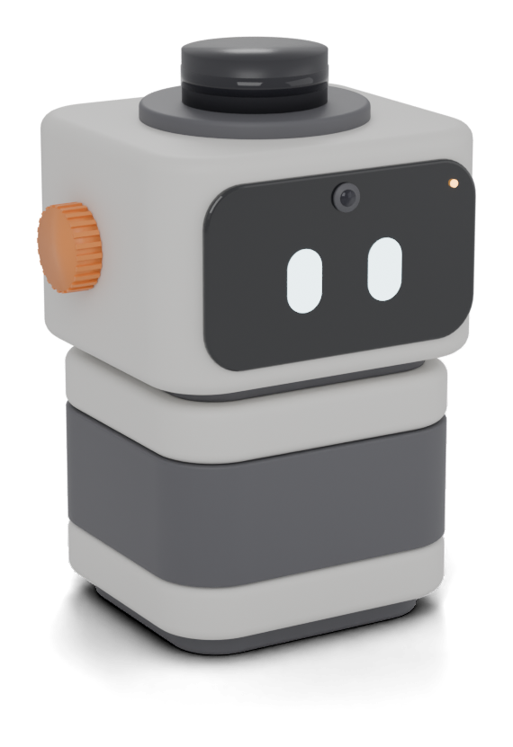
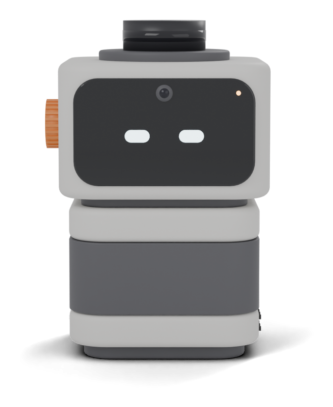

# SuperLens (français)

**Un petit compagnon de bureau qui voit la pièce de cinq façons à la fois, et qui sait comment tu vas.**

SuperLens est un robot open source pour ton bureau. Un lidar 360° tourne sur sa tête, une caméra et un visage vivent derrière une vitre noire, et deux radars (24 GHz et 60 GHz) se cachent derrière la bande qui fait le tour de son corps. Il t'entend grâce à un micro et te répond par un haut-parleur sur le côté.

Il peut **voir** (caméra, lidar), **ressentir** (qui est dans la pièce, comment on bouge, et ta respiration et ton rythme cardiaque quand tu es assis devant), **écouter** (micro) et **parler** (haut-parleur, yeux expressifs). Le gros du calcul tourne sur ton ordinateur, qui fusionne tout en un modèle vivant de la pièce.

  
  

Page de présentation : ouvre [`docs/index.html`](docs/index.html) dans un navigateur (FR/EN).

> **État : rév. F, design figé, CAO en cours.** La forme, la disposition des capteurs et la liste d'achats sont arrêtées (voir [docs/concepts/robot_v3_board.jpg](docs/concepts/robot_v3_board.jpg)). La CAO imprimable de la rév. F est en cours ; en attendant, [`hardware/cad/fanou.scad`](hardware/cad/fanou.scad) contient la rév. E précédente (le phare). Le câblage n'a pas changé depuis la rév. D.

## Pensé autour des capteurs

Le robot se tient droit ; **ce sont les capteurs qui sont inclinés à l'intérieur**, pas le corps.

- **Le cœur, au bureau** : le radar 60 GHz est sur un support incliné de 20° vers le haut. Son faisceau tombe sur la poitrine d'une personne assise à 0,6–1 m, à travers une paroi plate de 1,6 mm en PETG.
- **La pièce** : le radar 24 GHz, juste au-dessus, incliné de 10°, couvre ±60°.
- **Visage et caméra** : l'écran reste vertical derrière une vitre en acrylique fumé ; la caméra est inclinée de 20° pour cadrer ton visage.
- **Lidar au sommet** : sur un bureau, l'écran et le mur masquent une partie du balayage ; il cartographie mieux toute la pièce depuis un coin ou une étagère.
- **Silence pour le radar** : un amortisseur en TPU entre la tête et le corps empêche le moteur du lidar de perturber la mesure du cœur.
- **Compact** : environ 88 × 80 mm au sol, environ 15 cm de haut avec le lidar.

La mesure du cœur par radar est de niveau grand public : quelques battements d'erreur, et seulement si tu restes à peu près immobile. Ce n'est pas un appareil médical.

## En bref

- **Style sobre** : gris chaud, bande et visage anthracite, une seule molette orange. La personnalité passe par les yeux et le comportement.
- **Presque sans soudure** : prises Dupont et connecteurs Wago. Seules deux barrettes de broches sont à souder (XIAO et ampli).
- **Impression sans supports**, la bande anthracite par simple changement de filament.
- **Alimentation USB-C** : un chargeur ou une batterie qui fournit ≥ 2 A.
- **Budget** : environ 200 € de pièces avec le lidar D800 (environ 160 € avec le D500).

## Documentation

La documentation détaillée est en anglais :

| Étape | Document |
|---|---|
| Acheter | [docs/bom.md](docs/bom.md) |
| Imprimer | [docs/printing.md](docs/printing.md) |
| Câbler (29 connexions, guide débutant) | [docs/wiring.md](docs/wiring.md) |
| Assembler | [docs/assembly.md](docs/assembly.md) |
| Comprendre l'architecture | [docs/architecture.md](docs/architecture.md) |

Les trois règles de câblage, en français :

1. Fie-toi au nom imprimé sur la carte (TX, GND, 5V…), pas à la couleur du fil.
2. Le 5 V ne va jamais sur une broche D0–D10.
3. Branche l'alimentation en dernier, après avoir tout relu.

## Licences

Matériel : CERN-OHL-P-2.0 · Logiciel : MIT · Documentation : CC BY 4.0. Voir [README.md](README.md#licences).
