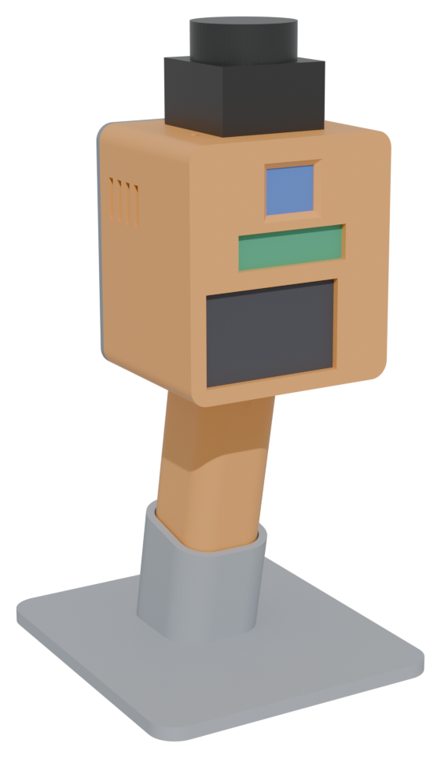
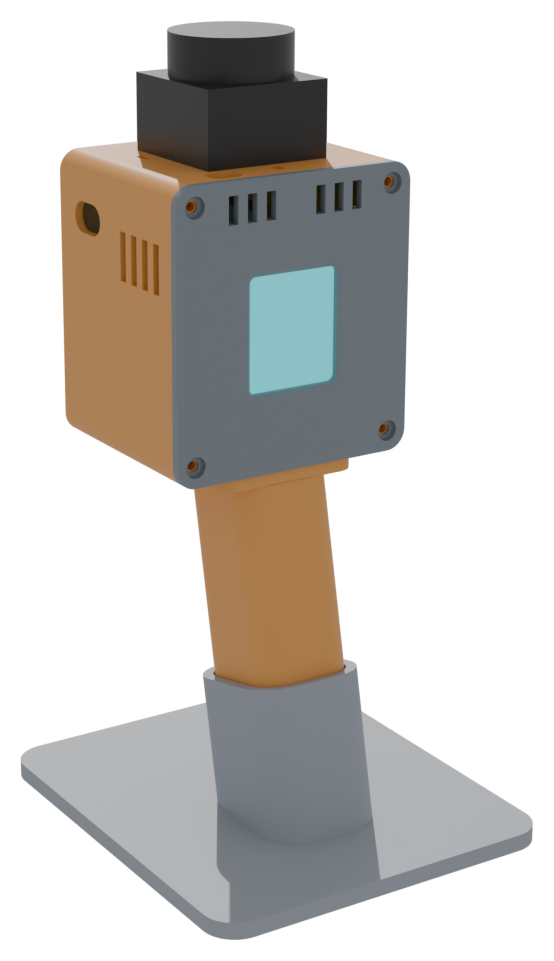

# SuperLens (français)

**Voir une pièce de cinq façons à la fois.**
SuperLens est une tête de capteurs portable et open source. Elle braque un lidar 360°, deux radars (24 GHz et 60 GHz) et une caméra sur la même scène, puis fusionne tout sur ton ordinateur en une seule image vivante : la forme exacte de la pièce, où se trouve chaque personne, à quelle vitesse elle bouge, et si elle respire.

  
  

Page de présentation : ouvre [`docs/index.html`](docs/index.html) dans un navigateur (FR/EN, avec une simulation en direct de l'écran arrière).

> **État : rév. D conçue, pas encore fabriquée.** La mécanique et le câblage sont terminés et vérifiés en CAO. Le firmware et le visualiseur arrivent ensuite.

## Ce qu'on veut faire

Chaque capteur seul est à moitié aveugle. Un lidar dessine des murs parfaits mais ne distingue pas une personne d'un portemanteau, et une vitre lui est invisible. Un radar sait qui bouge et qui respire, mais il ne sait pas dessiner la pièce. Une caméra voit tout mais ne comprend rien aux distances. SuperLens les réunit sur un même support et une même horloge, pour qu'un ordinateur puisse les fusionner.

1. **Capter : la tête est bête exprès.** L'ESP32-S3 lit chaque capteur, horodate chaque paquet et envoie tout en WiFi. Il dessine aussi une mini-carte sur son écran arrière.
2. **Fusionner : l'ordinateur réfléchit.** Il place chaque mesure dans le même repère 3D et affiche une seule vue superposée, en direct, dans Rerun.
3. **Modéliser : ensuite, un jumeau vivant.** Promène-toi avec et la carte devient un jumeau numérique vivant de l'espace, sans cloud.

Usages possibles : tête de perception pour un robot domestique, détection de présence et de sommeil sans caméra, scan de pièces, jeux de données pour la recherche, apprentissage de la fusion de capteurs.

## En bref

- **Presque sans soudure** : prises Dupont et connecteurs Wago partout. Seules deux barrettes de broches sont à souder (XIAO et ampli), ou aucune si tu les achètes pré-soudées.
- **Impression sans supports** : 5 pièces en PETG, déjà orientées pour le plateau.
- **Portable ou posé** : une poignée pistolet qui s'emboîte dans un socle, avec un écrou de trépied 1/4" au culot.
- **Il écoute et il parle** : le micro intégré à la carte caméra et un petit haut-parleur derrière les aérations latérales.
- **Un écran couleur 1,69" au dos** : mini-carte lidar vue de dessus et cibles radar, même sans PC.
- **Ta batterie USB-C** dans la poche, avec un câble de 1 m (≥ 2 A).
- **Budget** : environ 240 € de pièces sur AliExpress avec le lidar D800 (environ 200 € avec le D500).

## Documentation

La documentation détaillée est en anglais, pour toucher un maximum de monde :

| Étape | Document |
|---|---|
| Acheter | [docs/bom.md](docs/bom.md) |
| Imprimer | [docs/printing.md](docs/printing.md) |
| Câbler (29 connexions, guide débutant) | [docs/wiring.md](docs/wiring.md) |
| Assembler | [docs/assembly.md](docs/assembly.md) |
| Comprendre l'architecture | [docs/architecture.md](docs/architecture.md) |

Les trois règles de câblage, en français :

1. Fie-toi au nom imprimé sur la carte (TX, GND, 5V…), pas à la couleur du fil.
2. Le 5 V ne va jamais sur une broche D0–D10.
3. Branche la batterie en dernier, après avoir tout relu.

## Licences

Matériel : CERN-OHL-P-2.0 · Logiciel : MIT · Documentation : CC BY 4.0. Voir [README.md](README.md#licences).
