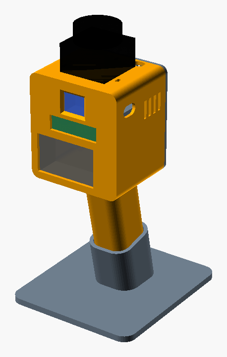
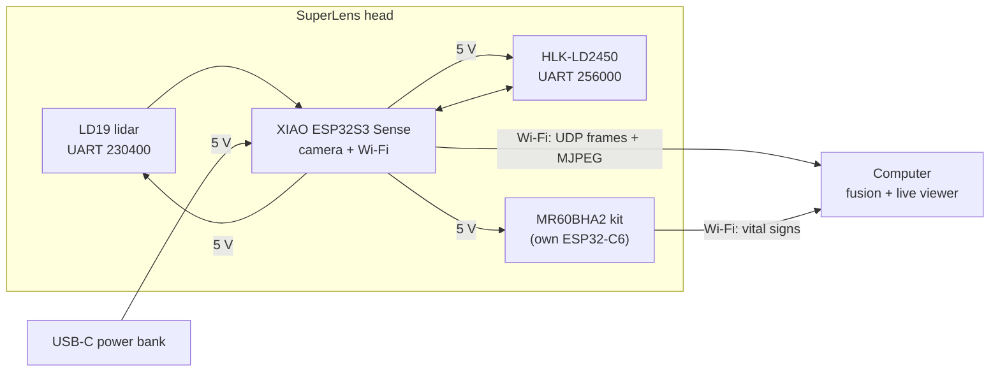

# SuperLens

**An open-source handheld sensor head that sees a room several ways at once.**
A 360° lidar, two mmWave radars (24 GHz and 60 GHz) and a camera stream to a computer, which fuses them into a single live overlay.

<p align="center">
  
  
</p>

> Français : [lire en français](README.fr.md)

> **Project status: rev B, designed, not built yet.** The mechanics and wiring are complete and checked in CAD. The firmware and the desktop viewer are next. Expect changes once the first unit is assembled.

## What each sensor adds

| Sensor | Band | What it tells you |
|---|---|---|
| LDROBOT **LD19** lidar | 905 nm laser | Precise 2D outline of the room, 360°, up to 12 m |
| Hi-Link **HLK-LD2450** | 24 GHz radar | X/Y position and speed of up to 3 people, up to 6 m |
| Seeed **MR60BHA2** kit | 60 GHz radar | Presence, breathing rate and heart rate, up to 1.5 m |
| **XIAO ESP32S3 Sense** | Visible | Colour camera. The ESP32-S3 also runs the device and its Wi-Fi |

Each sensor covers another's blind spot. The lidar gives exact geometry but misses glass and cannot tell a person from a coat rack. The radars see motion, speed and breathing, and they see through thin plastic and fabric. The camera adds texture and meaning.

## Design goals

- **No soldering.** Pre-soldered ESP32, Dupont plugs and two lever connectors. A wire stripper and a screwdriver are the only tools.
- **Prints without supports.** Five parts in PETG, pre-oriented for the bed.
- **Handheld or standing.** A pistol grip slides into a printed desk stand, and a 1/4"-20 tripod nut sits in the grip butt.
- **Bring your own power bank.** Any USB-C power bank that delivers ≥ 1.5 A at 5 V, strapped to the back.
- **Dumb device, smart computer.** The ESP32 only timestamps and forwards data. All fusion runs on the PC.

## How it works



See [docs/architecture.md](docs/architecture.md) for data rates, the power budget and the reasoning behind each choice.

## Build it

1. **Buy the parts** in [docs/bom.md](docs/bom.md): about €166 from AliExpress, and nothing needs soldering.
2. **Print** following [docs/printing.md](docs/printing.md). Print the 5-minute lidar template first.
3. **Wire** the 12 wires in [docs/wiring.md](docs/wiring.md). The guide is written for first-timers.
4. **Assemble** following [docs/assembly.md](docs/assembly.md).
5. **Flash and run.** The [firmware](firmware/) and the [host viewer](host/) are in progress.

## Repository layout

```
superlens/
├── hardware/
│   ├── cad/superlens.scad        # single parametric source for every part
│   ├── stl/                      # print-ready STLs (generated)
│   └── scripts/                  # export_stl.sh, render_previews.sh
├── firmware/                     # ESP32-S3 firmware (planned)
├── host/                         # desktop fusion + viewer (planned)
├── docs/                         # BOM, wiring, printing, assembly, architecture
└── LICENSES/                     # full licence texts
```

## Customising the enclosure

Every dimension is a named parameter at the top of [`hardware/cad/superlens.scad`](hardware/cad/superlens.scad): module fit clearance, screw holes, grip angle and more. Edit a value, then regenerate the parts:

```bash
hardware/scripts/export_stl.sh
```

## Licences

| What | Licence |
|---|---|
| Hardware (`hardware/`) | [CERN-OHL-P-2.0](LICENSES/CERN-OHL-P-2.0.txt) |
| Software (`firmware/`, `host/`, scripts) | [MIT](LICENSES/MIT.txt) |
| Documentation and images (`docs/`, READMEs) | [CC BY 4.0](LICENSES/CC-BY-4.0.txt) |

All three are permissive: build it, modify it, sell it. Just keep the attribution.

## Contributing

Issues and pull requests are welcome. Build reports with photos are especially useful while no unit has been built yet. See [CONTRIBUTING.md](CONTRIBUTING.md).

## Credits

Mechanical dimensions come from the LDROBOT LD19 datasheet (v2.5), the Hi-Link HLK-LD2450 manual, the Seeed MR60BHA2 datasheet and schematic, and the Seeed XIAO ESP32S3 Sense documentation. Sensor names are trademarks of their respective owners. This project is not affiliated with any of them.
