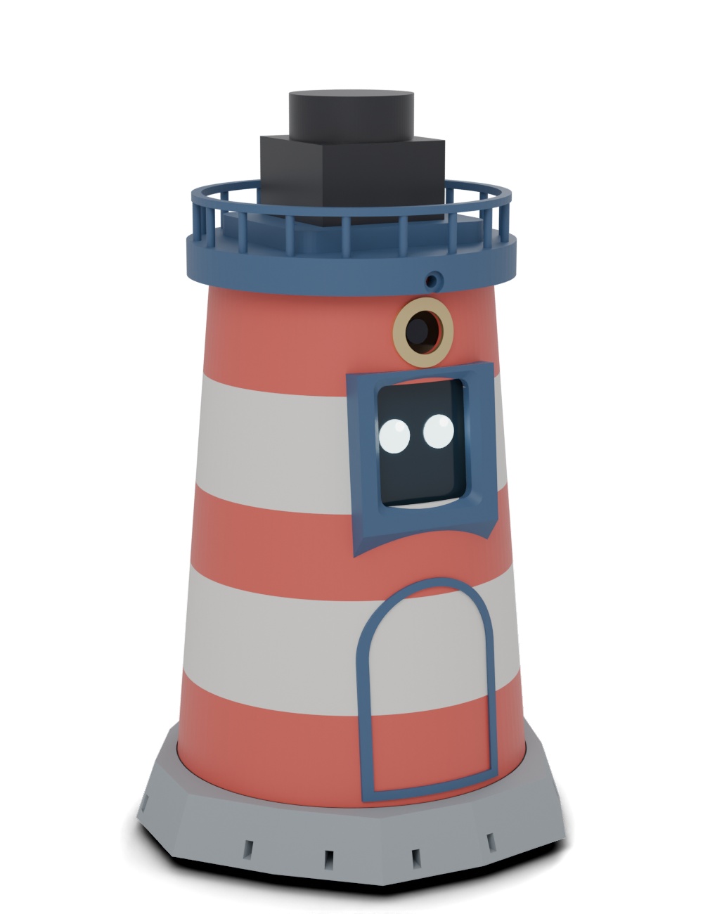
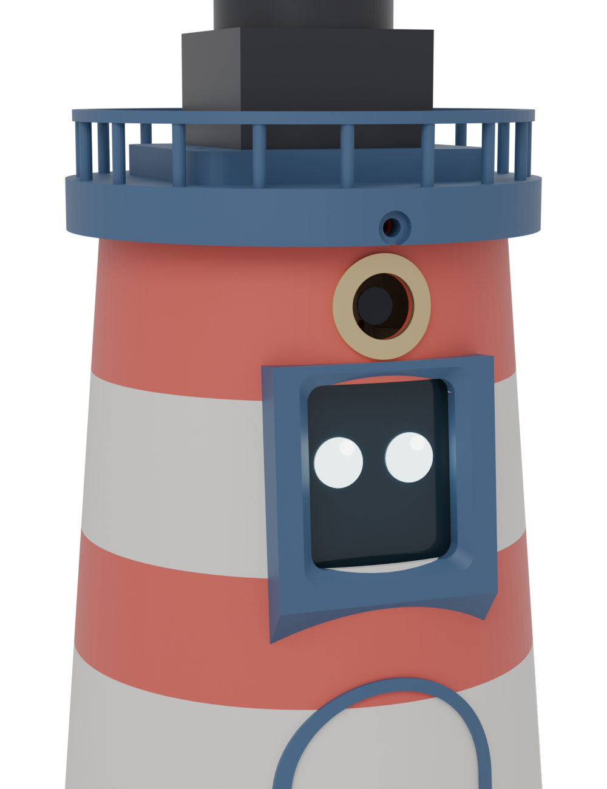
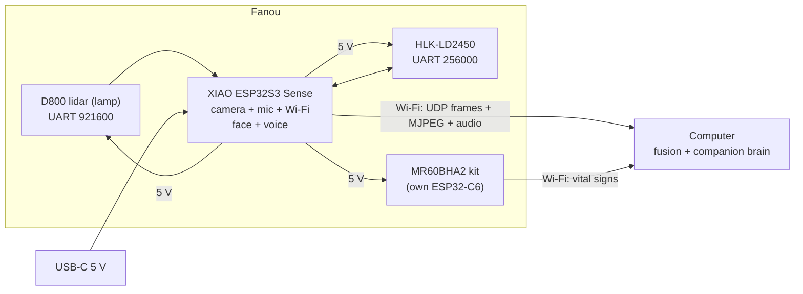

# SuperLens · Fanou

**A little lighthouse that lives on your desk, and sees the room five ways at once.**

Fanou is the SuperLens sensor stack turned into a desk companion. Its lamp is a 360° lidar turning on top of the gallery. Its face is a small screen behind a window. A camera looks out through a brass porthole, and two mmWave radars (24 GHz and 60 GHz) sleep behind the painted wall. It hears you through a microphone and answers through a speaker hidden in its rocky island.

Fanou can **see** (camera, lidar), **feel** (who is in the room, how they move, whether they breathe), **hear** (microphone) and **speak** (speaker, expressive eyes). The heavy thinking runs on your computer, which fuses everything into one live model of the room.

<p align="center">
  
  
</p>

> Français : [lire en français](README.fr.md) · Presentation page: open [`docs/index.html`](docs/index.html) in a browser.

> **Project status: rev E (Fanou), designed, not built yet.** The mechanics are complete and collision-checked in CAD, and the wiring is unchanged from rev D. The firmware and the desktop software are next.

## What we want to do

Every sensor on its own is half-blind. A lidar draws perfect walls but cannot tell a person from a coat rack. A radar knows who moves and who breathes, but it cannot draw the room. A camera sees everything and understands nothing about distance. Fanou puts them in one body, on one clock, and gives the result a personality.

1. **Capture: Fanou is dumb on purpose.** The ESP32-S3 reads every sensor, stamps each packet with the same clock and streams it over Wi-Fi. It draws its own eyes and plays its own sounds.
2. **Fuse: the computer does the thinking.** It places every measurement in the same 3D frame (lidar geometry, radar people and speeds, vital signs, camera colour) and shows one live overlay in [Rerun](https://rerun.io).
3. **Live: a companion that notices.** Fanou turns its eyes toward you when you sit down, dims when you leave, reminds you to breathe when you have been still for too long, and answers questions about the room. No cloud is required, and no image needs to leave the room.

## What each part adds

| Part | Band | Its role in Fanou |
|---|---|---|
| LDROBOT **D800** lidar (STL-27L) | 905 nm laser | The lamp: a 360° outline of the room, 21 600 points/s, up to 25 m. The cheaper D500 also fits. |
| Hi-Link **HLK-LD2450** | 24 GHz radar | Behind the middle red band: position and speed of up to 3 people, up to 6 m |
| Seeed **MR60BHA2** kit | 60 GHz radar | Behind the door: presence, breathing rate and heart rate, up to 1.5 m |
| **XIAO ESP32S3 Sense** | Visible light | The porthole camera, the microphone, Wi-Fi, and the brain that runs everything |
| Waveshare **1.69" LCD** (ST7789) | — | The face: expressive eyes, and a mini-map or status on demand |
| **MAX98357A** amp + 1 W speaker | Sound | The voice: beeps, chirps and short spoken answers |

The shell wall is 1.6 mm of PETG, half a wavelength at 60 GHz, so both radars see through it as if it were a window.

## Design goals

- **Attachment first.** A shape you know, a face that reacts, a voice. Fanou should feel like a small character, not a gadget.
- **Almost no soldering.** Dupont plugs and lever connectors everywhere. The only soldering is two header strips (on the XIAO and the amp).
- **Prints without supports.** Five parts plus a test template, pre-oriented for the bed. The stripes are simple filament changes at set heights.
- **Radars hidden behind paint.** No holes in front of the radars: they work through the wall.
- **Bring your own power.** A USB-C cable enters the back of the island. A charger or a power bank that delivers ≥ 2 A at 5 V is enough.
- **Dumb device, smart computer.** The ESP32 timestamps and forwards data. Fusion and language run on the PC.

## How it works



See [docs/architecture.md](docs/architecture.md) for data rates, the power budget and the reasoning behind each choice.

## Build it

1. **Buy the parts** in [docs/bom.md](docs/bom.md): about €240 from AliExpress with the D800 lidar (about €200 with the D500).
2. **Print** following [docs/printing.md](docs/printing.md). Print the 5-minute lidar template first.
3. **Solder** two header strips, then **wire** the 29 connections in [docs/wiring.md](docs/wiring.md). The guide is written for first-timers.
4. **Assemble** following [docs/assembly.md](docs/assembly.md).
5. **Flash and run.** The [firmware](firmware/) and the [host software](host/) are in progress.

## Repository layout

```
superlens/
├── hardware/
│   ├── blender/fanou.blend       # assembled model + print layout, open in Blender
│   ├── cad/fanou.scad            # parametric source (dimensions live here)
│   ├── stl/                      # print-ready STLs (generated)
│   └── scripts/                  # export_stl.sh, render_previews.sh
├── firmware/                     # ESP32-S3 firmware (planned)
├── host/                         # desktop fusion + companion (planned)
├── docs/                         # BOM, wiring, printing, assembly, architecture
│   ├── concepts/                 # the three character studies Fanou came from
│   └── index.html                # presentation page (open in a browser)
└── LICENSES/                     # full licence texts
```

## Open it in Blender

[`hardware/blender/fanou.blend`](hardware/blender/fanou.blend) contains the assembled lighthouse in its colours (millimetre units), the modules and lidar as volumes, the lights and camera used for the renders, and every printable part laid out in its print orientation. Blender 4.2 or newer is required.

The file is generated from the CAD by [`hardware/blender/build_blend.py`](hardware/blender/build_blend.py).

## Customising

Every dimension is a named parameter at the top of [`hardware/cad/fanou.scad`](hardware/cad/fanou.scad): tower height and taper, module positions, fit clearance, screw holes and more. Edit a value, then regenerate the parts:

```bash
hardware/scripts/export_stl.sh
```

## Licences

| What | Licence |
|---|---|
| Hardware (`hardware/`) | [CERN-OHL-P-2.0](LICENSES/CERN-OHL-P-2.0.txt) |
| Software (`firmware/`, `host/`, scripts) | [MIT](LICENSES/MIT.txt) |
| Documentation and images (`docs/`, READMEs) | [CC BY 4.0](LICENSES/CC-BY-4.0.txt) |

All three are permissive: build it, modify it, sell it. Just keep the attribution.

## Contributing

Issues and pull requests are welcome. Build reports with photos are especially useful while no unit has been built yet. See [CONTRIBUTING.md](CONTRIBUTING.md).

## Credits

Mechanical dimensions come from the LDROBOT LD19 datasheet (v2.5, same footprint as the STL-19P and STL-27L in the D500 and D800 kits), the Waveshare 1.69" LCD documentation, the Hi-Link HLK-LD2450 manual, the Seeed MR60BHA2 datasheet and schematic, and the Seeed XIAO ESP32S3 Sense documentation. Sensor names are trademarks of their respective owners. This project is not affiliated with any of them.
