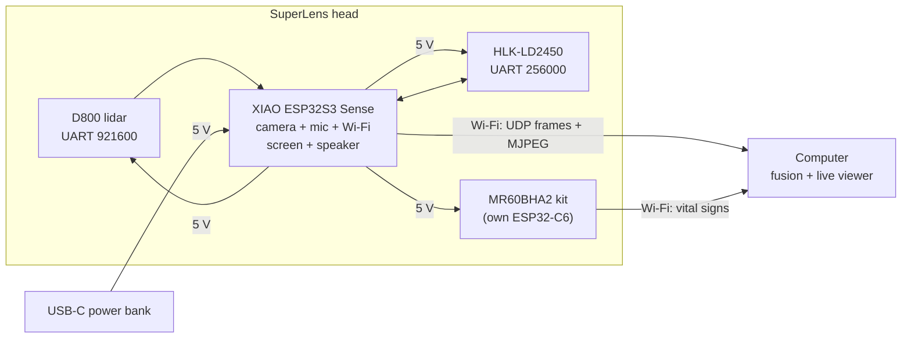

# SuperLens

**See a room five ways at once.**
SuperLens is an open-source handheld sensor head. It points a 360° lidar, two mmWave radars (24 GHz and 60 GHz) and a camera at the same scene, then fuses everything on your computer into one live picture: the exact shape of the room, where each person is, how fast they move, and whether they are breathing.

<p align="center">
  
  
</p>

> Français : [lire en français](README.fr.md) · Presentation page: open [`docs/index.html`](docs/index.html) in a browser (EN/FR, with a live simulation of the back screen).

> **Project status: rev D, designed, not built yet.** The mechanics and wiring are complete and checked in CAD. The firmware and the desktop viewer are next. Expect changes once the first unit is assembled.

## What we want to do

Every sensor on its own is half-blind. A lidar draws perfect walls but cannot tell a person from a coat rack, and glass is invisible to it. A radar knows who moves and who breathes, but it cannot draw the room. A camera sees everything and understands nothing about distance. SuperLens puts them on one frame and one clock, so a computer can merge them.

1. **Capture: the head is dumb on purpose.** The ESP32-S3 reads every sensor, stamps each packet with the same clock and streams it over Wi-Fi. It also draws a mini-map on its own back screen.
2. **Fuse: the computer does the thinking.** It places every measurement in the same 3D frame (lidar geometry, radar people and speeds, vital signs, camera colour) and shows one live overlay in [Rerun](https://rerun.io).
3. **Model: then, a living twin.** Walk around with it and the map grows into a live digital twin of the space. No cloud, and no image needs to leave the room.

What it can be used for:

- a perception head for a home robot;
- camera-free presence and sleep sensing;
- scanning and measuring rooms;
- recording multimodal datasets for research;
- learning sensor fusion hands-on.

## What each sensor adds

| Sensor | Band | What it tells you |
|---|---|---|
| LDROBOT **D800** lidar (STL-27L) | 905 nm laser | Precise 2D outline of the room, 360°, 21 600 points/s, up to 25 m. The cheaper D500 also fits. |
| Hi-Link **HLK-LD2450** | 24 GHz radar | X/Y position and speed of up to 3 people, up to 6 m |
| Seeed **MR60BHA2** kit | 60 GHz radar | Presence, breathing rate and heart rate, up to 1.5 m |
| **XIAO ESP32S3 Sense** | Visible | Colour camera. The ESP32-S3 also runs the device, its Wi-Fi and the screen |
| Waveshare **1.69" LCD** (ST7789) | — | The device's own view: top-down lidar mini-map, radar targets and status, without a computer |
| Built-in **PDM mic** + **MAX98357A** amp and 1 W speaker | Sound | Voice commands and sound events in, spoken feedback and beeps out |

Each sensor covers another's blind spot. The lidar gives exact geometry but misses glass and cannot tell a person from a coat rack. The radars see motion, speed and breathing, and they see through thin plastic and fabric. The camera adds texture and meaning.

## Design goals

- **Almost no soldering.** Dupont plugs and lever connectors everywhere. The only soldering is two header strips (on the XIAO and the amp), or none if you buy them pre-soldered.
- **Prints without supports.** Five parts in PETG, pre-oriented for the bed.
- **Handheld or standing.** A pistol grip slides into a printed desk stand, and a 1/4"-20 tripod nut sits in the grip butt.
- **It listens and talks.** The camera board's built-in microphone and a small speaker behind the side vents give it voice feedback and sound events.
- **Live screen on the back.** A 1.69" colour display shows a top-down lidar mini-map and the radar targets, even without a computer.
- **Bring your own power bank.** Any USB-C power bank that delivers ≥ 2 A at 5 V, kept in your pocket on a 1 m cable.
- **Dumb device, smart computer.** The ESP32 only timestamps and forwards data. All fusion runs on the PC.

## How it works



See [docs/architecture.md](docs/architecture.md) for data rates, the power budget and the reasoning behind each choice.

## Build it

1. **Buy the parts** in [docs/bom.md](docs/bom.md): about €240 from AliExpress with the D800 lidar (about €200 with the D500).
2. **Print** following [docs/printing.md](docs/printing.md). Print the 5-minute lidar template first.
3. **Solder** two header strips, then **wire** the 29 connections in [docs/wiring.md](docs/wiring.md). The guide is written for first-timers.
4. **Assemble** following [docs/assembly.md](docs/assembly.md).
5. **Flash and run.** The [firmware](firmware/) and the [host viewer](host/) are in progress.

## Repository layout

```
superlens/
├── hardware/
│   ├── blender/superlens.blend   # assembled model + print layout, open in Blender
│   ├── cad/superlens.scad        # parametric source (dimensions live here)
│   ├── stl/                      # print-ready STLs (generated)
│   └── scripts/                  # export_stl.sh, render_previews.sh
├── firmware/                     # ESP32-S3 firmware (planned)
├── host/                         # desktop fusion + viewer (planned)
├── docs/                         # BOM, wiring, printing, assembly, architecture
│   └── index.html                # presentation page (open in a browser)
└── LICENSES/                     # full licence texts
```

## Open it in Blender

[`hardware/blender/superlens.blend`](hardware/blender/superlens.blend) contains two collections: the assembled device with the sensors as coloured volumes (millimetre units), and every printable part laid out in its print-bed orientation. Blender 4.2 or newer is required.

The file is generated from the STLs by [`hardware/blender/build_blend.py`](hardware/blender/build_blend.py).

## Customising the enclosure

Every dimension is a named parameter at the top of [`hardware/cad/superlens.scad`](hardware/cad/superlens.scad): module fit clearance, screw holes, grip angle and more. Edit a value, then regenerate the parts:

```bash
hardware/scripts/export_stl.sh
```

## Licences

| What | Licence |
|---|---|
| Hardware (`hardware/`) | [CERN-OHL-P-2.0](LICENSES/CERN-OHL-P-2.0.txt) |
| Software (`firmware/`, `host/`, scripts) | [MIT](LICENSES/MIT.txt) |
| Documentation and images (`docs/`, READMEs) | [CC BY 4.0](LICENSES/CC-BY-4.0.txt) |

All three are permissive: build it, modify it, sell it. Just keep the attribution.

## Contributing

Issues and pull requests are welcome. Build reports with photos are especially useful while no unit has been built yet. See [CONTRIBUTING.md](CONTRIBUTING.md).

## Credits

Mechanical dimensions come from the LDROBOT LD19 datasheet (v2.5, same footprint as the STL-19P and STL-27L in the D500 and D800 kits), the Waveshare 1.69" LCD documentation, the Hi-Link HLK-LD2450 manual, the Seeed MR60BHA2 datasheet and schematic, and the Seeed XIAO ESP32S3 Sense documentation. Sensor names are trademarks of their respective owners. This project is not affiliated with any of them.
