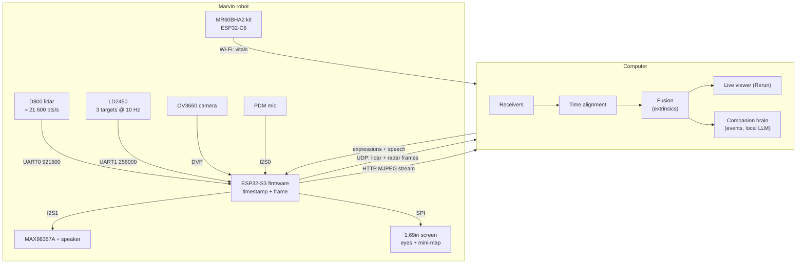

# Architecture

## Principle: dumb device, smart computer

The robot collects, timestamps and forwards data, and it performs: eyes on the screen, sounds on the speaker. The computer does everything else: parsing, fusion, 3D modelling, language and the companion's behaviour. This keeps the firmware small and lets heavy processing run on a GPU.

## Data rates

| Stream | Rate | Bandwidth |
|---|---|---|
| Lidar point packets, D800 (12 points each) | ≈ 1 800 packets/s × 47 bytes | ≈ 85 kB/s |
| Lidar point packets, D500 | ≈ 420 packets/s × 47 bytes | ≈ 20 kB/s |
| Microphone, 16 kHz 16-bit mono (when streamed) | — | 32 kB/s |
| LD2450 target frames | 10 Hz × 30 bytes | < 1 kB/s |
| Camera, MJPEG VGA | ≈ 10–15 fps | ≈ 300–600 kB/s |
| MR60BHA2 vitals | ≈ 1 Hz | negligible |

Everything fits comfortably in the ESP32-S3's Wi-Fi throughput.

## Design decisions

| Decision | Why | Alternative considered |
|---|---|---|
| **The MR60BHA2 stays a separate Wi-Fi node** | The kit ships with its own ESP32-C6 and firmware. Routing its data through the S3 would mean opening the case and soldering. Vital signs update at about 1 Hz, so timestamping them on arrival at the PC is precise enough. | UART link through the kit's Grove port (possible later) |
| **Power through the XIAO's USB-C port** | The 5V pin is tied directly to VBUS, so the ESP32 becomes the power distribution point with no extra board. | Separate USB-C breakout with 5.1 kΩ resistors and a soldered distribution board (rev A) |
| **WAGO lever connectors** | Solderless, reliable and reusable. | Soldered perfboard |
| **An upright robot, sensors tilted inside** | To measure heart rate at a desk, the 60 GHz radar must aim at a seated chest, about 20° up. Tilting the whole object (rev E and the early robot sketches) made it look like it was falling backwards. Keeping the shell vertical and tilting the sensors on an internal sled gives the same aim with a calm silhouette. | Tilted face panel (robot v1–v2), lighthouse taper (rev E) |
| **Radars behind a flat, uniform wall** | No holes in front of the radars keeps the design clean. A 1.6 mm PETG wall is half a wavelength at 60 GHz; seen at 20° incidence it is only about 3 % thicker electrically, which costs almost nothing. The anthracite band is a colour change, not a thickness change. | Open radar windows (rev A–D) |
| **Head and body decoupled by a TPU damper** | The radar measures sub-millimetre chest motion; the lidar motor spins at 10 Hz on top of the head. The damper keeps that vibration out of the body. | Rigid neck |
| **Screen vertical, camera tilted** | An IPS screen reads fine from 20° below, but a camera with a ~65° field of view at desk height would frame your chest. Tilting the XIAO by 20° centres your face. | Tilting the whole face |
| **Smoked acrylic face window** | Gives the black-glass look while letting the screen through; printed black PETG would be opaque. | Open screen cut-out with a bezel |
| **Grown-up design language** | The companion is for adults: warm grey, anthracite, one orange knob. Personality comes from the eyes and behaviour, not from decoration. | Cute toy styling (robot v2) |
| **Screen as the face, eyes by default** | A face makes the device readable at a glance: awake, listening, sleepy. The mini-map is still one tap away. | Back screen with a mini-map (rev C–D) |
| **Thread-forming screws into PETG and PLA** | No heat-set inserts and no nuts, except the optional tripod nut. | Brass inserts (rev A) |

## Coordinate frame

The CAD frame is also the device frame used by the host software:

- origin on the vertical axis of the body, at desk level (Z = 0);
- **X** to the right, **Y** backwards (the face looks towards −Y), **Z** up.

Sensor positions (extrinsics) for rev F. Body values come from `hardware/cad/marvin.scad`; head values are planned until the head CAD lands:

| Sensor | Position (X, Y, Z) mm | Facing |
|---|---|---|
| Lidar rotation centre | (0, ≈ 0, ≈ 133) | 360°, 0° to be calibrated. Planned. |
| Camera | (0, ≈ −38, ≈ 113) | −Y, tilted 20° up. Planned. |
| Screen centre | (0, ≈ −38, ≈ 92) | −Y, vertical. Planned. |
| MR60BHA2 case, face centre | (0, −28.4, 41.7) | −Y, tilted 20° up. The antenna is off-centre inside the case (about 7 mm to one side). |
| HLK-LD2450, face centre | (0, −33.1, 16.4) | −Y, tilted 10° up |

With the 60 GHz radar at 42 mm and tilted 20°, its boresight crosses the chest band of a seated person (280–450 mm above the desk) between about 0.65 and 1.1 m.

The 24 GHz radar sits below the 60 GHz one, not above it: the 60 GHz beam leaves the robot upwards, and a board standing in front of the upper half of the 60 GHz radar would shadow it.

## Roadmap

- [x] Rev A: enclosure, soldered power distribution
- [x] Rev B: solderless wiring, desk stand, tripod nut
- [x] Rev C: 1.69" colour screen on the back, power bank moved to the pocket, D500 lidar
- [x] Rev D: microphone + speaker, D800 lidar as the reference
- [x] Rev E: Fanou, the desk lighthouse companion
- [x] Rev F design: the upright robot, sensors tilted inside
- [x] Rev F CAD, body half: body, plinth, sensor sled, TPU neck
- [ ] Rev F CAD, head: face frame, window, lidar ring, knob (after measuring the screen)
- [ ] First physical build and dimension check
- [x] Protocol v1, simulated robot on a Wemos D1 mini, host receiver and Rerun viewer
- [x] Firmware: UART readers, the face on the screen, MR60BHA2 bridge (untested on hardware)
- [x] Firmware: audio, MJPEG camera, OTA (untested on hardware)
- [x] Host: voice (local), the app, recording and replay, lidar calibration
- [x] Host: presence events (brain) and the face, on simulated data
- [ ] Host: camera/lidar extrinsic calibration
- [ ] Companion: tested daily on the real robot, voice through the robot
- [ ] Companion: perception and learning, see [intelligence.md](intelligence.md)
- [ ] Optional: MR60BHA2 data over UART, 3D lidar variant
