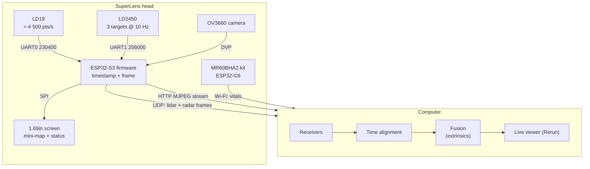

# Architecture

## Principle: dumb device, smart computer

The head collects, timestamps and forwards data. The computer does everything else: parsing, fusion, 3D modelling and visualisation. This keeps the firmware small and lets heavy processing run on a GPU.

## Data rates

| Stream | Rate | Bandwidth |
|---|---|---|
| LD19 point packets (12 points each) | ≈ 375 packets/s × 47 bytes | ≈ 18 kB/s |
| LD2450 target frames | 10 Hz × 30 bytes | < 1 kB/s |
| Camera, MJPEG VGA | ≈ 10–15 fps | ≈ 300–600 kB/s |
| MR60BHA2 vitals | ≈ 1 Hz | negligible |

Everything fits comfortably in the ESP32-S3's Wi-Fi throughput.

## Design decisions

| Decision | Why | Alternative considered |
|---|---|---|
| **The MR60BHA2 stays a separate Wi-Fi node** | The kit ships with its own ESP32-C6 and firmware. Routing its data through the S3 would mean opening the case and soldering. Vital signs update at about 1 Hz, so timestamping them on arrival at the PC is precise enough. | UART link through the kit's Grove port (possible later) |
| **Power through the XIAO's USB-C port** | The 5V pin is tied directly to VBUS, so the ESP32 becomes the power distribution point with no extra board. | Separate USB-C breakout with 5.1 kΩ resistors and a soldered distribution board (rev A) |
| **WAGO lever connectors** | Solderless, reliable and reusable. | Soldered perfboard |
| **Pressing columns on the back cover** | Every module is held without screws or clips, and 3 mm foam absorbs tolerances. | Individual screw-in retainers |
| **Thread-forming M3 screws into PETG** | No heat-set inserts, so no soldering iron is needed. | Brass heat-set inserts (rev A) |
| **1.69" screen on the back cover, power bank in the pocket** | You see the live mini-map while holding the grip. The ESP32 draws a downsampled top-down lidar view and the radar targets locally, so the screen works without a PC. Freeing the back cover meant moving the power bank to your pocket. | Status-only monochrome OLED; side-mounted screen |
| **2D lidar on top, sensors on the front** | Nothing sits above the laser plane, so the lidar has a clear 360° view. The camera sits on the lidar axis to minimise parallax. | — |

## Coordinate frame

The CAD frame is also the device frame used by the host software:

- origin at the front-bottom-centre of the head;
- **X** to the right, **Y** backwards, **Z** up;
- the lidar scan plane sits at about Z = 111 mm, centred on X = 0, Y = 31 mm.

Sensor positions (extrinsics) come straight from the CAD parameters:

| Sensor | Position (X, Y, Z) mm | Facing |
|---|---|---|
| LD19 rotation centre | (0, 31, ≈111) | 360°, 0° to be calibrated |
| Camera (window centre) | (0, 0, 67) | −Y (forwards) |
| HLK-LD2450 | (0, 0, 48.5) | −Y |
| MR60BHA2 | (−7.4, 0, 21.1) | −Y |

## Roadmap

- [x] Rev A: enclosure, soldered power distribution
- [x] Rev B: solderless wiring, desk stand, tripod nut
- [x] Rev C: 1.69" colour screen on the back, power bank moved to the pocket, D500 lidar
- [ ] First physical build and dimension check
- [ ] Firmware: UART readers, UDP framing, MJPEG, OTA
- [ ] Host: receivers, Rerun viewer, camera/lidar extrinsic calibration
- [ ] Optional: MR60BHA2 data over UART, 3D lidar variant
