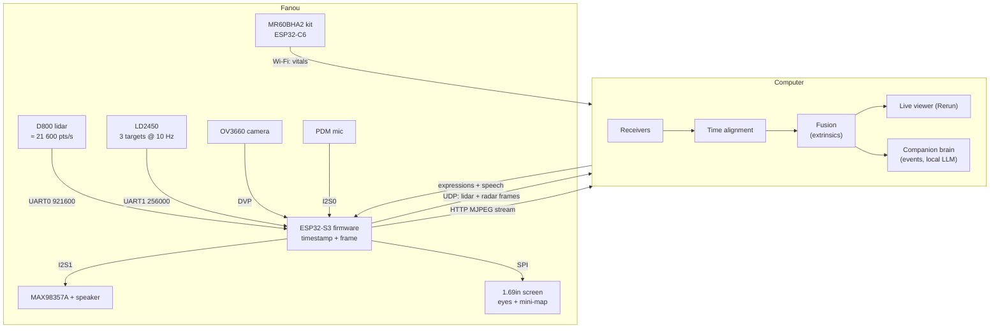

# Architecture

## Principle: dumb device, smart computer

Fanou collects, timestamps and forwards data, and it performs: eyes on the screen, sounds on the speaker. The computer does everything else: parsing, fusion, 3D modelling, language and the companion's behaviour. This keeps the firmware small and lets heavy processing run on a GPU.

## Data rates

| Stream | Rate | Bandwidth |
|---|---|---|
| Lidar point packets, D800 (12 points each) | ≈ 1 800 packets/s × 47 bytes | ≈ 85 kB/s |
| Lidar point packets, D500 | ≈ 420 packets/s × 47 bytes | ≈ 20 kB/s |
| Microphone, 16 kHz 16-bit mono (when streamed) | — | 32 kB/s |
| LD2450 target frames | 10 Hz × 30 bytes | < 1 kB/s |
| Camera, MJPEG VGA | ≈ 10–15 fps | ≈ 300–600 kB/s |
| MR60BHA2 vitals | ≈ 1 Hz | negligible |

Everything fits comfortably in the ESP32-S3's Wi-Fi throughput.

## Design decisions

| Decision | Why | Alternative considered |
|---|---|---|
| **The MR60BHA2 stays a separate Wi-Fi node** | The kit ships with its own ESP32-C6 and firmware. Routing its data through the S3 would mean opening the case and soldering. Vital signs update at about 1 Hz, so timestamping them on arrival at the PC is precise enough. | UART link through the kit's Grove port (possible later) |
| **Power through the XIAO's USB-C port** | The 5V pin is tied directly to VBUS, so the ESP32 becomes the power distribution point with no extra board. | Separate USB-C breakout with 5.1 kΩ resistors and a soldered distribution board (rev A) |
| **WAGO lever connectors** | Solderless, reliable and reusable. | Soldered perfboard |
| **A lighthouse** | People attach to characters, and a lighthouse already is one: it watches, it turns, it signals. Its lamp is where a 360° lidar has to be anyway, on top with nothing above the scan plane. | An owl (Hulotte) and a round robot (Tito), see `docs/concepts/` |
| **Radars behind the painted wall** | No holes in front of the radars keeps the character clean. A 1.6 mm PETG wall is half a wavelength at 60 GHz, so it is almost transparent to both radars. | Open radar windows (rev A–D) |
| **Everything on one spine that slides into the tower** | All modules, wires and connectors are assembled and tested in the open, then the tower slides over them. The tower wall is the front stop, and 3 mm foam pads absorb tolerances. | Modules inserted through the back of a box (rev A–D) |
| **Modules set back from the round wall** | A flat module in a round tower touches with its corners first. Each module sits back by just enough (`sb()` in the CAD) to clear the wall, so all four face the room through less than 7 mm of air and plastic. | A flat front face on the tower |
| **Screen as a portrait window, eyes by default** | A face makes the device readable at a glance: awake, listening, sleepy. The mini-map is still one tap away. | Back screen with a mini-map (rev C–D) |
| **Speaker in the island** | The speaker needs volume and a grille; the island has both, and its weight keeps the lighthouse stable. | Speaker in the side wall (rev D) |
| **Thread-forming screws into PETG and PLA** | No heat-set inserts and no nuts, except the optional tripod nut. | Brass inserts (rev A) |

## Coordinate frame

The CAD frame is also the device frame used by the host software:

- origin on the tower axis, at CAD Z = 0 (the bottom plate's underside is at Z = 2.6 mm, about where the table is once the feet are on);
- **X** to the right, **Y** backwards (the face looks towards −Y), **Z** up;
- the tower tapers by 4.6°, so every front module leans back by that angle and **looks 4.6° upward**, towards a seated person's face.

Sensor positions (extrinsics) come straight from the CAD parameters. They are the centre of each module's front face:

| Sensor | Position (X, Y, Z) mm | Facing |
|---|---|---|
| Lidar rotation centre | (0, 0, ≈ 205) | 360°, 0° to be calibrated. Scan plane about 25 mm above the plinth. |
| Camera (porthole centre) | (0, −37.4, 152.3) | −Y, tilted 4.6° up |
| Screen centre | (0, −37.9, 121.9) | −Y, tilted 4.6° up |
| HLK-LD2450 | (0, −37.4, 90.7) | −Y, tilted 4.6° up |
| MR60BHA2 case | (0, −43.0, 54.6) | −Y, tilted 4.6° up. The antenna is off-centre inside the case (about 7 mm to one side). |

## Roadmap

- [x] Rev A: enclosure, soldered power distribution
- [x] Rev B: solderless wiring, desk stand, tripod nut
- [x] Rev C: 1.69" colour screen on the back, power bank moved to the pocket, D500 lidar
- [x] Rev D: microphone + speaker, D800 lidar as the reference
- [x] Rev E: Fanou, the desk lighthouse companion
- [ ] First physical build and dimension check
- [ ] Firmware: UART readers, UDP framing, MJPEG, OTA
- [ ] Host: receivers, Rerun viewer, camera/lidar extrinsic calibration
- [ ] Companion: presence events, eye animations, voice, local LLM
- [ ] Optional: MR60BHA2 data over UART, 3D lidar variant
