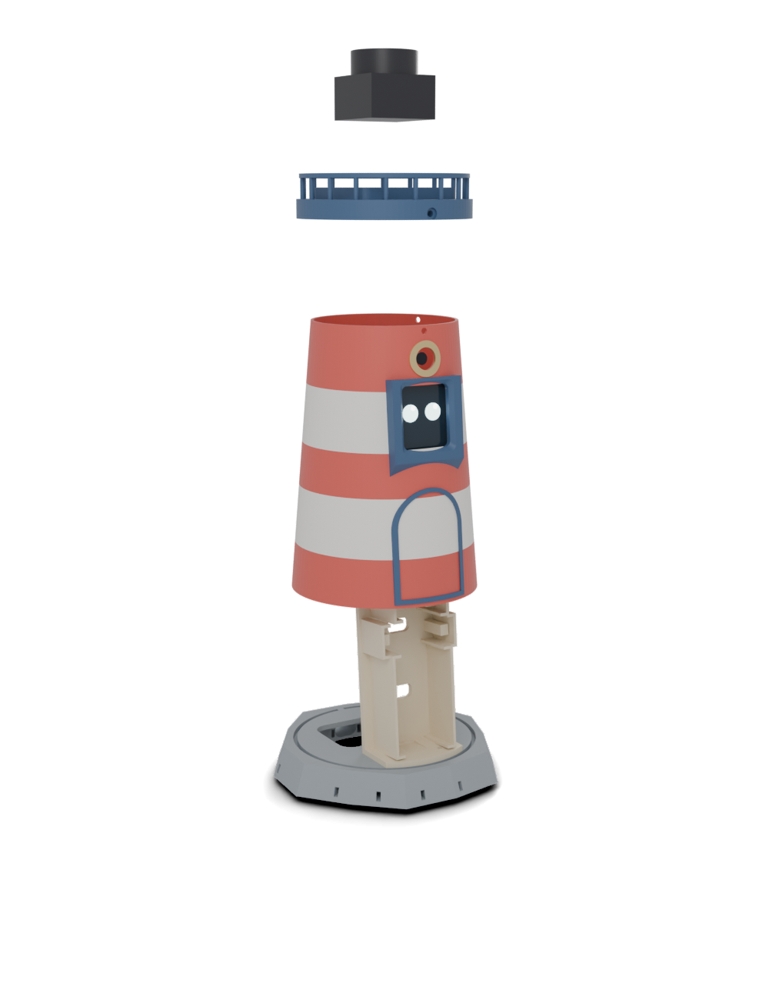

# Assembly

You need a screwdriver, a wire stripper and, for two header strips, a soldering iron. Follow the steps in order. The whole build takes an evening.

How it goes together: every electronic module rides on the **spine**, which is screwed onto the **island**. The striped **tower** then slides down over the spine and seats in the island's groove. The **gallery cap** closes the top and carries the lidar.

## 0. Solder the headers

Solder the 2 × 7 header pins under the XIAO ESP32S3 Sense (long side of the pins pointing away from the camera board) and the 7-pin header on the MAX98357A amp. Skip this step if you bought them pre-soldered.

## 1. Check the lidar on the template

Lay the lidar on the printed template. Its three holes must fall inside the slots. If they don't, adjust `lidPairDY` / `lidSingleDY` in the CAD **before** printing the cap, and please open an issue with your measurements.

## 2. Spine on the island

Stand the spine on the island, its foot flange towards the front (the side opposite the USB-C hole and the key). Drive 2 × M3×6 from inside the island into the flange.

## 3. Modules on the spine

Each module slides into its rails from the front, face forward. Stick a 3 mm foam pad on each pillar behind it: when the tower goes on, the wall presses every module back against the foam.

1. **MR60BHA2 kit** (bottom, in its printed case): radar face forward, USB-C port down, into the notch.
2. **HLK-LD2450**: flat antenna side forward. Foam on the two pillars at the board ends.
3. **Screen**: glass forward, cable connector at the back. Foam on the two pillars, which press on the brass standoffs.
4. **XIAO ESP32S3 Sense** (top): camera lens forward, centred in the rails. Its USB-C port faces one of the side notches.

## 4. Wire it

Follow the [wire-by-wire table](wiring.md#wire-by-wire-table) and tick each line.

- Stick the four WAGOs on the back of the spine, halfway up, with foam tape.
- Stick the amp on the back of the spine, low down, terminals facing down.
- Pass the XIAO's Dupont plugs through the slots in the spine, above and below its pillar.
- Wire the lidar cable now (lines 5–8), leaving its small JST plug free: it goes up through the tower at step 8.
- Tug gently on every wire in a WAGO: none should come out.

## 5. Power cable

Thread the straight end of the USB-C cable **from inside** the island out through the hole at the back, leaving about 25 cm inside. Plug the right-angle end into the XIAO, angled downward, and run the cable down behind the spine.

## 6. Speaker and bottom plate

Stick the speaker into the cradle on the bottom plate, cone facing the grille, and screw its wires into the amp terminals. If you want the tripod thread, press the 1/4"-20 nut into its hexagon from above. Close the bottom plate with 4 × M3×10 into the island's bosses, then stick the four silicone feet underneath.

## 7. First power-up, tower off

Plug the cable into a charger. You should see:

- the ESP32 LED light up,
- the MR60BHA2 kit's LED light up,
- the screen backlight turn on.

Plug the lidar's JST plug in for a moment: it should start spinning. If nothing happens, unplug and re-check lines 1 to 5 of the wiring table. Unplug before going on.

## 8. Tower and cap

1. Put the gallery cap on top of the tower: the tower rim goes into the groove under the gallery. Line up the three screw holes.
2. The lidar cable is already wired (step 4); its small JST plug is still free. Pass that plug up through the inside of the tower and out through the cable opening in the cap.
3. Lower the tower over the spine, face window in front of the screen, until its rim drops into the island groove. The small key at the back only lets it go in one way.
4. Drive the 3 × M3×12 radially through the gallery rim.

## 9. Lidar

Plug the JST plug into the lidar, lay the lidar on the plinth and fix it with 3 × M2.5×10, driven gently: they cut their own thread.

## 10. Say hello

Plug in the power. The lidar starts turning: Fanou is awake.

## Check on arrival

These dimensions are not guaranteed by the datasheets. Verify them before printing the big parts:

- **Lidar holes** on the printed template (step 1).
- **MR60BHA2 case**: designed for 54 × 35 × 22 mm. If yours differs, set `kitW`, `kitH`, `kitD`.
- **Screen thickness and standoffs**: the rails assume 4.5 mm (glass + PCB), 4 mm standoffs 26.5 mm apart (`lcdT`, `lcdStand`, `lcdSx`).
- **Camera lens position**: the porthole is centred on the XIAO. If the lens sits off-centre on your board, move the porthole (`camD`, or the `throughF(xU + xH/2)` line in `shell()`).
- **Speaker size**: the cradle expects a 20 × 30 mm face and at most 5 mm of depth (`spkL`, `spkH`, `spkT`).
- **USB-C cable**: the straight plug must pass through the 14 × 9 mm hole in the island, and the right-angle plug must fit beside the XIAO (side notch of 11 mm).
- **LD2450 cable**: it should end in female Dupont plugs. If yours are male, add a few male–female jumpers.
