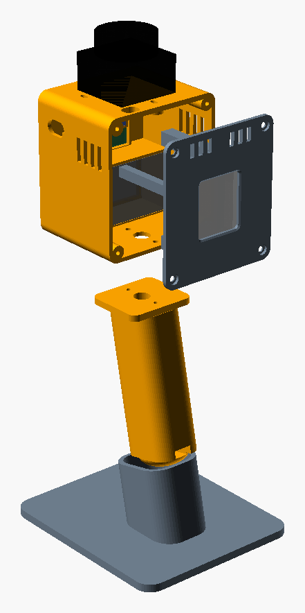

# Assembly

You only need a screwdriver and a wire stripper. Follow the steps in order.

## 1. Check the lidar on the template

Lay the LD19 on the printed template. Its three holes must fall inside the slots. If they don't, adjust `lidPairDY` / `lidSingleDY` in the CAD **before** printing the head, and please open an issue with your measurements.

## 2. Mount the lidar

Drop three M2.5 nuts into their pockets under the top deck, then drive the M2.5×10 screws from above. Route the lidar cable through the rear-right opening.

## 3. Insert the modules from the back

1. **MR60BHA2 kit**: radar face forwards, its USB-C port to the right (that side of the sleeve is open).
2. **HLK-LD2450**: flat antenna side forwards, into the middle frame.
3. **XIAO ESP32S3 Sense**: camera in the top window, USB-C port facing the hole in the right side wall.

## 4. Wire it

Follow the [wire-by-wire table](wiring.md#wire-by-wire-table) and tick each line. Tug gently on every wire in a WAGO: none should come out. Tuck the WAGOs at the bottom of the head.

## 5. First power-up, lid off

Plug in the power bank. You should see:

- the ESP32 LED light up,
- the lidar start spinning,
- the MR60BHA2 kit's LED light up.

If nothing happens, unplug and re-check lines 1, 2, 3 and 7 of the wiring table.

## 6. Fit the screen in the back cover

Lay the screen face down in its pocket, glass against the window, with its connector facing the inside. Stick a 3 mm foam pad on each brass standoff: the two clamp bars press on them when the cover is closed. Plug its cable in, then wire it following lines 13–20 of the wiring table.

## 7. Close the back cover

Stick a 3 mm foam pad on the end of each column: they press the modules against the front. Drive 4 × M3×10 gently, since the screws cut their own thread in the plastic.

## 8. Grip and tripod nut

Slide the 1/4"-20 nut into the slot at the back of the grip butt. Screw the grip under the head with 2 × M3×12, driven from inside the head.

## 9. Power bank and stand

Plug the 1 m USB-C cable into the hole in the right side wall and keep the power bank in your pocket. Stick the silicone feet under the stand and drop the grip into it.

## Check on arrival

These dimensions are not guaranteed by the datasheets. Verify them before printing the big parts:

- **LD2450 cable**: it should end in female Dupont plugs. If yours are male, add a few male–female jumpers.
- **Your USB-C cable plug** must fit through the 14 × 9 mm hole in the side wall.
- **Screen thickness**: the pocket assumes 4.5 mm (glass + PCB) and 4 mm standoffs (`lcdT`, `lcdStand`). If the clamp bars do not touch the standoffs through the foam, adjust these values.
- **MR60BHA2 case**: designed for 54 × 35 × 22 mm. If it rattles, set `clr = 0.2` and reprint the head.
- **LD2450 back side**: if its connector hits a pressing column, trim the column or move it (`x=[-15, 15]` in `cover()`).
