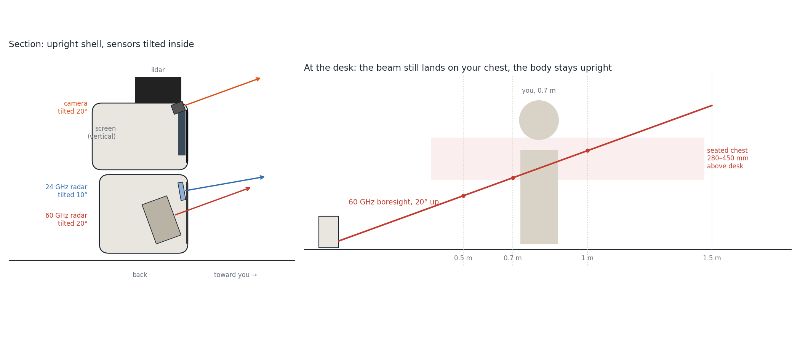

# Assembly

> **Rev F status:** this is the planned assembly order for the upright robot. Screw sizes and a step-by-step photo guide will follow with the rev F CAD and the first build.

You need a screwdriver, a wire stripper and, for two header strips, a soldering iron. The whole build takes an evening.

How it goes together: the body holds the **sensor sled** (both radars, the WAGOs and the amp). The head holds the **head frame** (screen, XIAO with its camera, acrylic window) and carries the lidar on top. The two halves are joined through the **TPU neck damper**, and every wire between them passes through the neck.

## 0. Solder the headers

Solder the 2 × 7 header pins under the XIAO ESP32S3 Sense (long side of the pins pointing away from the camera board) and the 7-pin header on the MAX98357A amp. Skip this step if you bought them pre-soldered.

## 1. Check the lidar on the template

Lay the lidar on the printed template. Its three holes must fall inside the slots. If they don't, adjust `lidPairDY` / `lidSingleDY` in the CAD **before** printing the lidar ring, and please open an issue with your measurements.

## 2. Face window

Cut the smoked acrylic, file the corners round and peel the protective film. Clip it into the head frame from the inside.

## 3. Head

1. **Screen** into the head frame, glass against the acrylic, connector at the back.
2. **XIAO ESP32S3 Sense** into its 20° cradle, lens centred in the camera hole above the screen.
3. Slide the head frame into the head shell and close it.
4. Pass the **lidar cable** up through the lidar ring, screw the ring on, then the lidar with 3 × M2.5×10 (they cut their own thread).

## 4. Body

1. **MR60BHA2 kit** (in its printed case) on the sled's 20° face, radar forward, on 3 mm foam.
2. **HLK-LD2450** on the 10° face above it, flat antenna side forward, on foam.
3. Stick the four **WAGOs** and the **amp** on the back of the sled.
4. **Speaker** against the dot grille inside the right wall, on foam tape.
5. Slide the sled into the body shell; the shell wall is the front stop.

## 5. Wire it

Follow the [wire-by-wire table](wiring.md#wire-by-wire-table) and tick each line. Wires between head and body go through the neck damper. Tug gently on every wire in a WAGO: none should come out.

## 6. Power cable and first power-up

Pass the USB-C cable in through the back of the plinth and up through the neck, and plug the right-angle end into the XIAO. Plug the other end into a charger. You should see:

- the ESP32 LED light up,
- the MR60BHA2 kit's LED light up,
- the screen backlight turn on,
- the lidar start spinning.

If nothing happens, unplug and re-check lines 1 to 5 of the wiring table.

## 7. Close it

Fit the neck damper between body and head, close the plinth, add the feet and the knob.

## Check on arrival

These dimensions are not guaranteed by the datasheets. Verify them before printing the big parts:

- **Lidar holes** on the printed template (step 1).
- **MR60BHA2 case**: designed for 54 × 35 × 22 mm.
- **Screen thickness and standoffs**: 4.5 mm glass + PCB, 4 mm standoffs 26.5 mm apart.
- **Camera lens position** on your XIAO Sense, relative to the camera hole.
- **Speaker size**: a 20 × 30 mm face, at most 5 mm deep.
- **USB-C cable**: the right-angle plug must fit beside the XIAO.
- **LD2450 cable**: it should end in female Dupont plugs. If yours are male, add a few male–female jumpers.
