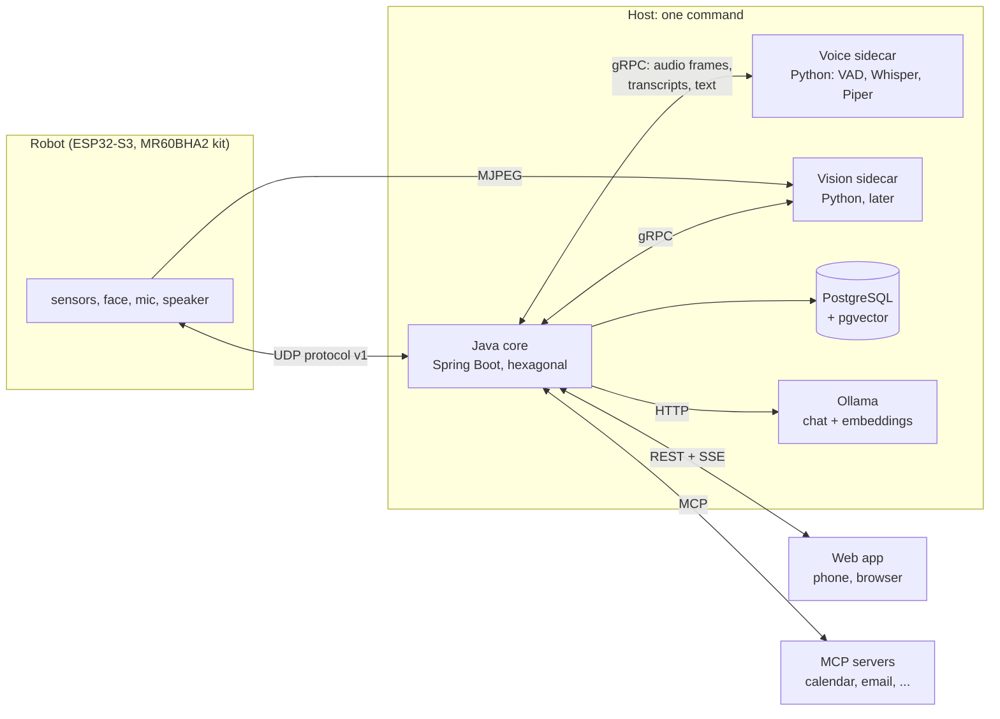
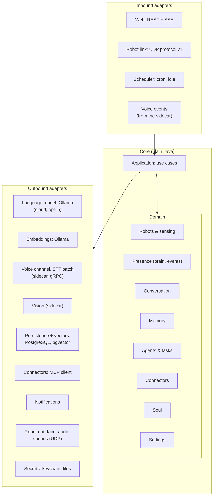
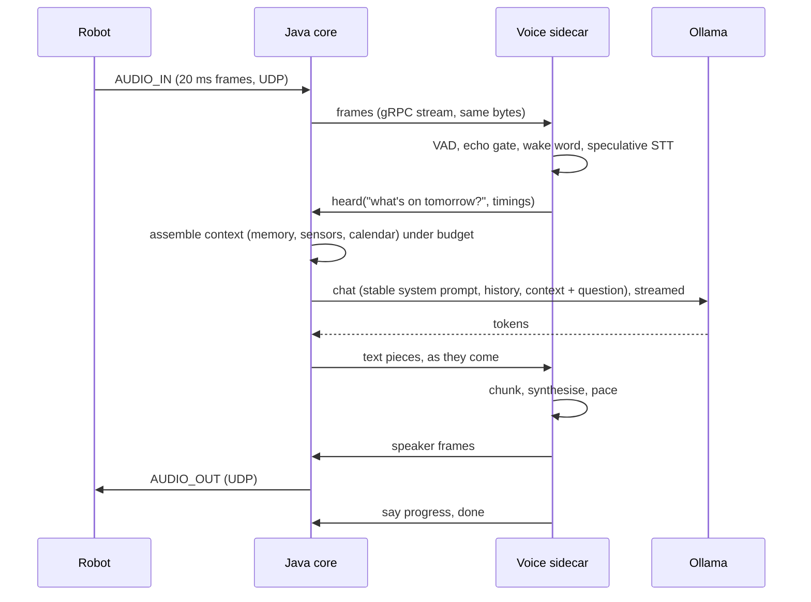
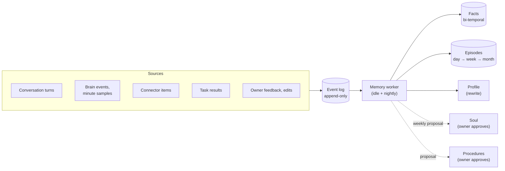
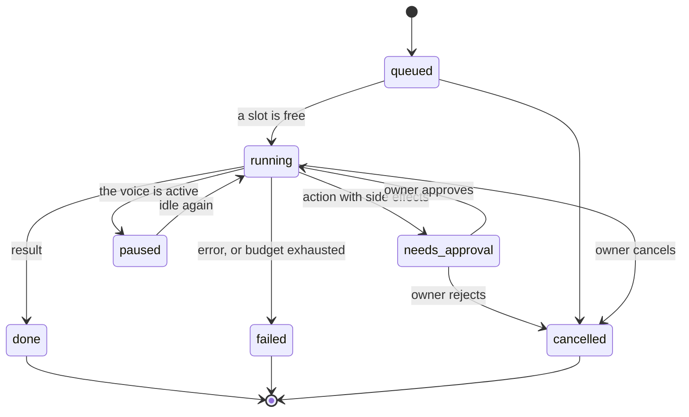
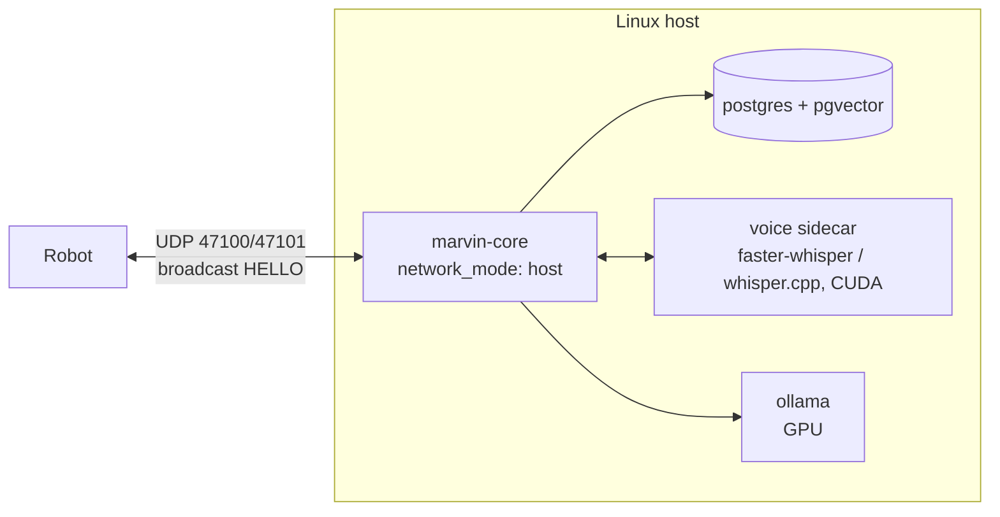

<!-- SPDX-License-Identifier: CC-BY-4.0 -->
# Marvin's brain: design

This is the design for the next generation of Marvin's host software: a long-term memory, background agents, connectors to the owner's email and calendar, an identity that grows over time, and a new host core in Java. It builds on what runs today ([architecture.md](architecture.md), [voice.md](voice.md), [ui.md](ui.md), [protocol.md](protocol.md)) and on the perception plan in [intelligence.md](intelligence.md). Status: **proposal**, nothing here is implemented yet.

Versions and facts about third-party projects were checked in late September 2026; the sources are at the end.

## The design in one page

**Decisions already taken** (not up for debate in this document):

1. **One entry point.** One process starts everything on the host, and everything is controlled from the web app: voice on and off, settings, robots, memory, connectors, agents, logs.
2. **The host core is rewritten in Java with Spring Boot, as a hexagonal architecture** (ports and adapters). Later everything runs in Docker, then Kubernetes.
3. **Layered memory, agents and connectors**, with a hard **context budget** so that more knowledge never means a bigger, slower prompt.
4. **A Soul**: Marvin's identity with its owner, a fixed core written by the owner plus a learned part that changes only with the owner's approval.
5. **Microservices in the long term.** The host starts as one deployable, but its parts must be able to become separate services without a rewrite ([section 10.4](#104-toward-microservices)).

**What this document recommends:**

- **Java 25 (LTS), Spring Boot 4.1, Spring AI 2.0**, Maven multi-module, a framework-free domain, ArchUnit to keep it that way.
- **Machine learning stays in Python, in "sidecars"**: small local services behind ports, started and supervised by the Java host, so there is still one command. MLX (Whisper on the Apple GPU) cannot run in a container on macOS; the Mac runs the sidecars natively, Linux runs them in containers with CUDA.
- **The real-time audio loop lives in the voice sidecar** (microphone, VAD, echo gate, speculative STT, chunked TTS, barge-in). Java owns the conversation: context, model, tools, memory. The seam is "a transcript comes in, a stream of text goes out", which costs about a millisecond on localhost.
- **The Java host owns the robot's UDP socket** (protocol v1, unchanged) and relays audio frames to the voice sidecar. Rerun is not ported: a debug tap forwards raw datagrams to the existing Python viewer.
- **Memory is an append-only event log plus derived layers**: Soul (≈300 tokens, system prompt), Profile (≈500 tokens, rewritten nightly), Facts (bi-temporal, with provenance), Episodes (day → week → month summaries), Procedures. A memory worker consolidates when idle and at night. A context assembler builds each prompt under a hard per-section budget.
- **PostgreSQL 18 with pgvector everywhere**, including on the Mac. It needs no GPU, so it runs fine in Docker on macOS (or from Homebrew). One storage engine, one set of queries.
- **Spring AI for model clients** (Ollama chat and embeddings, tool calling, MCP client), **not for memory**: its chat memory is a message window and its vector store is a single document table; our memory model is the domain and gets its own schema.
- **Agents are background tasks** with their own context, tool subset, model and budget. Side effects need the owner's approval in the app. Marvin never sends an email: it writes drafts.
- **Migration is a strangler in seven phases (0 to 6) (about 22 to 28 weeks of full-time work for one developer)**. The protocol, the app and the recordings stay compatible at every step, and golden files taken from the Python host are the contract the Java host must reproduce.



## 1. Goals and non-goals

**Goals**

- Marvin remembers what matters about its owner over months and years, and can say where each thing it knows came from.
- A spoken answer stays as fast as today (first word ≈ 1.1–1.6 s with a 4B model and Piper), however much Marvin knows.
- Long jobs ("prepare my week", "find the email about the car insurance") run in the background without blocking the conversation.
- Everything is visible and controllable from the one web app: nothing happens that the owner cannot see, undo or turn off.
- The host core is maintainable for years: strict boundaries, fast tests, one language for the core.
- Every step of the migration leaves a working robot.

**Non-goals**

- A general agent platform. Marvin is one companion for one home; there is no multi-tenancy.
- Autonomous actions in the world. Marvin proposes; the owner disposes.
- Rewriting working ML code in Java. Whisper, Piper, VAD and future vision models stay Python or C++.
- Cloud-first anything. Cloud models are an opt-in per task, never a dependency.
- A protocol v2. The robot does not change for any of this.
- Medical interpretation of vital signs. Marvin keeps measuring, not diagnosing ([intelligence.md](intelligence.md)).

## 2. Privacy principles

These are design constraints, checked in code review and, where possible, in tests.

1. **Local first.** Memory, recordings, audio and images live on the owner's machine. Local models by default. The only network traffic without explicit consent is what the owner already enabled (the weather tool, the connectors).
2. **The owner sees, edits and deletes everything.** Every fact shows its sources; every summary, profile and soul version is readable and editable in the app. "Forget this" deletes the item and everything derived only from it, and marks the summaries that used it for regeneration.
3. **Switches per source.** Sensors, conversation, camera, each connector: each has an on/off switch for *collection* and a separate one for *memory* (a connector can be usable as a tool without anything being remembered from it).
4. **Sensitivity labels on everything.** Each event and fact carries one of `normal`, `personal`, `sensitive` (health including vital signs, finances, third parties' private matters), `secret` (credentials, codes, never stored: dropped at ingestion). `sensitive` data never goes to a cloud model and is never spoken while someone else is detected in the room.
5. **Third parties.** People mentioned in email or conversation are remembered only in relation to the owner ("the owner's brother lives in Lyon"), never profiled.
6. **Export.** One button exports everything as a zip of JSON (machine-readable, the full schema) and Markdown (readable: profile, soul, facts, episodes).
7. **No dark patterns.** Marvin does not try to increase how much it is used (see [Soul guardrails](#guardrails)).

## 3. Architecture overview

### 3.1 Hexagonal core

The core is a set of domain modules with no framework and no I/O. It talks to the world only through ports: interfaces owned by the core, implemented by adapters.



**Domain modules**

| Module | Holds | Comes from |
|---|---|---|
| Robots & sensing | `Device`, link state and stats, LD2450 targets, lidar revolutions, vitals, parsers for the raw frames | `receiver.py`, `protocol.py`, `ldrobot.py`, `ld2450.py`, `frames.py` |
| Presence | `Brain`, `PresenceState`, `Event` (arrived, sat_down, ...) | `brain.py`, `events.py` |
| Conversation | `Turn`, `Heard`, `Reply`, tool loop, persona text, fillers, the "why Marvin said that" record | `voice/assistant.py` (the non-audio half), `persona.py`, `tools/` |
| Memory | event log, facts, episodes, profile, procedures, consolidation rules, context assembler, retrieval scoring | new |
| Agents & tasks | `Task`, lifecycle, `Budget`, `Approval`, agent loop | new |
| Connectors | `Connector`, scopes, ingestion policy, cursors | new |
| Soul | core, learned part, versions, reflection proposals | new |
| Settings | typed settings, validation, defaults | `ui/server.py`, `voice/control.py` |

**Ports**

| Direction | Port | Adapter (first) | Notes |
|---|---|---|---|
| In | `WebApi` | Spring MVC, SSE | Same endpoints as today's app (see [ui.md](ui.md)), plus new sections |
| In | `RobotInbound` | UDP 47100, protocol v1 | Handshake, parsing, loss counting, lidar revolutions |
| In | `Schedule` | Spring scheduling | Nightly consolidation, weekly reflection, connector sync, idle detection |
| In | `VoiceEvents` | gRPC stream from the voice sidecar | `heard`, `ignored`, `status`, `level`, `partial`, `say` progress |
| Out | `RobotOutbound` | UDP | `HOST_ACK`, `FACE_STATE`, `FACE_EVENT`, `AUDIO_OUT`, `AUDIO_CTRL`, `SOUND` |
| Out | `LanguageModel` | Spring AI `OllamaChatModel`, streamed | Cloud adapter only for tasks with consent |
| Out | `Embeddings` | Spring AI Ollama embeddings | One model for everything, dimension fixed in the schema |
| Out | `VoiceChannel` | gRPC to the voice sidecar | See [section 4](#4-the-ml-reality-sidecars): one bidirectional port rather than separate STT and TTS |
| Out | `SpeechToText` (batch) | gRPC to the voice sidecar | Transcribing recordings, not the live loop |
| Out | `Vision` | gRPC to the vision sidecar | Later: faces, pose, as brain inputs |
| Out | `EventLog`, `MemoryStore`, `TaskStore`, ... | JDBC, Flyway, pgvector | Repositories per module |
| Out | `ConnectorClient` | Spring AI MCP client | Plus native adapters where MCP lacks incremental sync |
| Out | `Notifier` | SSE to the app, robot speech/earcon, optional push | |
| Out | `AudioDevices`, `Camera` | inside the sidecars | The core never opens a sound card or a camera |
| Out | `SecretStore` | macOS Keychain, file with 0600, Docker/Kubernetes secrets | Never the database, never logs, never prompts |
| Out | `Clock` | system clock; device clock for sensor time | Tests inject a fake clock; replays use the robot's clock as today |

**Why `VoiceChannel` and not separate STT and TTS ports.** The live loop couples them in time: the echo gate needs to know when the speaker really played the last sample; barge-in stops TTS from what the microphone hears; speculative STT starts before the end of speech. Splitting them across a process boundary would put a 20 ms-granularity real-time loop on two sides of a socket. The honest port is "a voice that hears and speaks", with a batch STT port on the side.

### 3.2 Versions

| Component | Version | Why |
|---|---|---|
| Java | **25 LTS** | The current LTS (September 2025). JDK 27 (September 2026) is not LTS and Spring Boot 4.1 supports Java 17–26. The next LTS, 29, is due September 2027. |
| Spring Boot | **4.1.x** (4.1.1, August 2026) | Current stable line, open-source support to July 2027. 4.2 is at milestone 2. |
| Spring AI | **2.0.x** (2.0.1, August 2026) | GA in June 2026, built for Boot 4.0/4.1; Ollama chat with streaming, tool calling and `think` control; Ollama embeddings; MCP client and server on MCP Java SDK 2.0. |
| PostgreSQL | **18** + pgvector **0.8.x** | 19 is still in beta. |
| ArchUnit | **1.5.x** | |
| Python (sidecars) | 3.12, managed with `uv` | One lock file per sidecar; reproducible on the Mac and in containers. |

Virtual threads on (`spring.threads.virtual.enabled=true`): the UDP loop, sidecar streams and SSE are all blocking I/O, and virtual threads keep that code straightforward. Generational ZGC keeps pauses well under a millisecond, far below the 20 ms audio frame.

### 3.3 Build: Maven, multi-module

**Recommendation: Maven** with the wrapper. The module graph is small (about ten modules), the build is not a bottleneck, and Maven's declarative model, `enforcer` (dependency convergence, banned dependencies in the domain) and the Spring Boot parent give guardrails with no build logic to maintain. Gradle would be faster on incremental builds and could drive the Python builds, but a build script is code, and nothing here needs it. The Python sidecars keep their own `uv` projects; CI runs both.

```
host-java/
├── pom.xml                         # parent: versions, enforcer, ArchUnit, Spotless
├── marvin-domain/                  # plain Java: model, domain services, NO Spring, NO I/O
│   └── marvin.host.domain.{robot,presence,conversation,memory,agent,connector,soul,settings}
├── marvin-application/             # use cases + port interfaces; depends on domain only
│   └── marvin.host.application.{robot,conversation,memory,agent,connector,soul}
│       ├── port.in                 # WebApi-facing use-case interfaces
│       └── port.out                # LanguageModel, Embeddings, VoiceChannel, EventLog, ...
├── marvin-adapter-web/             # Spring MVC, SSE, static app (moved from host/marvin_host/ui/static)
├── marvin-adapter-robot/           # UDP protocol v1: receiver, sender, .mvrec record/replay
├── marvin-adapter-persistence/     # JDBC, Flyway migrations, pgvector
├── marvin-adapter-llm/             # Spring AI: Ollama chat and embeddings, optional cloud
├── marvin-adapter-sidecar/         # gRPC clients, process supervisor, health checks
├── marvin-adapter-mcp/             # Spring AI MCP client, native connector adapters
├── marvin-adapter-notify/          # notification channels
├── marvin-app/                     # Spring Boot main, configuration, wiring, scheduler
└── marvin-contracts/               # .proto files, protocol test vectors, golden files (shared with Python)
sidecars/
├── voice/                          # Python: the current voice package, minus LLM/tools/persona
└── vision/                         # Python, later
```

Naming: packages `marvin.host.<layer>.<module>`; ports end in the role they play (`LanguageModel`, `EventLog`), adapters say their technology (`OllamaLanguageModel`, `JdbcEventLog`); use cases are verbs (`AnswerQuestion`, `ConsolidateMemory`, `ApproveAction`). Domain events are records in the past tense (`PersonArrived`, `FactLearned`).

Spring Modulith was considered for module boundaries and its event publication registry. ArchUnit covers the boundaries we need without tying the domain to Spring; the event log (below) already gives us durable, replayable events.

Because the long-term target is microservices (section 10.4), the domain and application modules are cut along **bounded contexts** (robot, presence, conversation, memory, agent, connector, soul, settings), and ArchUnit also forbids one context from reaching into another's internals: contexts talk through their application ports and through events only, and each owns its own Postgres schema. That is what makes a later split a deployment change instead of a rewrite.

### 3.4 ArchUnit rules

One test class in `marvin-app` (it sees every module), run on every build:

```java
@AnalyzeClasses(packages = "marvin.host")
class ArchitectureTest {
  @ArchTest static final ArchRule hexagon = onionArchitecture()
      .domainModels("marvin.host.domain..")
      .domainServices("marvin.host.domain..")
      .applicationServices("marvin.host.application..")
      .adapter("web", "marvin.host.adapter.web..")
      .adapter("robot", "marvin.host.adapter.robot..")
      .adapter("persistence", "marvin.host.adapter.persistence..")
      .adapter("llm", "marvin.host.adapter.llm..")
      .adapter("sidecar", "marvin.host.adapter.sidecar..")
      .adapter("mcp", "marvin.host.adapter.mcp..")
      .adapter("notify", "marvin.host.adapter.notify..");

  @ArchTest static final ArchRule pureDomain = noClasses().that().resideInAPackage("marvin.host.domain..")
      .should().dependOnClassesThat().resideInAnyPackage(
          "org.springframework..", "jakarta.persistence..", "java.sql..", "java.net..", "io.grpc..");

  @ArchTest static final ArchRule noSpringAiOutsideAdapters = noClasses()
      .that().resideOutsideOfPackages("marvin.host.adapter.llm..", "marvin.host.adapter.mcp..", "marvin.host.app..")
      .should().dependOnClassesThat().resideInAPackage("org.springframework.ai..");

  @ArchTest static final ArchRule modulesDoNotCycle = slices()
      .matching("marvin.host.domain.(*)..").should().beFreeOfCycles();

  @ArchTest static final ArchRule noSystemClock = noClasses().that().resideInAPackage("marvin.host.domain..")
      .should().callMethod(System.class, "currentTimeMillis");   // time comes from the Clock port
}
```

Onion architecture already forbids adapter-to-adapter dependencies and any dependency from the core to an adapter. The Maven module split makes most violations impossible to compile; ArchUnit catches the rest (inside a module, and the Spring AI rule).

### 3.5 Testing strategy

| Level | What | How |
|---|---|---|
| Domain unit tests | Brain, retrieval scoring, context budget, consolidation rules, task state machine, soul guardrails | JUnit 5, no Spring, fake `Clock`; milliseconds each |
| Golden tests from Python | The brain and the parsers must reproduce the Python host exactly | Fixtures in `marvin-contracts/golden/` (below) |
| Protocol contract tests | Every message type, byte for byte, both directions | Test vectors from `test_protocol.py` (the real LD19 packet, the LD2450 datasheet frame) exported as hex + expected JSON; a Java simulator run over real UDP on localhost, as `test_receiver.py` does |
| Replay tests | A `.mvrec` recording through the Java receiver gives the same events as through the Python one | The Java adapter reads and writes `.mvrec` v1 (the format is small, see `record.py`) |
| Adapter tests | JDBC + pgvector, Flyway migrations, Ollama client | Testcontainers (`pgvector/pgvector:pg18`, the Ollama module with a tiny model), Spring Boot `@ServiceConnection` |
| Sidecar contract tests | The gRPC contract in both languages | Same `.proto`; Python tests with a fake Java peer and the reverse; audio fixtures as WAV |
| UI API contract | The existing app keeps working unchanged | JSON snapshots of today's endpoints, recorded from the Python server in demo mode, replayed against the Java server |
| LLM behaviour | Tool choice, extraction quality | A small evaluation set run on demand (not in CI): questions → expected tool calls; conversations → expected facts. Scored, tracked over time |

**Golden files.** The Python tests generate their recordings on the fly (`record.write_simulated`); they are not in the repository. Phase 0 adds a script that writes a few small recordings (walk in, sit, stand up, leave; vitals acquired and lost; a lidar yaw offset) and, next to each, the Python brain's events and presence states as JSON Lines. These files are the contract: the Java brain must produce the same events at the same device times. They are regenerated only on purpose, and the diff is reviewed.

## 4. The ML reality: sidecars

### 4.1 What runs where

The best speech stack on the Mac is Python or C++ on the Apple GPU:

- **MLX Whisper** (large-v3-turbo on the GPU, a few hundred ms per question) is what Marvin uses on Apple Silicon today.
- **faster-whisper** (CTranslate2) runs on CPU and NVIDIA CUDA; it has no Metal backend.
- **whisper.cpp** runs on Metal and Core ML, CUDA, Vulkan and more, ships an HTTP server and Silero VAD.
- **Piper** runs on CPU with ONNX, fast enough (a sentence in about 0.1 s).

**MLX and Metal are not available inside Docker containers on macOS.** Containers run in a Linux VM with no Metal passthrough; Docker's own Model Runner runs its Metal backend natively on the host for exactly that reason. The partial exception: Podman with the libkrun/krunkit VM exposes a Vulkan GPU to containers (translated to Metal through MoltenVK), which gets llama.cpp close to native speed; it does not help MLX. Ollama in a container on a Mac runs on the CPU only.

So:

- **On the Mac, sidecars run natively**, as child processes of the Java host, from `uv`-managed environments. Ollama runs natively (the app or `ollama serve`).
- **On Linux with an NVIDIA GPU, sidecars run in containers** with faster-whisper or whisper.cpp on CUDA, and Ollama in a container or natively.
- The sidecar's backend is a setting (`mlx`, `faster-whisper`, `whisper.cpp`), as the STT backend is today.

**Piper's licence.** Piper moved to `OHF-Voice/piper1-gpl` (the original repository was archived in October 2025) and is now GPL-3.0. The host is MIT. Running Piper in a separate process, as a sidecar, keeps the two apart; a published container image that bundles Piper must meet the GPL for that component. The voice models have their own licences, listed per voice.

### 4.2 The supervisor: still one entry point

`marvin-app` starts, watches and stops the sidecars:

- A sidecar is declared in configuration: command (native) or image (containers), gRPC port, health check, required or optional.
- Start: spawn (`ProcessBuilder`), wait for the gRPC health check, then mark the port ready. Logs are piped into the app's Log panel with the sidecar's name.
- Crash: restart with exponential backoff (1 s → 60 s), shown in the app with the last error lines. A missing Python environment gives a fix, as today's voice panel does ("run `uv sync` in `sidecars/voice`").
- Stop: graceful shutdown over gRPC, then `SIGTERM`, then `SIGKILL` after 5 s. A shutdown hook makes sure no orphan survives the host.
- In Docker Compose or Kubernetes, the supervisor switches to "external" mode: it only checks health and reports; the orchestrator restarts.

### 4.3 Where the audio loop lives

**Recommendation: the whole real-time loop lives in the voice sidecar. Java owns what to say.**

The current pipeline is already split along this line in all but name: `assistant.py` mixes an audio machine (capture, VAD, echo gate, wake word, speculative STT, chunking, synthesis, playback, barge-in) with a conversation (context, model, tools, history). The audio half is timing-critical, tested, and depends on Python libraries. The conversation half is where all the new work (memory, agents, soul) happens.

| Stays in the voice sidecar (Python) | Moves to the Java core |
|---|---|
| Audio I/O: the Mac's microphone and speakers (`io.py`); the robot's audio as frames relayed by Java | Owning the robot's UDP socket and relaying `AUDIO_IN` / `AUDIO_OUT` / `AUDIO_CTRL` / `SOUND` |
| VAD and segmentation (`vad.py`) | Deciding whether and what to answer, with the conversation history |
| Echo gate and echo filter (`echo.py`) | Context assembly from memory and sensors (`persona.py`'s context block, extended) |
| Wake word, listening windows, follow-up window, "merci" ends the conversation (`wake.py`, `filters.py`) | The model call, streamed; the tool loop, fillers, `</think>` handling (`llm.py`, `tools/`, `text.strip_thinking`) |
| Speculative and final STT, hallucination filters (`stt.py`, `filters.py`) | Tools: weather, recall, calendar, delegate a task |
| Chunking text for speech, cleaning it (`text.py`: first clause early, no markdown, no JSON) | Proactive speech decisions (`proactive.py`: reminders, welcome back, notifications) |
| TTS and playback pacing (`tts.py`, the robot speaker's 150 ms lead from `robot_audio.py`) | Recording every turn in the event log, with its latency breakdown |
| Live signals for the app: level, utterance, partial, say | Forwarding those signals to the app over SSE |

**One turn:**



**What this costs.** Each hop over localhost gRPC costs roughly 0.1–0.5 ms. Audio frames arrive every 20 ms, so relaying them through Java adds well under a frame. The turn itself adds two hops: the transcript to Java, the first text piece back. Together: about a millisecond, against a first word at 1.1–1.6 s. The latency that matters is elsewhere and does not change: 0.55 s of silence to end a question, recognition, the model's first token (which the prompt design below protects), the first chunk's synthesis.

**The alternative** was to keep the audio loop in Java and call STT and TTS as remote functions. It would split the echo gate from the speaker it gates, put audio devices behind Java Sound (weak on macOS), and rewrite a few thousand lines of tested timing code for no user-visible gain. Rejected.

**The gRPC contract** (`marvin-contracts/voice.proto`), sketched:

```proto
service Voice {
  rpc Session(stream CoreToVoice) returns (stream VoiceToCore);   // one long-lived bidi stream
  rpc Transcribe(AudioClip) returns (Transcript);                  // batch, for recordings
  rpc Options(Empty) returns (VoiceOptions);                       // backends, models, voices
}
message CoreToVoice { oneof m {
  Configure configure = 1;  AudioFrame robot_mic = 2;   // relayed AUDIO_IN, with sample index and robot clock
  ReplyStart reply_start = 3;  TextPiece text = 4;  ReplyEnd reply_end = 5;
  Say say = 6;  ListenNow listen_now = 7;  Mute mute = 8;  StopSpeaking stop = 9; } }
message VoiceToCore { oneof m {
  Status status = 1;  Heard heard = 2;  Ignored ignored = 3;  Level level = 4;  Partial partial = 5;
  SpeakerFrame robot_speaker = 6;  RobotAudioCtrl ctrl = 7;  SayProgress say = 8;  Interrupted interrupted = 9; } }
```

### 4.4 Rerun

Rerun has no Java SDK, and the web app already has lidar, radar and vital-sign views. **Rerun is not ported.** The Java robot adapter gets a **datagram tap**: an option that forwards every received datagram, unchanged, to a localhost UDP port. The existing Python receiver and viewer read it (`marvin-host viewer --tap 47110`), and they already replay `.mvrec` files, which the Java host writes in the same format. The 3D view stays a developer tool, with no cost to the core. The same goes for the simulator (`marvin-host sim`): it pretends to be a robot over UDP and works against the Java host unchanged.

## 5. Memory

### 5.1 Layers

| Layer | Size | Where it goes | Changes | Written by |
|---|---|---|---|---|
| **Soul** | ≈ 300 tokens | System prompt | Rarely (approved versions) | Owner (core), weekly reflection (learned part, approved) |
| **Profile** | ≈ 500 tokens | System prompt, after the soul | Nightly, **rewritten, not appended** | Memory worker; owner edits win |
| **Facts** | Unbounded; ≤ 300 tokens retrieved per turn | Retrieved into the question's context block, or via `recall` | Continuously | Memory worker, owner |
| **Episodes** | Day, week, month summaries | Today's and yesterday's gist in context (≤ 150 tokens); older ones via `recall` | Daily, weekly, monthly | Memory worker |
| **Procedures** | A few dozen routines | Matched by trigger; the matched one's line in context | Rarely, approved | Owner, or proposed by reflection |
| **Raw log** | Everything | Never in context directly; the source of truth | Append-only (deletions are real) | Every part of the system |

The Soul and Profile are what Letta calls core memory blocks: always in context, labelled, size-limited. Facts follow Graphiti's bi-temporal model. The extraction step follows mem0. Episodes are a summary hierarchy. Retrieval scoring follows the Generative Agents paper. None of these libraries is used directly (see [5.8](#58-what-we-take-from-existing-libraries)).

### 5.2 The write path

**Everything is an event in one append-only log**: what Marvin heard and answered (today's `conversation` table), brain events and per-minute samples (today's `events` and `samples`), connector items (an email arrived, a calendar event changed), task results, the owner's feedback and edits. Each event has a source, a sensitivity label and, when it comes from outside, a reference to the original (a message id, an event id).



**When the worker runs:**

- **Idle pass**: nobody has talked to Marvin for 10 minutes and no conversation is open. Processes new events since the last pass: extraction and fact updates only. Stops between steps as soon as the voice becomes active (the GPU belongs to the conversation).
- **Nightly pass** (default 03:00, or the first idle hour after it if the Mac was asleep): the day summary, week and month roll-ups when due, the profile rewrite, decay, then re-warming the voice model's prompt cache with the new profile, so the morning's first question is not slow.

**Steps of a pass:**

1. **Extract.** For each batch of new events (a conversation, a day of sensor summaries, a set of emails), ask the model for candidate facts as structured output (Ollama's JSON schema mode): `{subject, statement, valid_from?, valid_to?, importance 1–10, sensitivity, confidence}`. Input: the batch, the current profile, and the date, so relative times ("next Tuesday") resolve against the event's own timestamp.
2. **Reconcile** (mem0's update phase, Graphiti's invalidation). For each candidate, fetch the 10 most similar current facts; the model picks one operation:
   - `ADD` a new fact;
   - `UPDATE`: same fact, better wording or new detail → new version, the old one marked superseded;
   - `INVALIDATE`: the world changed ("moved to Lille" after "lives in Lyon") → the old fact gets `valid_to` (the world's time) and `expired_at` (our time); nothing is deleted;
   - `NOOP`.
3. **Link provenance**: every fact keeps the ids of the events it came from.
4. **Summarise** (nightly): the day's episode from its events (≤ 200 words), then the week from its days and the month from its weeks.
5. **Rewrite the profile** (nightly): from the previous profile, the day's new and invalidated facts, and the owner's edits. Hard limit 500 tokens; the rewrite is a new version with a diff, visible in the app. Lines the owner wrote or pinned are kept verbatim.
6. **Decay** (nightly): each fact's retrieval weight decays with time since it was last used; facts below a threshold are archived (still searchable with `recall`, never auto-retrieved). Nothing is deleted by decay.
7. **Retention** (nightly): raw sensor samples older than the retention setting (default 1 year) are reduced to their day summaries. Conversation text is kept until the owner says otherwise.

Honest limits: a 4–8B local model is mediocre at extraction. It misses facts, merges people, misreads dates. That is why every fact has provenance and a confidence, why the owner can fix anything in the app, why a larger local model (up to 27–32B, if the Mac has the memory) is used at night when speed does not matter, and why the extraction prompts are measured against a small evaluation set before they change.

### 5.3 The read path: a context assembler with a budget

The **context assembler** builds each prompt from sections, each with a hard token budget. When a section overflows, it is cut by score, never by position. Budgets depend on the path: the voice path is small because every token in the volatile part is processed again at each turn; background agents get more.

**Prompt layout, voice path** (target model context: 8192 tokens, as today):

| Part | Section | Budget | Changes | Cached by Ollama |
|---|---|---:|---|---|
| System | Rules (today's persona: body, how to speak, tools usage) | ≈ 600 | With the code | Yes |
| System | Soul | 300 | Rarely | Yes |
| System | Profile | 500 | Nightly | Yes (re-warmed after the rewrite) |
| System | Tool schemas | ≈ 400 | With settings | Yes |
| History | Previous turns, whole turns only | ≤ 2500 | Each turn | Yes (the prefix grows) |
| Last message | Now: time, presence, seated for, vitals, room | 120 | Each turn | No |
| Last message | Today so far (episode gist) + next calendar items | 150 | Each turn | No |
| Last message | Retrieved facts (top 5) | 300 | Each turn | No |
| Last message | Matched procedure, open tasks, pending approvals | 80 | Each turn | No |
| Last message | The question | ≈ 50 | | No |

About 1800 tokens of "memory" in total (soul, profile and the volatile block), of which only ≈ 700 are new at each turn. That distinction is the key to latency: Ollama reuses the cached prefix (system prompt and history), so what costs time at each turn is the volatile block. A 4B model on Apple Silicon processes a prompt at hundreds to a few thousand tokens per second depending on the chip; 700 tokens is a fraction of a second at worst, and the assembler logs `prompt_eval_count` and `prompt_eval_duration` from Ollama's response so the budget is tuned on measurements, not guesses.

**Keeping the prompt cache.** The rule already in place today stays: the system prompt is byte-identical from one question to the next; the live context goes into the last user message. New: the soul and profile join the system prompt because they change at most daily; the profile rewrite is followed by a warm-up. Tool schemas are sorted and canonical, as today. The history keeps its past context blocks (they are part of the cached prefix; stripping them would invalidate it).

**Token counting.** Java has no Qwen tokenizer at hand. The assembler estimates tokens with a characters-per-token ratio per language, calibrated continuously from Ollama's `prompt_eval_count`, and keeps a 10 % margin.

**Retrieval scoring** for auto-retrieved facts, as in Generative Agents, as a weighted sum of normalised terms rather than a product (with a product, one weak term hides a fact that is both very relevant and very important):

```
score = 1.0 · relevance + 0.5 · recency + 0.7 · importance
relevance  = cosine(question embedding, fact embedding)            (min-max over the candidates)
recency    = 0.995 ^ hours since the fact was last used or learned
importance = importance / 10
```

Candidates: the 30 nearest facts by vector (pgvector HNSW), filtered to currently valid (`expired_at IS NULL AND (valid_to IS NULL OR valid_to > now())`), not archived, and allowed by the path (no `sensitive` facts when a guest is detected, none at all for a cloud model). Then scored, cut to the budget. A relevance floor keeps irrelevant facts out: an empty section is better than noise. The question's embedding is computed on the speculative transcript as soon as it exists, so retrieval (tens of milliseconds) overlaps the end of recognition.

**As built (memory v1, read path).** As above, with these deliberate differences, explained in [host-java/NOTES.md](../host-java/NOTES.md) ("Memory v1, read path"): the "now" section's budget is 200 tokens, not 120 (the brain's context is up to about 230 real tokens, and the line saying the sensors are simulated, which must never be cut, is about 100 of them); the history is held to its 2500 tokens by dropping its older half at once, as the turn limit already does; the question waits at most 300 ms for its memory, then goes without; "today so far" is today's and yesterday's day summaries, sentence by sentence (a day is summarised the night after); the relevance floor is 0.45 (bge-m3). `forget` answers a six-character code and forgets only when it comes back in a later turn, or when the owner confirms in the app. The retrieval, the tools and the memory API are described in [memory.md](memory.md). Since the review fixes: the memory sections share one budget of 250 tokens (`marvin.memory.volatile-budget`), filled by score, because what memory adds to every question's prompt evaluation is what it costs the first word; the conversation's history is dropped when a guest comes in and after anything is forgotten; with a guest, `remember` only suggests and a forget is confirmed in the app.

**Tools for deep dives**, offered to the model like `get_weather`:

| Tool | Does |
|---|---|
| `recall(query, period?)` | Searches facts (including archived and past ones, with their validity), episodes and the raw log; returns a short, dated list with sources |
| `calendar(range)` | Events in a range, from the calendar connector |
| `search_email(query)` | Searches mail through the connector; returns senders, subjects, dates, snippets |
| `remember(statement)` | The owner said "remember that ...": written at once as an owner-stated fact, confidence 1 |
| `forget(query)` | Proposes the matching facts for deletion; confirmed by voice or in the app |
| `delegate(goal)` | Starts a background task (section 6) |

With many tools, Spring AI 2.0's tool-search advisor (progressive disclosure of tool definitions) is worth measuring. For the voice path, a short fixed list is better: it keeps the tool block stable and cached.

### 5.4 Data model

```sql
-- the source of truth
CREATE TABLE event_log (
  id          bigserial PRIMARY KEY,
  ts          timestamptz NOT NULL,          -- when it happened (world time)
  recorded_at timestamptz NOT NULL DEFAULT now(),
  source      text NOT NULL,                 -- conversation | brain | sample | connector:<id> | task | owner
  kind        text NOT NULL,                 -- heard | reply | sat_down | email | event_changed | task_done | edit ...
  sensitivity text NOT NULL DEFAULT 'normal',
  external_ref text,                         -- message id, calendar event id, device id
  body        text,                          -- human-readable content, when there is one
  data        jsonb NOT NULL DEFAULT '{}',   -- structured payload (timings, context sent, tool calls ...)
  consolidated_at timestamptz                -- last memory pass that read it
);
CREATE INDEX ON event_log (ts);  CREATE INDEX ON event_log (source, kind, ts);

CREATE TABLE fact (
  id          uuid PRIMARY KEY,
  subject     text NOT NULL,                 -- owner | person:<name> | place:<name> | thing:<name>
  statement   text NOT NULL,                 -- one sentence, English
  kind        text NOT NULL,                 -- preference | relation | plan | habit | biographical | state
  importance  smallint NOT NULL,             -- 1..10
  confidence  real NOT NULL,                 -- 0..1; owner-stated = 1
  sensitivity text NOT NULL,
  valid_from  timestamptz, valid_to timestamptz,     -- world time (Graphiti: valid_at / invalid_at)
  learned_at  timestamptz NOT NULL, expired_at timestamptz,  -- our time (created_at / expired_at)
  superseded_by uuid REFERENCES fact(id),
  last_used_at timestamptz, use_count int NOT NULL DEFAULT 0,
  archived    boolean NOT NULL DEFAULT false,
  pinned      boolean NOT NULL DEFAULT false,            -- owner: never decays, never rewritten
  origin      text NOT NULL,                             -- extracted | owner | task
  embedding   vector(1024) NOT NULL
);
CREATE TABLE fact_source (fact_id uuid REFERENCES fact ON DELETE CASCADE,
                          event_id bigint REFERENCES event_log ON DELETE CASCADE,
                          PRIMARY KEY (fact_id, event_id));
CREATE INDEX ON fact USING hnsw (embedding vector_cosine_ops);

CREATE TABLE episode (
  id bigserial PRIMARY KEY, level text NOT NULL,       -- day | week | month
  period_start timestamptz NOT NULL, period_end timestamptz NOT NULL,
  summary text NOT NULL, embedding vector(1024), stale boolean NOT NULL DEFAULT false,
  created_at timestamptz NOT NULL, UNIQUE (level, period_start));

CREATE TABLE block_version (                            -- soul (core, learned) and profile
  id bigserial PRIMARY KEY, block text NOT NULL,        -- soul_core | soul_learned | profile
  content text NOT NULL, tokens int NOT NULL,
  status text NOT NULL,                                 -- proposed | active | rejected | reverted
  rationale text, evidence bigint[],                    -- event ids behind a proposal
  author text NOT NULL,                                 -- owner | worker | reflection
  created_at timestamptz NOT NULL, decided_at timestamptz);

CREATE TABLE procedure (id uuid PRIMARY KEY, name text, trigger jsonb, instruction text,
  enabled boolean, status text, created_at timestamptz);

CREATE TABLE task (id uuid PRIMARY KEY, goal text, status text, model text, cloud_allowed boolean,
  budget jsonb, spent jsonb, parent_turn bigint, result text, error text,
  created_at timestamptz, updated_at timestamptz);
CREATE TABLE task_step (task_id uuid REFERENCES task ON DELETE CASCADE, n int, kind text,
  data jsonb, at timestamptz, PRIMARY KEY (task_id, n));
CREATE TABLE approval (id uuid PRIMARY KEY, task_id uuid REFERENCES task, action jsonb,
  preview text, status text, created_at timestamptz, decided_at timestamptz);

CREATE TABLE connector (id text PRIMARY KEY, type text, enabled boolean, remember boolean,
  scopes text[], policy jsonb, cursor jsonb, last_sync timestamptz, last_error text);

CREATE TABLE setting (key text PRIMARY KEY, value jsonb NOT NULL);
```

Facts are stored in English whatever the conversation's language (one embedding space, one set of prompts); the multilingual embedding model matches French questions against English facts. The embedding model is **one model everywhere** (bge-m3 through Ollama by default, 1024 dimensions, multilingual; a memory setting); changing it means re-embedding everything, which the nightly pass can do in the background (a new column, then a swap).

**As built (memory v1, write path).** The tables live in the `memory` schema with these deliberate differences, explained in [host-java/NOTES.md](../host-java/NOTES.md) ("Memory v1"): `sensitivity` is never `secret` in storage (secrets are redacted or dropped before); `fact.embedding` may be `NULL` (written while the embedding model was missing, embedded by the next nightly pass) and `fact.extracted_by` records the model and prompt version; `episode` has the period's first local `day` and an `events` count; `block_version` has a `superseded` status (a version replaced by a newer active one) and `kept_lines` (the owner's lines every rewrite keeps verbatim); a `state` table holds the worker's progress, the feeds' high-water marks, what was forgotten from the feeds (times and references only) and the owner's memory settings; `event_log.withheld` marks the lines a forgotten fact was learned from (kept for the other facts' links, never summarised, recalled, listed or exported). Without pgvector (the embedded PostgreSQL) the embedding columns are `real[]` and similar facts are found by an exact scan. How it all works: [memory.md](memory.md).

"Forget" is real: the event rows go, `fact_source` cascades, facts left with no source are deleted, and the episodes covering those days are marked `stale` and rewritten that night.

### 5.5 Storage choice

**PostgreSQL 18 with pgvector, in every mode.** One database for the log, the relational data and the vectors; transactions across them (a fact and its sources are written together); HNSW indexes; mature backups (`pg_dump`); Testcontainers for tests; the same engine from the Mac to Kubernetes.

For the single-machine native mode, the embedded options were considered honestly:

| Option | For | Against |
|---|---|---|
| **PostgreSQL in Docker on the Mac** | Same image as everywhere; Postgres needs no GPU, so the Docker limitation does not apply | Needs Docker Desktop (or Podman) installed and running |
| **PostgreSQL from Homebrew** (+ `pgvector` formula) | Native, no Docker | A second install path to document; version drift |
| Embedded PostgreSQL for Java (zonky `embedded-postgres`) | Starts from the JAR | Built for tests; pgvector is not bundled (a custom binary bundle is needed) |
| SQLite + `sqlite-vec` (today's store is SQLite) | One file, zero setup; at Marvin's scale (tens of thousands of facts) brute-force vector search is fast enough | Two SQL dialects to maintain in every repository and migration, or giving up PostgreSQL features (jsonb, arrays, HNSW) everywhere |
| PGlite | Embedded Postgres | WASM, JavaScript-first; no Java story |

**Recommendation:** PostgreSQL in Docker by default on the Mac (the host starts it with the bundled Compose file if it is not running), Homebrew as the documented alternative. SQLite would be the right call for a Python app with one user; for a Java core headed to containers, one engine is worth one extra install. Today's `marvin.db` is imported once by a migration command (events, samples, conversation, settings become `event_log` and `setting` rows).

### 5.6 How it reaches the owner

The app's new **Memory** section: the profile (current text, history of versions with diffs, edit), facts (search, filter by subject, kind, validity, sensitivity; each with its sources, one tap away; edit, pin, delete), episodes (browse by day, week, month), procedures, the raw log (search, delete a range), and per-source switches. Every edit is an event too, so the worker never undoes it.

### 5.7 Sensitive data in memory

- Vital signs and anything health-related are `sensitive` by rule, not by the model's judgement: the brain's events and samples are labelled at the source.
- Candidate facts the model labels `secret` (passwords, codes, card numbers) are dropped before they are stored; the event keeps a redacted body.
- `sensitive` facts are never auto-retrieved while the brain sees more than one person, never sent to a cloud model, and never spoken proactively.

### 5.8 What we take from existing libraries

| Library | What we take | Why not use it directly |
|---|---|---|
| **Letta** (MemGPT) | Core memory as labelled blocks with limits and descriptions, always in context; a "sleep-time" process that consolidates memory away from the conversation | Python server with its own agent runtime and storage; Marvin's loop and prompt cache need tight control |
| **Zep / Graphiti** | Bi-temporal facts: world validity (`valid_from`/`valid_to`) separate from system time (`learned_at`/`expired_at`); invalidation instead of deletion; episodes as provenance; resolving relative dates against the episode's timestamp | Python, graph database (Neo4j or similar) and several model calls per episode; a relational table with a subject column is enough at this scale |
| **mem0** | Two-phase pipeline: extract candidates, then reconcile each against its top-K similar memories with ADD / UPDATE / DELETE / NOOP | Python library; we replace DELETE with Graphiti-style invalidation to keep history |
| **Generative Agents** | Retrieval by relevance, recency and importance; periodic reflection | A research design, not a library |
| **Spring AI** | Ollama chat (streaming, tool calls, `think` off), embeddings, MCP client, structured output | Its `ChatMemory` is a message window (it evicts, it does not summarise or extract), and `VectorStore` is one table of documents with JSON metadata: neither fits bi-temporal facts with scoring in SQL. We call Spring AI's tool execution ourselves (`internalToolExecutionEnabled=false`) to keep fillers, holding back text-written tool calls, approvals and the three-round limit that exist today |

## 6. Agents and tasks

### 6.1 Marvin as orchestrator

The voice conversation runs on a fast model (4–8B, as today). It does not do long work itself: it **delegates** with the `delegate(goal)` tool and says so ("I'll look into it and tell you"). A background **agent** then works on the task with its own context (the goal, the relevant profile and facts, its tools), its own model, and its own budget. Results come back as a notification and as an event in the log, so memory learns from them.

Examples: "prepare my week" (calendar + open tasks + last week's episode → a short brief), "find the email about the car insurance and tell me the renewal date", "draft a reply to the plumber saying Thursday works".

### 6.2 Lifecycle



- **One running agent at a time on a single machine.** The conversation model and an agent's model compete for the same GPU and memory; the agent pauses between steps while a conversation is open. On a machine with a separate GPU (or a cloud model with consent), the limit is a setting.
- **Every step is persisted** (`task_step`: model call, tool call, result), so a task survives a restart and the app can show exactly what it did.
- **Budgets**, set per task type with defaults: steps (20), tokens (50 000), wall time (10 min), and money for cloud models (default 0: cloud off). Exhausting one ends the task as `failed` with what it had.

### 6.3 Side effects and approvals

Tools are classified:

| Class | Examples | Rule |
|---|---|---|
| Read | recall, calendar list, email search | Allowed within the connector's scopes |
| Local write | remember, create a reminder, write a note | Allowed, logged, undoable in the app |
| External write | create an email draft, create a calendar event, reply to an invitation | Needs approval: the task goes to `needs_approval` with a preview |
| Irreversible external | send an email, delete anything remote, pay | **Not offered.** The MCP tool filter removes them; the owner acts in their own client |

**Marvin never sends an email.** It creates a draft through the connector; the approval shows the draft and "Open in Gmail" (or the client in use); sending is the owner's click, outside Marvin. Approvals appear in the app's **Tasks** section and, discreetly, as one line in the Talk panel; Marvin may mention a pending approval by voice once, never nag.

### 6.4 Notifications

A `Notifier` port with channels: the app (SSE, always), the robot (an earcon, or a sentence when someone is present, not in quiet hours, not during a call), and optional push to the phone (for example a self-hosted ntfy server; off by default). One rule for all proactive speech, as today: at most one unsolicited sentence every 10 minutes, never during a conversation. The "when to talk" bandit in [intelligence.md](intelligence.md) plugs in here later.

### 6.5 Models

| Job | Default (local, Ollama) | Optional |
|---|---|---|
| Conversation | `qwen3:4b-instruct` (as today), 8B if the Mac allows | — |
| Background agents | The largest local model that fits (8B–32B) | A cloud model per task, with consent |
| Memory worker, reflection | Same as agents, run at night | Never cloud by default (it reads everything) |
| Embeddings | bge-m3 (1024 dimensions, multilingual; Qwen3-Embedding 0.6B is an alternative of the same size) | — |

**Cloud consent is per task**, explicit, and shown: the app displays exactly what will be sent (the assembled context, with `sensitive` items already removed) and the budget, and the owner confirms. A setting can pre-approve a task type ("weekly brief may use the cloud model, max 0.20 € per run"), still never with `sensitive` data. The key lives in the `SecretStore`.

## 7. Connectors

### 7.1 MCP as the default

Connectors are MCP clients (Spring AI's MCP client, on MCP Java SDK 2.0). The MCP specification of 2026-07-28 made requests stateless (no session handshake), added `Mcp-Method`/`Mcp-Name` headers for gateways, formalised long-running **tasks** as an extension, added multi-round-trip requests for asking the user mid-call, and hardened authorization (issuer validation; Client ID Metadata Documents instead of dynamic client registration). Streamable HTTP is the default transport; stdio remains for local servers.

For Google, official remote MCP servers exist for Gmail, Calendar, Drive and others (`gmailmcp.googleapis.com`, `calendarmcp.googleapis.com`, ...), with OAuth 2.0, **in Developer Preview** as of this writing. Community servers exist too, run locally over stdio with the owner's own OAuth client. Which one to use is an open question (below); the port does not care.

**Honest limit: MCP is made for tools, not for ingestion.** A tool call answers a question now; ingestion needs "everything changed since cursor X". So a connector has two faces:

- **Tools** (on demand, for the model): through MCP, filtered by scope and class (the MCP tool filter drops irreversible tools).
- **Sync** (for memory): through MCP when the server can list by date or change token; otherwise a native adapter behind the same `ConnectorClient` port (the Gmail and Calendar APIs both have incremental sync). The rest of the system does not see the difference.

### 7.2 Ingestion policy

What gets remembered is a per-connector policy, editable in the app, with conservative defaults:

| Connector | Default ingestion | Never |
|---|---|---|
| Calendar | Events from −1 day to +14 days as **live context** (not facts); past events become part of the day's episode; recurring events and their changes can become facts ("weekly football on Wednesdays") | Attendees' details beyond their names |
| Email | Metadata of threads with real people (not newsletters, not notifications: filtered by headers and sender allow/deny lists); a one-sentence summary for threads where the owner wrote or was addressed directly; facts only from those summaries | Attachments; message bodies stored in full (fetched on demand by `search_email`); anything labelled secret |
| Later: notes, tasks, home sensors | Per connector | |

Each ingested item becomes an `event_log` row with `source = connector:<id>`, the external id for provenance, a sensitivity label, and goes through the same consolidation as everything else. Turning a connector's **remember** switch off stops ingestion and offers to delete what was learned from it (by provenance).

### 7.3 Scopes and secrets

- Each connector asks for the narrowest OAuth scopes that serve its enabled features (read-only calendar unless event creation is turned on; Gmail read plus compose for drafts, never send).
- OAuth tokens and API keys go through the `SecretStore`: the macOS Keychain natively; mounted secrets in Docker and Kubernetes; a 0600 file as the last resort. They never enter the database, the logs, the event log or a prompt. The app shows only "connected as ..." and a Disconnect button that revokes the token.
- OAuth runs in the browser from the app, with a localhost redirect to the host.

## 8. Soul

### 8.1 Two parts

- **Core** (≈ 150 tokens), written by the owner, changed only by the owner: character (calm, grown-up, dry humour, as in today's persona), what Marvin will not do, how it addresses the owner, the language rules.
- **Learned** (≈ 150 tokens): what Marvin has learned about *how to be with this owner*: "prefers short answers in the morning", "likes being told the rain forecast without asking on cycling days", "does not want break reminders during calls". Facts about the owner go in the profile; the learned soul is about the relationship.

Together they sit in the system prompt, right after the rules. They change rarely, so the prompt cache holds.

### 8.2 Weekly reflection

Once a week (Sunday night by default), a reflection job reads the week's episodes, the owner's feedback (thumbs, "be quiet", corrections) and the current soul, and **proposes** a new learned part, with a rationale and the events behind each change. Nothing changes until the owner approves it in the app, where the proposal appears as a diff. The owner can approve, edit, reject, or revert to any previous version. Each version is kept.

### 8.3 Guardrails

Checked by rules in the domain (not only by prompting), on every proposal and every owner edit of the learned part:

- **No manipulation**: no persuasion techniques, no flattery as a strategy, no inventing feelings to steer the owner.
- **No dependency-building**: nothing that aims to increase time spent with Marvin, to discourage other relationships or help, or to make Marvin the owner's main confidant. Proactive speech stays rate-limited whatever the soul says.
- **Honesty**: Marvin says what it does not know, never claims observations beyond its sensors and memory (the rule in `persona.py` today), and can always say where a memory came from.
- **Bounded**: the learned part cannot contradict the core, cannot grant itself tools or permissions, and has a hard size limit.
- A proposal that fails a rule is shown to the owner as rejected, with the reason, not silently dropped.

## 9. The app

The current app stays: same design language, same tabs, plain HTML/CSS/JavaScript with no build step, served by the Java host from the same URLs, with the same access key rules ([ui.md](ui.md)). The API contract tests keep it working through the migration. New sections join Settings or become tabs on a wide screen:

| Section | Controls |
|---|---|
| Home, Talk, Robot, History | As today |
| **Memory** | Profile (versions, edit), facts (search, sources, edit, pin, delete), episodes, procedures, raw log, per-source switches, export, forget |
| **Tasks** | Running and past tasks with their steps, pending approvals (preview, approve, reject), budgets, cancel |
| **Connectors** | Connect, scopes, ingestion policy, remember switch, last sync and errors, disconnect |
| **Soul** | Core (edit), learned part, pending proposal as a diff, version history, revert |
| **System** | Sidecars (state, restart, logs), Ollama models, database (size, backup, export), the voice on and off, log with filters |
| **Settings** | As today, plus models per job, cloud consent defaults, quiet hours for notifications |

The face on the Home tab is drawn in the browser, as the Talk panel already does, instead of the server rendering PNGs with `face.py`. `face.py` stays as the reference renderer and the source of golden images for the firmware.

**As built (memory v1, app shell).** The owner approved a new visual direction, so the Java host's app no longer keeps the old design language: one interface with a Day and a Night appearance (and Auto), identical markup and geometry, five destinations (Home, Talk, Memory, Activity, Marvin) in a bottom bar on a phone and a rail on a computer. The sections above find their place there: Robot and Settings under Marvin, History and the log under Activity (with tasks, as an empty state until they exist), Soul and Connectors as "coming later" entries under Marvin, approvals as "your decision" on Home (today: forgetting a memory). The URLs, the API and the access key rules are unchanged; the contract tests check the app's files by status and headers only, since the Python host keeps its older app. Every face in the app is drawn in the browser with face.py's geometry; `/face.png` remains, shown as "the robot's screen". Details in [ui.md](ui.md) and [host-java/NOTES.md](../host-java/NOTES.md) ("Stage: app shell"). Since the app screens stage, the log lives under Marvin > System with the services and their states (the voice sidecar can be restarted from there), not under Activity; Memory's screen has a fourth filter, **Past** (no longer true, or archived; corrected versions stay in each fact's own history), and forgetting everything asks for the phrase typed after a first confirmation (details in "Stage: app screens").

## 10. Deployment

### 10.1 Native on the Mac (first)

One command:

```bash
./marvin up        # or: java -jar marvin-host.jar
```

It checks and starts, in order: PostgreSQL (the bundled Compose file in Docker if not reachable, or the Homebrew service), Ollama (checks it is running and the models are pulled; says how to fix it if not), the voice sidecar (`uv run` in `sidecars/voice`, MLX Whisper and Piper), then the core, the robot link and the app. It prints the app's address, as today. Stopping it stops everything it started.

### 10.2 Docker Compose (Linux, with an NVIDIA GPU)



The catch is the robot link: the robot finds the host by **broadcasting** `HELLO` on the LAN. A container on a bridge network does not receive LAN broadcasts, so the core runs with **host networking** (fine on Linux). The sidecars and Postgres stay on the bridge network. The voice sidecar gets no audio device in this mode: it hears and speaks through the robot only. On macOS, Compose is only for Postgres; the core and sidecars run natively.

### 10.3 Kubernetes

Candidly: **for one robot in one home, Kubernetes is not worth it on its own merits.** Compose does everything a single machine needs. It becomes worth it when there are several machines with different jobs, for example a small always-on box for the core, Postgres and the robot link, plus a GPU machine for Ollama and the sidecars that may sleep, or when learning Kubernetes is itself a goal.

If so: **k3s** (a single binary, fine on a mini-PC). The core as a one-replica StatefulSet with `hostNetwork: true`, pinned to the node on the robot's LAN; Postgres as a StatefulSet with a local volume (or CloudNativePG if backups and upgrades are wanted); sidecars and Ollama on the GPU node through the NVIDIA device plugin. A Mac cannot be a GPU node. The hexagonal core does not change: the sidecar supervisor switches to external mode, the secret store reads mounted secrets.

### 10.4 Toward microservices

The long-term target is a set of services. The path there is a **modular monolith first**: splitting before the boundaries have proven themselves would multiply deployments, network hops and failure modes for a system that runs on one machine for one person. Every rule below exists so that splitting later is cheap.

**Boundaries now, processes later.** Each bounded context is a candidate service. Already true on day one: the voice and vision sidecars are separate processes behind ports. Inside the core, the rules of section 3.3 hold: no shared tables, no calls into another context's internals, communication through ports and events.

**Events are the backbone.** Contexts already publish domain events to the append-only event log (section 5.2). In the monolith, the log is a Postgres table read through an in-process port; with services, the same events go to a broker behind the same port, written with a transactional outbox so an event is never lost or published twice. Recommended broker: **NATS JetStream** (a single small binary, persistence, replay, request/reply) rather than Kafka, whose operating cost only pays off at volumes Marvin will not reach. Consumers are idempotent (event ids), and event schemas are versioned in `marvin-contracts`.

**Synchronous calls** stay rare and explicit: gRPC for the latency-critical paths (voice ↔ conversation), REST for the rest; contracts in `marvin-contracts` (`.proto`, OpenAPI, AsyncAPI for events), checked by contract tests on both sides.

**Likely order of extraction**, when a real reason appears (different scaling, hardware, release cadence or fault isolation):

| Service | Why it would split | Constraint |
|---|---|---|
| Voice and vision sidecars | Already separate (Python, GPU) | Same machine as the GPU |
| Robot gateway (UDP v1, audio relay, face link) | Must sit on the robot's LAN with host networking; small and stable | One per LAN; low latency to the robot |
| Memory worker (consolidation, embeddings) | Heavy, batch, can run on the GPU machine at night | Reads the event log, owns the memory schema |
| Agent runner | Long tasks, own budgets, may use other models | Approvals stay in the core |
| Connectors (ingestion per source) | Separate secrets and failure domains, polling schedules | Scopes per connector |
| Conversation (context assembler, tool loop) | Last to go: it sits on the latency path of every answer | Few hops: voice → conversation → model |

**Cross-cutting from the start**, cheap now and hard to add later: OpenTelemetry traces and metrics across the core and sidecars (one trace per question, from the end of speech to the first word), structured logs with correlation ids, configuration from the environment, health and readiness endpoints on every process, and service identity (mTLS inside Kubernetes, a shared token on one machine).

**The latency budget decides.** A spoken answer must keep its first word within about 1.5 s. Every service on the answer path costs a hop and a failure mode, so the conversation path stays as short as possible even when everything else is split.

## 11. Migration plan

A strangler: the Java host grows beside the Python one and takes over piece by piece. Rules that hold at every phase:

- **Protocol v1 does not change.** The firmware is not touched by this plan.
- **The app does not change** until phase 3, then only grows.
- **One of the two hosts is always complete.** Until the Java host reaches parity (end of phase 2), `marvin-host run` stays the default; only one of them can own UDP 47100 at a time.
- **Recordings stay valid**: both hosts read and write `.mvrec` v1.

| Phase | Deliverables | Tests that carry over | Effort (weeks, one developer full-time) |
|---|---|---|---|
| **0. Contracts** | Maven skeleton, ArchUnit, CI for Java and Python; `marvin-contracts`: protocol test vectors, golden recordings with the Python brain's events, JSON snapshots of every app endpoint in demo mode, `voice.proto` | Python tests unchanged; the golden files are produced by them | 1–2 |
| **1. Core without voice** | Robot adapter (UDP v1: handshake, parsers, loss, lidar revolutions, face link, datagram tap, `.mvrec` record and replay); brain and events ported; Postgres store and import of `marvin.db`; web adapter serving the existing app with the same API and SSE streams; `./marvin up` with Postgres | `test_protocol`, `test_receiver`, `test_brain`, `test_record`, `test_link` → golden and contract tests in Java; UI snapshot tests | 4–5 |
| **2. Voice sidecar, parity** | `sidecars/voice`: today's voice package without `llm.py`, tools and persona, behind gRPC; robot audio relayed by Java; conversation service in Java (Spring AI Ollama, tool loop with the weather tool, persona and context, fillers, `</think>` handling, latency breakdown, inspector data); supervisor; voice settings and options. **The Java host becomes the default**; the Python host is kept for the simulator, the viewer and replay | `test_voice` (audio half), `test_robot_audio` stay in the sidecar; `test_voice_tools`, `test_voice_control`, `test_ui_control`, `test_ui_conversation` → Java; an end-to-end test with fake STT/TTS and a stub model, as today's `FakeLLM` | 4–5 |
| **3. Memory v1** | Event log for everything; memory worker (extraction, reconciliation, day/week/month episodes, profile rewrite, decay); context assembler with budgets and cache-preserving layout; `recall`, `remember`, `forget`; Memory section in the app; export | New domain tests; an extraction evaluation set; latency check: first word within +100 ms of phase 2 | 5–6 |
| **4. Agents, tasks, connectors** | Task runtime with budgets, persistence and pausing; approvals; notifications; `delegate`; calendar connector (read), then email (search, drafts); Tasks and Connectors sections | Task state machine tests; MCP adapter tests against a local fake MCP server | 4–5 |
| **5. Soul** | Core and learned blocks, versions, weekly reflection, guardrail rules, Soul section | Guardrail rule tests with adversarial proposals | 2 |
| **6. Containers** | Images, Compose on Linux with CUDA sidecars; (optional) k3s manifests | The same test suites in CI against the images | 2–3 (+2 for k3s) |

Total: **about 22 to 28 weeks** of focused work, including phase 0; phases 3 to 5 are where the product value is, phases 1 and 2 are where the risk is. At side-project pace, expect roughly double. Phases 1–2 can be shortened by keeping the Python conversation code longer (phase 2 could keep the LLM in the sidecar temporarily), but that postpones the point where memory can be built in Java, so it is not recommended.

What stays Python for good: the voice and vision sidecars, the simulator and the scene (they also generate the firmware's scene data), the Rerun viewer, calibration and firmware tooling (`face_golden.py`). Calibration (lidar yaw) could move to Java later; it is not on the critical path.

## 12. Open questions for the owner

1. **Which machine is the host long-term?** A laptop that sleeps (then nightly passes run "at the first idle hour") or an always-on Mac mini / Linux box? This decides whether phase 6 matters early.
2. **Cloud models at all?** If never, the consent machinery can wait and the agents are sized to local models.
3. **Which Google account and connector?** Google's official MCP servers are remote and in Developer Preview (enrolment and a Cloud project needed); community servers run locally with your own OAuth client. Personal Gmail or Workspace?
4. **Who else is in the room?** Guests, a partner: should Marvin recognise more than one person (speaker or face ID), and what may it remember about them?
5. **Retention defaults**: keep conversation text forever, or summarise and drop it after a year?
6. **Language of stored memory**: English (recommended: one embedding space, one set of prompts) while the conversation stays French?
7. **Is Kubernetes a goal in itself** (learning), or only if the hardware calls for it?
8. **PostgreSQL on the Mac**: Docker Desktop is acceptable as a prerequisite, or Homebrew only?

## Sources

Checked in late September 2026.

**Java and Spring**
- [Spring Boot release cycles (endoflife.date)](https://endoflife.date/spring-boot): 4.1.1 on 2026-08-20, 4.1 support to 2027-07, Java 17–26
- [Spring Boot 4.2.0-M2 available now](https://spring.io/blog/2026/09/25/spring-boot-4-2-0-M2-available-now/)
- [Java version history](https://en.wikipedia.org/wiki/Java_version_history), [JDK 25](https://openjdk.org/projects/jdk/25/): 25 is the LTS; 27 (2026-09-15) is not
- [Spring AI releases](https://github.com/spring-projects/spring-ai/releases): 2.0.0 GA and 2.0.1
- [Spring AI 2.0 GA overview](https://javarubberduck.com/java/news-2026-06-29-spring/): Boot 4.0/4.1, MCP Java SDK 2.0, `ToolCallingAdvisor`, tool search
- [Spring AI: Ollama chat](https://docs.spring.io/spring-ai/reference/api/chat/ollama-chat.html), [Ollama embeddings](https://docs.spring.io/spring-ai/reference/api/embeddings/ollama-embeddings.html)
- [Spring AI: chat memory](https://docs.spring.io/spring-ai/reference/api/chat-memory.html), [PGvector store](https://docs.spring.io/spring-ai/reference/api/vectordbs/pgvector.html)
- [Spring AI: MCP client](https://docs.spring.io/spring-ai/reference/api/mcp/mcp-client-boot-starter-docs.html)
- [Spring Modulith: application events](https://docs.spring.io/spring-modulith/reference/events.html)
- [ArchUnit](https://www.archunit.org/), [ArchUnit user guide (onion architecture)](https://www.archunit.org/userguide/html/000_Index.html)
- [Spring Boot: Testcontainers](https://docs.spring.io/spring-boot/reference/testing/testcontainers.html), [Testcontainers pgvector module](https://testcontainers.com/modules/pgvector/), [Ollama module](https://java.testcontainers.org/modules/ollama/)

**Storage**
- [pgvector 0.8.2 released](https://www.postgresql.org/about/news/pgvector-082-released-3245/), [PostgreSQL 19 Beta 4](https://www.postgresql.org/about/news/postgresql-19-beta-4-released-3386/)
- [pgvector vs sqlite-vec](https://llbbl.blog/2026/04/26/pgvector-vs-sqlitevec-you-probably.html), [PGlite](https://github.com/electric-sql/pglite)
- [Qwen3-Embedding](https://github.com/QwenLM/Qwen3-Embedding), [on Ollama](https://ollama.com/library/qwen3-embedding)

**Memory research**
- [MemGPT: Towards LLMs as Operating Systems (arXiv 2310.08560)](https://arxiv.org/abs/2310.08560)
- [Letta: memory blocks](https://docs.letta.com/guides/agents/memory-blocks), [sleep-time agents](https://docs.letta.com/guides/agents/architectures/sleeptime/), [Sleep-time compute](https://www.letta.com/blog/sleep-time-compute/)
- [Zep: A Temporal Knowledge Graph Architecture for Agent Memory (arXiv 2501.13956)](https://arxiv.org/abs/2501.13956), [Graphiti: beyond static knowledge graphs](https://blog.getzep.com/beyond-static-knowledge-graphs/)
- [Mem0: Building Production-Ready AI Agents with Scalable Long-Term Memory (arXiv 2504.19413)](https://arxiv.org/abs/2504.19413), [summary](https://datasciocean.com/en/paper-intro/mem0/)
- [Generative Agents: Interactive Simulacra of Human Behavior (arXiv 2304.03442)](https://arxiv.org/abs/2304.03442)

**MCP and connectors**
- [The 2026-07-28 MCP specification](https://blog.modelcontextprotocol.io/posts/2026-07-28/), [changelog](https://modelcontextprotocol.io/specification/2026-07-28/changelog)
- [Google Workspace MCP servers](https://developers.google.com/workspace/guides/configure-mcp-servers), [Calendar MCP server](https://developers.google.com/workspace/calendar/api/guides/configure-mcp-server)

**GPU, containers and speech**
- [Docker Model Runner: vLLM on macOS](https://www.docker.com/blog/docker-model-runner-vllm-metal-macos/): "no GPU passthrough for Metal in containers", the backend runs natively
- [MLX discussion: MLX in Docker on macOS](https://github.com/ml-explore/mlx/discussions/257), [apple/container: GPU passthrough](https://github.com/apple/container/discussions/62)
- [Red Hat: llama.cpp in macOS Podman containers at native speed](https://developers.redhat.com/articles/2025/09/18/reach-native-speed-macos-llamacpp-container-inference) (libkrun, Vulkan via MoltenVK, API remoting)
- [Apple Silicon GPUs, Docker and Ollama: pick two](https://chariotsolutions.com/blog/post/apple-silicon-gpus-docker-and-ollama-pick-two/)
- [whisper.cpp](https://github.com/ggml-org/whisper.cpp), [faster-whisper](https://github.com/SYSTRAN/faster-whisper), [MLX Whisper](https://github.com/ml-explore/mlx-examples/tree/main/whisper)
- [Piper (archived)](https://github.com/rhasspy/piper), [piper1-gpl](https://github.com/OHF-Voice/piper1-gpl)
- [k3s](https://k3s.io/)
