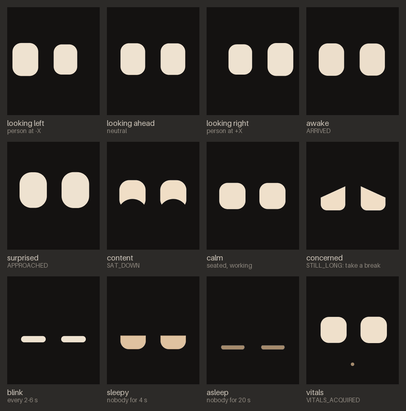

# The face

Marvin's face is two eyes on the 1.69" screen behind the smoked acrylic window. They are calm and
simple on purpose: rounded rectangles, lids that close over them, a gaze that follows you. The
reference implementation lives in [`host/marvin_host/face.py`](../host/marvin_host/face.py) (with
the rasterizer in [`raster.py`](../host/marvin_host/raster.py)); the firmware runs a 1:1 C++ port
of it, checked frame by frame against Python (see [On the robot](#on-the-robot-the-c-port)).

<p align="center">
  
</p>

Regenerate the pictures with `python host/scripts/face_preview.py --gif` (needs Pillow). The GIF,
[`images/face_demo.gif`](images/face_demo.gif), plays a short scenario: someone arrives, comes
close, sits down, gets a break reminder, leaves, and the robot falls asleep (the last part is
sped up four times).

## Screen

| | |
|---|---|
| Panel | ST7789 IPS, 240 × 280 px, portrait, RGB565 |
| Origin | top-left; screen x to the right **as seen from the front** (device +X), y down |
| Centre | device frame (0, −38, 92) mm, facing −Y (planned) |
| Window | 2.3 mm smoked acrylic: dark background, bright shapes. Pure black disappears behind the glass, so the background is a very dark warm grey. |

## Colours

| Name | RGB | RGB565 | Use |
|---|---|---|---|
| `BACKGROUND` | (20, 18, 17) | `0x1082` | background, and every lid (lids are drawn in the background colour) |
| `EYE_WHITE` | (236, 230, 218) | `0xEF3B` | eyes, `warmth = 0` |
| `EYE_AMBER` | (255, 190, 120) | `0xFDEF` | eyes, `warmth = 1` (sleepy, asleep) |
| `ACCENT` | (238, 118, 38) | `0xEBA4` | the vitals dot; the same orange as the knob |

Eye colour = `BACKGROUND + brightness × (lerp(EYE_WHITE, EYE_AMBER, warmth) − BACKGROUND)`.

## Primitives

Everything is drawn with four calls, available in TFT_eSPI and LovyanGFX:

| Reference (`raster.Canvas`) | Device | Used for |
|---|---|---|
| `fill_round_rect(cx, cy, w, h, r)` | `fillRoundRect` | the eye |
| `fill_quad(4 points)` | 2 × `fillTriangle` | the upper lid |
| `fill_ellipse(cx, cy, rx, ry)` | `fillEllipse` | the lower lid |
| `fill_circle(cx, cy, r)` | `fillCircle` | the vitals dot |

The reference anti-aliases edges (coverage from a signed distance). The firmware does not use a
graphics library: its port of the rasterizer draws the same shapes with the same anti-aliasing into
a 240 × 280 RGB565 framebuffer (≈ 134 kB, in PSRAM) and pushes only what changed.

## Drawing one frame

Given the current `FaceParams p`, the gaze offset `(gx, gy)` in pixels and the blink closure `b`:

```
fill(BACKGROUND)
lean = clamp(gx / GAZE_X_PX, -1, 1)
openness = p.open * (1 - b)
for side in (-1, +1):                       # left eye, right eye (as seen from the front)
    k = 1 + side * PERSPECTIVE * lean       # the eye on the gaze side is slightly bigger
    w, h = p.width * k, p.height * k
    cx = EYE_CX + side * p.spacing / 2 + gx
    h_eff = max(CLOSED_H, h * openness)
    cy = EYE_CY + p.dy + gy + (h - h_eff) * CLOSE_DROP     # eyes close towards a low line
    top, bottom = cy - h_eff / 2, cy + h_eff / 2
    fillRoundRect(cx, cy, w, h_eff, min(p.radius * k, w/2, h_eff/2), eye colour)
    if p.lid_top > 0 and h_eff > CLOSED_H:  # upper lid: everything above a tilted line
        y_mid = top + p.lid_top * h_eff;  s = p.lid_tilt * h_eff / 2
        inner x = cx - side * (w/2 + LID_MARGIN), y = y_mid - s
        outer x = cx + side * (w/2 + LID_MARGIN), y = y_mid + s
        quad (inner, top - LID_MARGIN) (outer, top - LID_MARGIN) (outer, y) (inner, y) in BACKGROUND
    if p.lid_bottom > 0 and h_eff > CLOSED_H:   # lower lid: an ellipse rising from below
        fillEllipse(cx, bottom - p.lid_bottom * h_eff + 0.5 * h_eff, 0.56 * w, 0.5 * h_eff, BACKGROUND)
if accent > 0: fillCircle(ACCENT_POS, ACCENT_R, blend(BACKGROUND, ACCENT, accent))
```

Layout constants: `EYE_CX = 120`, `EYE_CY = 146`, `CLOSED_H = 5`, `CLOSE_DROP = 0.35`,
`PERSPECTIVE = 0.06`, `LID_MARGIN = 3`, `ACCENT_POS = (120, 228)`, `ACCENT_R = 4.5` (px).

## Expressions (`FaceParams`)

Sizes in pixels; lid values are fractions of the visible eye height; `lid_tilt > 0` lowers the
upper lid on the outer side of each eye.

| Expression | width | height | radius | spacing | dy | open | lid_top | lid_tilt | lid_bottom | brightness | warmth | When |
|---|---|---|---|---|---|---|---|---|---|---|---|---|
| `neutral` | 64 | 82 | 22 | 104 | 0 | 1 | 0 | 0 | 0 | 1 | 0.1 | present, standing |
| `awake` | 66 | 88 | 24 | 106 | 0 | 1 | 0 | 0 | 0 | 1 | 0.1 | ARRIVED, 1.6 s |
| `surprised` | 72 | 94 | 32 | 110 | −4 | 1 | 0 | 0 | 0 | 1 | 0.1 | APPROACHED, 1.0 s |
| `attentive` | 60 | 88 | 20 | 104 | 0 | 1 | 0 | 0 | 0 | 1 | 0.1 | STOOD_UP, 2.0 s |
| `content` | 68 | 76 | 26 | 106 | 0 | 1 | 0 | 0 | 0.36 | 1 | 0.2 | SAT_DOWN, 3.5 s |
| `calm` | 68 | 68 | 22 | 104 | 2 | 1 | 0 | 0 | 0 | 1 | 0.15 | present, seated |
| `concerned` | 64 | 80 | 16 | 104 | 0 | 1 | 0.4 | 0.4 | 0 | 1 | 0.2 | STILL_LONG, 7.0 s |
| `sleepy` | 66 | 74 | 22 | 104 | 4 | 1 | 0.55 | 0 | 0 | 0.9 | 0.45 | nobody for 4–20 s |
| `asleep` | 60 | 74 | 22 | 104 | 14 | 0 | 0 | 0 | 0 | 0.7 | 0.9 | nobody for 20 s |

A blink is not an expression: it multiplies `open` by `1 − b`.

## Animation rules

**Smoothing.** Every `FaceParams` field and the gaze move with a critically damped spring,
stepped exactly so it is stable at any frame rate:

```
e = exp(-w dt);  x0 = x - target;  c = v + w x0
x = target + (x0 + c dt) e;        v = (v - w c dt) e
```

| Spring | w (rad/s) |
|---|---|
| Expression change | 7 |
| Falling asleep, getting sleepy | 1.6 |
| Opening from closed (wake-up) | 9 |
| Gaze following a person | 16 |
| Glances and micro-saccades | 24 |

**Gaze.** With `d = head − screen centre` (device frame, mm):
`yaw = atan2(d.x, max(−d.y, 1))`, `pitch = atan2(d.z, hypot(d.x, d.y))`, then
`gx = 28 × clamp(yaw / 50°, −1, 1)` and `gy = −22 × clamp(pitch / 60°, −1, 1)` pixels. A person at
+X therefore moves the eyes to the right of the screen as seen from the front, and a head above
the screen moves them up. Without a head estimate, the body position is used with an assumed
head height of 400 mm (seated) or 950 mm (standing) above the desk. When engaged, a
micro-saccade of up to ±3 px (±1.8 px vertically) is added every 0.8–2.8 s.

**Idle glances.** Present but farther than 2.2 m, or no position: the eyes look 60 % of the way to
the person and glance around (±80 % horizontally) every 1.2–3.5 s, for 0.5–1.4 s each.

**Blinks.** Every 2–6 s (uniform), 15 % of them doubled. A blink closes in 0.07 s, holds 0.04 s and
opens in 0.13 s, with smoothstep easing. The slow, deliberate blink is 0.35 / 0.30 / 0.55 s; it
is used when sleepy, twice on STILL_LONG and once on VITALS_ACQUIRED. No blinks while asleep.

**Sleep.** Counted from the moment nobody is present (or LEFT): 0–4 s the eyes look where the
person went, then the other way, then back (`neutral`); 4–20 s `sleepy`; after 20 s `asleep`. While
asleep, the closed-eye lines "breathe": brightness × (1 − 0.25 × (0.5 − 0.5 cos(2πt / 5.5 s))).
The face starts asleep and wakes as soon as someone is present, with a single blink 0.7 s later.

**Vitals cue.** On VITALS_ACQUIRED, the orange dot fades in (time constant 0.4 s) for 5 s,
pulsing at the heart rate (60 bpm if unknown) between 45 % and 100 % opacity; VITALS_LOST stops it.

**Randomness.** A seeded xorshift32 (`XorShift32` in face.py): seeded with `state = (seed × 2654435761 + 0x9E3779B9) mod 2³²` (0 replaced by 0x6D2B79F5), then `x ^= x << 13; x ^= x >> 17;
x ^= x << 5`, uniform = `lo + (hi − lo) × x / 2³²`. The same seed and the same calls give the same
frames, which the tests rely on.

## How the host drives the face

```python
from marvin_host.face import Face

face = Face(seed=0)
for event in brain_events:          # marvin_host.events.Event
    face.on_event(event)            # queued, applied at the next update
frame = face.update(state, t)       # PresenceState, t in seconds (caller's monotonic clock)
# frame: (280, 240, 3) uint8 RGB; face.expression: the current expression name
```

`update` never reads the wall clock: the caller supplies time, so recordings and simulations
replay exactly. Event timestamps (`t_us`, device clock) are not used; an event takes effect at the
next `update`. On the robot, the host sends the events and a compact state (below) and the firmware
runs the same logic at the display rate.

## On the robot: the C++ port

[`firmware/src/face/`](../firmware/src/face) holds the port. Everything but the screen driver is
portable C++ (no Arduino), built and tested on the PC:

| File | Role |
|---|---|
| `raster.{h,cpp}` | `raster.py`: the four primitives and their anti-aliasing, drawn row by row into the RGB565 framebuffer; returns the rectangle that changed |
| `face.{h,cpp}` | `face.py`: constants, `FaceParams` table, springs, xorshift32, blinks, expressions, events, gaze |
| `face_link.{h,cpp}` | Decodes `FACE_STATE` / `FACE_EVENT`; runs the face alone when the host is silent |
| `display_st7789.{h,cpp}` | ST7789 init and pixel push (ESP32 + Arduino only) |
| `face_app.{h,cpp}` | What `main.cpp` calls: `face_app::begin()`, `face_app::on_message()` (boards built with `-DMARVIN_HAS_SCREEN`) |

**Parity with Python.** The rasterizer follows `raster.py` operation by operation in single
precision (numpy float32) and the behaviour follows `face.py` in double precision, with the same
random draws in the same order. [`host/scripts/face_golden.py`](../host/scripts/face_golden.py)
plays a 49 s scenario (seed 7: arrival, approach, sitting down, vitals cue, break reminder, standing
up, walking away, sleep, waking up again; 973 frames) through the Python face and writes the CRC-32
of every RGB565 frame plus 7 complete frames (9 kB, run-length encoded) into
[`firmware/test/test_face/`](../firmware/test/test_face). The Unity test replays it:

| Distance maths | Frames bit-exact | Complete frames: pixels that differ | Max difference |
|---|---:|---:|---:|
| exact (`hypotf`, as numpy; default on the PC) | 973 / 973 | 0 | 0 |
| fast (`sqrtf(x² + y²)`; default on the ESP32) | 967 / 973 | 0 | 0 |

The test allows at most 0.5 % of the pixels to differ, by at most 2 LSB per RGB565 channel.
Natively, a frame renders in about 0.5 ms.

```bash
cd host && python scripts/face_golden.py      # after changing face.py or raster.py
cd firmware && pio test -e native -f test_face
```

**Screen.** A small driver of our own, no graphics library: the face already renders into its own
framebuffer, so the panel needs only an init sequence, a window command and a pixel stream.
Arduino-ESP32's `SPIClass::writePixels` feeds the SPI FIFO from the CPU, so the framebuffer can live
in PSRAM with no DMA constraint. SPI2 at 40 MHz (GPIO7 and GPIO9 go through the GPIO matrix;
`-DMARVIN_TFT_SPI_HZ=80000000` usually works with short wires), row offset 20 (the 240 × 280 panel
sits inside the controller's 240 × 320), colour inversion on (IPS). Only the changed rectangle is
sent: nothing at all when the face is still, the eyes' area (under 10 ms) when they move, and about
30 ms for a full frame. The face runs in its own FreeRTOS task on core 0 at 30 fps, so rendering
and SPI never block the main loop.

**Host messages.** `FACE_STATE` (0x82, 17 bytes, 10 Hz: present, seated, head and position in mm,
distance, heart rate) and `FACE_EVENT` (0x83, one byte per event); see
[protocol.md](protocol.md#face-messages). On the host, [`link.py`](../host/marvin_host/link.py)
sends them to every robot with a screen.

**Alone.** With no `FACE_STATE` for 5 s (the host stopped, Wi-Fi dropped) or before the first one,
the face is told nobody is there: it looks around, gets sleepy after 4 s and falls asleep after
20 s, breathing slowly. It never freezes, and wakes up when the host comes back with someone
present.
