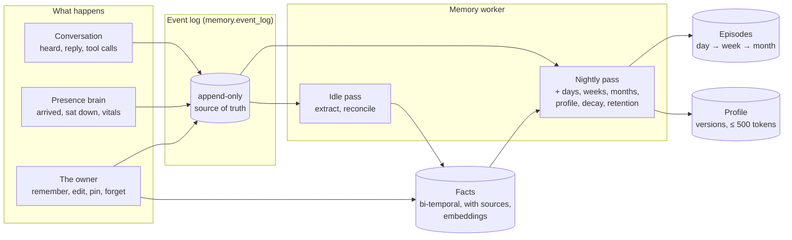
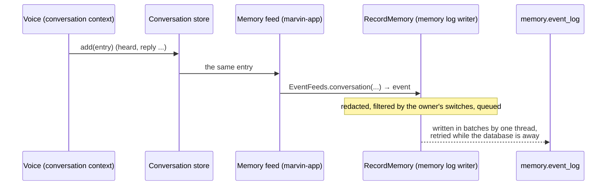
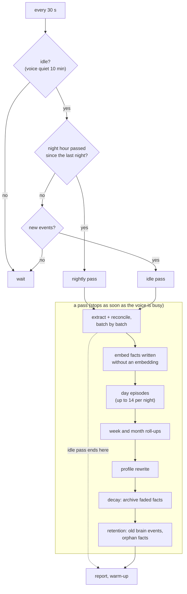

<!-- SPDX-License-Identifier: CC-BY-4.0 -->
# Marvin's memory

How Marvin remembers, for a reader of the repository. The design is [design.md, section 5](design.md#5-memory);
this page describes what the Java host does today and where to find it. The engineering decisions and known gaps
of each stage are in [host-java/NOTES.md](../host-java/NOTES.md) ("Memory v1").

Memory is its own bounded context, `memory`: `marvin.host.domain.memory` (the rules, plain Java),
`marvin.host.application.memory` (the use cases and their ports), its own PostgreSQL schema `memory` with its own
Flyway history. The conversation and the presence brain know nothing of it: they are read through their ports, and
memory reaches the world (the database, Ollama, the voice) only through its own.

## In one picture



What is **not** built yet: the read path (the context assembler that puts memory into the voice's prompt, and the
`recall` tool), the Memory screen of the new app, the Soul, procedures, connectors and background tasks. The profile
is written and versioned, but no prompt reads it yet.

## The event log

Everything memory knows comes from one append-only table, `memory.event_log`: when it happened (`ts`), where it comes
from (`source`: `conversation`, `brain`, `owner`), what it is (`kind`), a sensitivity label, a human-readable `body`,
structured `data`, and `external_ref`, the original's id (`conversation:<entry id>`, `presence:<event id>`).
`(source, external_ref)` is unique: the same record fed twice is kept once, which is what makes the backfill safe to
run beside the live feed.



- **Feeds.** `marvin-app` plugs the conversation store (a decorator around it) and the presence history (a listener)
  into memory's `RecordMemory` port; `EventFeeds` (domain) turns their plain values into events. The voice's thread
  only queues: it never waits for the database.
- **What is kept.** Heard and reply lines (with language, source, tool calls, errors; not the context and prompt the
  conversation keeps for its inspector). Brain events except the host's own markers (`host_started` ...). Owner
  actions. Notes and ignored utterances are not kept.
- **Labels at the source** (design 5.7): vital signs are `sensitive` by rule; conversation lines start `normal`.
- **Secrets are never stored**: card numbers (Luhn-checked), IBANs, and values said after "password", "PIN", "code",
  "mot de passe", "digicode" ... are replaced by `[redacted]` before an event is written (`Redaction`). When the
  extraction model labels a fact `secret` that the rules missed, the fact is dropped and the owner's line is redacted
  harder (every word of four or more characters with a digit).
- **Switches per source** (design 2.3): `collect_conversation` and `collect_brain`. The conversation's own history is
  kept either way; the switch only decides what memory learns from.
- **Backfill.** At start, once per source (`memory.state` remembers it), the conversation and presence histories kept
  before memory existed are read in pages through their contexts' ports (`ConversationHistory.after`,
  `PresenceHistory.after`) and appended the same way.

## Facts, on two clocks

A fact is one English sentence about a subject (`owner`, `person:<name>`, `place:<name>`, `thing:<name>`), with a
kind, an importance (1–10), a confidence, a sensitivity, its sources (the event ids it came from, `fact_source`) and
an embedding. Facts are in English whatever the conversation's language: one embedding space, one set of prompts.

Following Graphiti, a fact carries **two times**:

| | from | to |
|---|---|---|
| **World time**: when it was true | `valid_from` | `valid_to` |
| **Our time**: when memory believed it | `learned_at` | `expired_at` |

```mermaid
stateDiagram-v2
  direction LR
  [*] --> current: ADD (learned_at = now)
  current --> superseded: UPDATE (new wording, new version;<br/>expired_at, superseded_by)
  current --> ended: INVALIDATE (the world changed;<br/>valid_to = world time, expired_at = now)
  current --> archived: decay (nightly), not pinned
  archived --> current: the owner un-archives
  current --> [*]: the owner forgets it
```



"Lives in Lyon" learned in March, then "moved to Lille in August" learned in September: the Lyon fact gets
`valid_to` = August (the world's time) and `expired_at` = September (ours). Nothing is deleted:

- *Where does the owner live?* The current facts: Lille.
- *Where did the owner live in June?* `FactStore.asOf(June, now)`: Lyon, a true record of its time.
- *What did memory believe in early September?* `asOf(early September, early September)`: Lyon, for then, because
  the end was only learned later.

An updated wording is a new version: the old one gets `superseded_by` and is no longer a record of anything; the
versions stay readable (`ManageFacts.get` returns them).

## The worker

`MemoryWorker` checks every 30 seconds whether a pass is due:

- **Idle pass**: nobody has talked with Marvin for `idle_minutes` (10) and the voice is neither listening, thinking
  nor speaking. It reads the events no pass has read yet.
- **Nightly pass**: from `night_hour` (03:00, local time) at the first idle moment after it, so a Mac that sleeps at
  night does it in the morning. It does the idle pass first.
- **Consolidate now**: the app (`POST /api/memory/consolidate`, `{"pass": "idle"}` or `"nightly"`) starts one at
  once; it still gives way to the voice.



**Extraction and reconciliation** (design 5.2, steps 1 to 3). The new conversation lines are cut into batches: a
conversation is a run of lines with no silence longer than 10 minutes, at most 40 lines. For each batch:

1. The model reads the batch (each line with its local date and time), the current profile and "now" (the batch's
   last line), and returns candidate facts as JSON (Ollama's structured output, the schema in `format`). Relative
   dates ("demain", "next Tuesday") resolve against the line that says them.
2. Each candidate is checked (`FactCandidate.check`): secrets dropped, subject normalised, numbers clamped, dates
   parsed; health and money are `sensitive` by rule whatever the model said.
3. Each candidate is embedded and compared with the 10 most similar current facts (pgvector) and with the batch's
   earlier candidates. With nothing similar enough, it is added without asking the model; otherwise the model picks
   `ADD`, `UPDATE` (merged wording), `INVALIDATE` (with the date it stopped being true) or `NOOP` (the events become
   more sources of the known fact).
4. The owner's word wins (`Reconciliation`): a pinned fact is never changed by extraction (the candidate is added
   beside it), an owner-written fact is never reworded.
5. The plans are written in order and the batch's events marked read. A batch is all or nothing: a pass cut short by
   the voice writes nothing of the batch in progress; the next pass does it again.

**Episodes**: a day's summary from its events (sensitive ones left out, at most about 3500 tokens of input, 200
words out); a week's from its days; a month's from the weeks that start in it. Forgetting events marks the episodes
that covered them `stale`; the next night rewrites them.

**Profile** (design 5.2, step 5): rewritten, not appended, from the previous version, the facts learned and ended
since, and the owner's kept lines, which every rewrite keeps verbatim (`ProfileText.enforce`: kept lines first, then
the model's, cut from the end to fit 500 estimated tokens). Sensitive facts never enter the profile: it will be in
every prompt, whoever is in the room. Every rewrite is a new version in `memory.block_version` with its evidence (the
events behind the facts); the owner can edit it (their changed lines become kept lines), pin lines, or restore any
version. Nothing is rewritten when nothing changed, so the voice's cached prompt survives quiet nights.

**Decay** (step 6): a fact's strength is its importance halved every `14 × importance` days since it was last used
(or learned); below 0.05 it is archived (out of automatic retrieval, still found by `recall`, never deleted). Pinned
facts and the owner's own never fade.

**Retention** (step 7): brain events older than `retention_days` (365) are deleted once their day is summarised,
unless a fact came from them. The conversation is kept until the owner forgets it.

## Models and latency

- **Embeddings**: Ollama `/api/embed`, `bge-m3` by default (1024 dimensions, multilingual: a French question finds an
  English fact). The size is fixed when the tables are made (`marvin.memory.embedding-dimensions`); a model with
  another size is refused with a clear message. A missing model is reported in `/api/health` with its fix,
  `ollama pull bge-m3`; the owner's `remember` still works (the fact is embedded by the next nightly pass).
- **The memory model** (`memory_model`, empty: the voice's model, already loaded) does the idle pass; the
  **night model** (`night_model`, empty: the memory model) the nightly one: a larger local model is better at
  extraction and the night has time (for example `qwen3:27b` on a 64 GB Mac).
- **The voice comes first.** Memory's requests use the voice's context size (`num_ctx` 8192: a different one would
  reload the model) and `temperature` 0; they are streamed so that the call in flight is abandoned (and Ollama stops)
  as soon as the voice becomes busy. A request to the voice's own model evicts the voice's cached prompt, so after a
  pass that used it, or changed the profile, the voice rehearses its first question again (`VoiceControl.rewarm`).
- Prompts are resources, versioned: `marvin-adapter-llm/src/main/resources/marvin/memory/prompts/v1/`. Each fact
  records the prompt version and the model that wrote it (`extracted_by`).

## Storage without pgvector

With Docker, PostgreSQL has pgvector: embeddings are `vector(1024)` with an HNSW index (cosine). The embedded
PostgreSQL (no Docker) has no pgvector: the same migration makes `real[]` columns, and the nearest facts are found by
comparing every candidate in Java, exact and fast enough for the thousands of facts one home gathers. `/api/health`
says which (`memory: ... exact cosine scan (no pgvector)`). A database made without pgvector keeps its `real[]`
columns if pgvector appears later.

## The owner's control

`ManageFacts` (list, sources, versions, remember, edit, pin, archive), `ForgetMemory`, `BrowseMemory` (profile,
versions with diffs, episodes, the raw log), `ExportMemory` (every table as JSON and a readable Markdown),
`ConfigureMemory` (the settings above) and `MemoryHealth`. Every change is an owner event in the log first, so the
worker never undoes it.

**Forgetting is real** (design 2.2). Forgetting a fact deletes it with all its versions and removes the profile lines
that state it (a new profile version, at once, not only at the next rewrite); the owner event it leaves has no
content. Forgetting events deletes them; the facts that came only from them go too, and the episodes that covered
them are rewritten the next night. "Forget everything" empties memory's schema (the conversation's own history is the
conversation's).

## The evaluation set

`marvin-adapter-llm/src/test/resources/memory-eval/cases.json`: a dozen short conversations in French and English
(a home, a move, a sister, small talk, tomorrow's plan, a preference, a pet, a PIN, a health matter, an update, a
known fact, a habit, Marvin's own advice), with the facts a good extraction finds and the operation expected against
facts already known. `MemoryEvaluationTest` runs them through the real prompts, adapters and consolidator and
reports precision, recall, operations, dates and sensitivity (`target/memory-eval-report.txt`).

By default it runs against the stub Ollama with scripted answers: that checks the harness, not a model. To measure a
model, on the machine that runs Ollama:

```bash
cd host-java
MARVIN_EVAL_OLLAMA=http://localhost:11434 MARVIN_EVAL_MODEL=qwen3:4b-instruct MARVIN_EVAL_EMBED=bge-m3 \
  ./mvnw -q -pl marvin-adapter-llm -am test -Dtest=MemoryEvaluationTest -Dsurefire.failIfNoSpecifiedTests=false
cat marvin-adapter-llm/target/memory-eval-report.txt
```

Add `MARVIN_EVAL_MIN_RECALL=0.7` (and `MARVIN_EVAL_MIN_PRECISION`) to make it fail below a score. Change the prompts
only with a report before and after.

## Where the code is

| What | Where |
|---|---|
| Rules (candidates, reconciliation, profile, decay, redaction, feeds, settings) | `marvin-domain/.../domain/memory/` |
| Use cases: log feed, consolidator, worker, nightly pass, owner control, export | `marvin-application/.../application/memory/` |
| Ports | `application/memory/port/in`, `application/memory/port/out` |
| Schema | `marvin-adapter-persistence/src/main/resources/db/migration/memory/` |
| Stores | `JdbcEventLog`, `JdbcFactStore`, `JdbcEpisodeStore`, `JdbcProfileStore`, `JdbcMemoryState` |
| Ollama | `OllamaMemoryModel`, `OllamaEmbedder`, prompts in `marvin/memory/prompts/v1/` |
| Wiring, feeds, voice activity | `marvin-app/.../MemoryWiring`, `MemoryFeeds`, `VoiceActivityTracker` |
| Tests | domain `*Test`; application `memory/*Test` with in-memory stores (`memory/testing`, shared as a test jar); `MemoryStoresIT` (SQL, with and without pgvector); `OllamaMemoryModelTest`, `MemoryEvaluationTest`; `MemoryEndToEndIT` (the whole host) |
