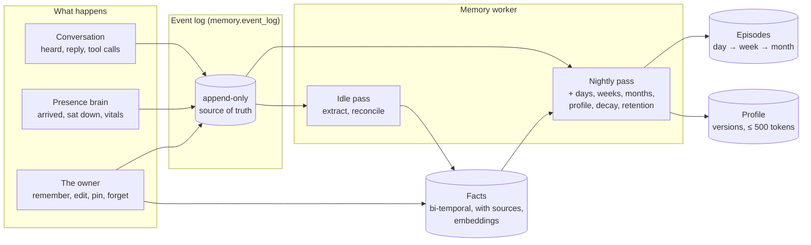
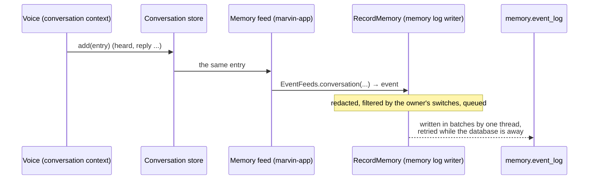
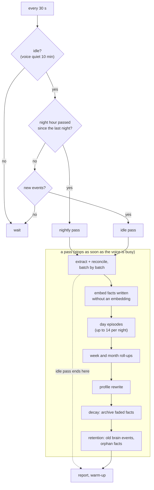
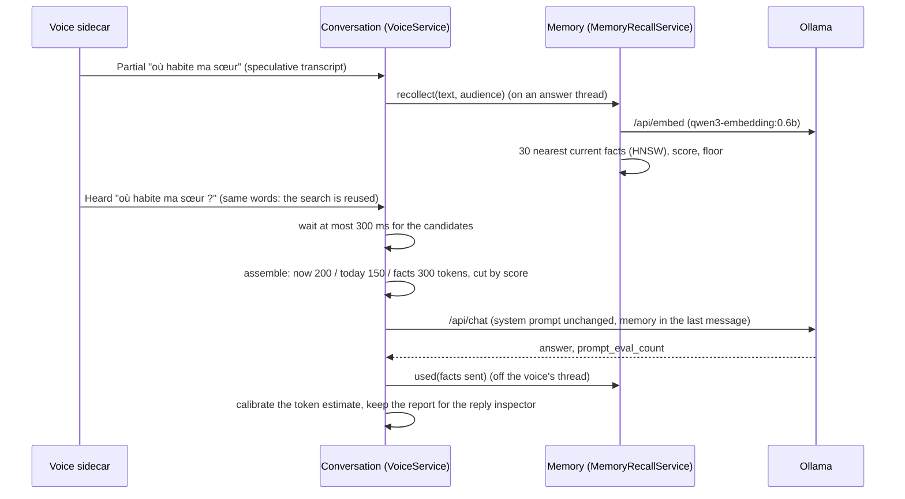
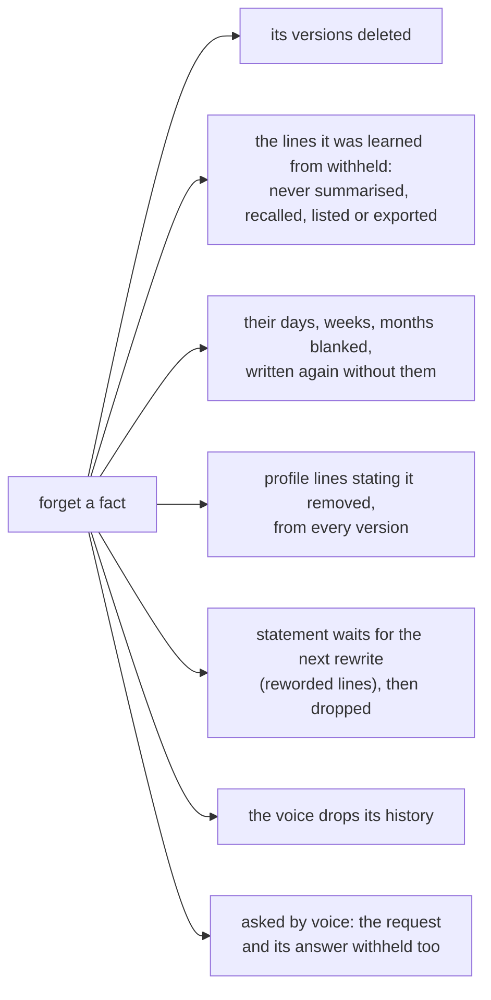

<!-- SPDX-License-Identifier: CC-BY-4.0 -->
# Marvin's memory

How Marvin remembers, for a reader of the repository. The design is [design.md, section 5](design.md#5-memory);
this page describes what the Java host does today and where to find it. The engineering decisions and known gaps
of each stage are in [host-java/NOTES.md](../host-java/NOTES.md) ("Memory v1").

Memory is its own bounded context, `memory`: `marvin.host.domain.memory` (the rules, plain Java),
`marvin.host.application.memory` (the use cases and their ports), its own PostgreSQL schema `memory` with its own
Flyway history. The conversation and the presence brain know nothing of it: they are read through their ports, and
memory reaches the world (the database, Ollama, the voice) only through its own.

## In one picture



What is **not** built yet: the read path (the context assembler that puts memory into the voice's prompt, and the
`recall` tool), the Memory screen of the new app, the Soul, procedures, connectors and background tasks. The profile
is written and versioned, but no prompt reads it yet.

## The event log

Everything memory knows comes from one append-only table, `memory.event_log`: when it happened (`ts`), where it comes
from (`source`: `conversation`, `brain`, `owner`), what it is (`kind`), a sensitivity label, a human-readable `body`,
structured `data`, and `external_ref`, the original's id (`conversation:<entry id>`, `presence:<event id>`).
`(source, external_ref)` is unique: the same record fed twice is kept once, which is what makes the catch-up safe to
run beside the live feed.



- **Feeds.** `marvin-app` plugs the conversation store (a decorator around it) and the presence history (a listener)
  into memory's `RecordMemory` port; `EventFeeds` (domain) turns their plain values into events. The voice's thread
  only queues: it never waits for the database.
- **Catch-up** (the in-process equivalent of an outbox): at every start and every ten minutes, each source is read
  after its high-water mark (`feed:<name>` in `memory.state`), so what the live feed missed (a full queue, a crash) still
  arrives; the first time, that is the whole past. What the owner forgot from the log is recorded as time ranges and
  references only (`forgotten_feed`), and a catch-up never brings it back.
- **What is kept.** Heard and reply lines (with language, source, tool calls, errors; not the context and prompt the
  conversation keeps for its inspector). Brain events except the host's own markers (`host_started` ...). Owner
  actions. Notes and ignored utterances are not kept.
- **Labels at the source** (design 5.7): vital signs are `sensitive` by rule; conversation lines start `normal`, and
  become `sensitive` when a sensitive fact is learned from their conversation (the whole batch: the fact's sources).
- **Secrets are never stored**: card numbers (Luhn-checked), IBANs, and values said after "password", "PIN", "code",
  "mot de passe", "digicode" ... are replaced by `[redacted]` before an event is written (`Redaction`). When the
  extraction model labels a fact `secret` that the rules missed, the fact is dropped and the owner's line is redacted
  harder (every word of four or more characters with a digit).
- **Switches per source** (design 2.3): `collect_conversation` and `collect_brain`. The conversation's own history is
  kept either way; the switch only decides what memory learns from.
- **Backfill.** At start, once per source (`memory.state` remembers it), the conversation and presence histories kept
  before memory existed are read in pages through their contexts' ports (`ConversationHistory.after`,
  `PresenceHistory.after`) and appended the same way.

## Facts, on two clocks

A fact is one English sentence about a subject (`owner`, `person:<name>`, `place:<name>`, `thing:<name>`), with a
kind, an importance (1–10), a confidence, a sensitivity, its sources (the event ids it came from, `fact_source`) and
an embedding. Facts are in English whatever the conversation's language: one embedding space, one set of prompts.

Following Graphiti, a fact carries **two times**:

| | from | to |
|---|---|---|
| **World time**: when it was true | `valid_from` | `valid_to` |
| **Our time**: when memory believed it | `learned_at` | `expired_at` |

```mermaid
stateDiagram-v2
  direction LR
  [*] --> current: ADD (learned_at = now)
  current --> superseded: UPDATE (new wording, new version;<br/>expired_at, superseded_by)
  current --> ended: INVALIDATE (the world changed;<br/>valid_to = world time, expired_at = now)
  current --> archived: decay (nightly), not pinned
  archived --> current: the owner un-archives
  current --> [*]: the owner forgets it
```



"Lives in Lyon" learned in March, then "moved to Lille in August" learned in September: the Lyon fact gets
`valid_to` = August (the world's time) and `expired_at` = September (ours). Nothing is deleted:

- *Where does the owner live?* The current facts: Lille.
- *Where did the owner live in June?* `FactStore.asOf(June, now)`: Lyon, a true record of its time.
- *What did memory believe in early September?* `asOf(early September, early September)`: Lyon, for then, because
  the end was only learned later.

An updated wording is a new version: the old one gets `superseded_by` and is no longer a record of anything; the
versions stay readable (`ManageFacts.get` returns them).

## The worker

`MemoryWorker` checks every 30 seconds whether a pass is due:

- **Idle pass**: nobody has talked with Marvin for `idle_minutes` (10) and the voice is neither listening, thinking
  nor speaking. It reads the events no pass has read yet.
- **Nightly pass**: from `night_hour` (03:00, local time) at the first idle moment after it, so a Mac that sleeps at
  night does it in the morning. It does the idle pass first.
- **Consolidate now**: the app (`POST /api/memory/consolidate`, `{"pass": "idle"}` or `"nightly"`) starts one at
  once; it still gives way to the voice.



**Extraction and reconciliation** (design 5.2, steps 1 to 3). The new conversation lines are cut into batches: a
conversation is a run of lines with no silence longer than 10 minutes, at most 40 lines. For each batch:

1. The model reads the batch (each line with its local date and time), the current profile and "now" (the batch's
   last line), and returns candidate facts as JSON (Ollama's structured output, the schema in `format`). Relative
   dates ("demain", "next Tuesday") resolve against the line that says them.
2. Each candidate is checked (`FactCandidate.check`): secrets dropped, subject normalised, numbers clamped, dates
   parsed; health and money are `sensitive` by rule whatever the model said.
3. Each candidate is embedded and compared with the 10 most similar current facts (pgvector) and with the batch's
   earlier candidates. With nothing similar enough, it is added without asking the model; otherwise the model picks
   `ADD`, `UPDATE` (merged wording), `INVALIDATE` (with the date it stopped being true) or `NOOP` (the events become
   more sources of the known fact).
4. The owner's word wins (`Reconciliation`): a pinned fact is never changed by extraction (the candidate is added
   beside it), an owner-written fact is never reworded.
5. The plans are written in one transaction and the batch's events marked read. A batch is all or nothing: a pass cut
   short by the voice writes nothing of the batch in progress; the next pass does it again.
6. **The owner meanwhile.** The model calls take seconds; the owner may forget, correct or pin in the meantime. Every
   owner change runs under `MemoryGuard` and moves its generation on; the batch is written only if the generation is
   the one read before the model calls, and only if every fact a plan ends is still current (`FactStore.Conflict`)
   and every new fact keeps a source. Otherwise nothing is written and the batch is decided again from fresh facts.
   Episodes and profile versions are written the same way. Forgetting everything also stops the pass at once.
7. A sensitive fact makes the batch's lines `sensitive` (and blanks a day already summarised with them).
8. Without the embedding model, extraction does not start (nothing is lost: the events wait) and the rest of the
   nightly pass goes on; the report says `partial` with the fix.

**Episodes**: a day's summary from its events (sensitive and withheld ones left out, at most about 3500 tokens of
input, 200 words out); a week's from its days; a month's from the weeks that start in it. The days to write come from
the log (the days that have events after the last one done, `days_through` in the state), so a long gap does not stall
them. Forgetting events, or a fact, marks the episodes that covered them `stale` **and blanks their summary at once**:
nothing reads a stale summary; the next night rewrites it, or deletes it when nothing is left of its day. A summary the
model cannot write (unreadable output) is skipped and tried again one, two, then three nights later; the other days
and steps go on. Each nightly step runs on its own: one that fails does not keep decay or retention from running.

**Profile** (design 5.2, step 5): rewritten, not appended, from the previous version, the facts learned and ended
since, and the owner's kept lines, which every rewrite keeps verbatim (`ProfileText.enforce`: kept lines first, then
the model's, cut from the end to fit 500 estimated tokens). Sensitive facts never enter the profile: it will be in
every prompt, whoever is in the room. Every rewrite is a new version in `memory.block_version` with its evidence (the
events behind the facts); the owner can edit it (their changed lines become kept lines), pin lines, or restore any
version. Nothing is rewritten when nothing changed, so the voice's cached prompt survives quiet nights. Statements
the owner forgot, corrected, archived or made sensitive wait in the state (`profile_removals`) for the next rewrite,
run by the next pass (idle or nightly), which is told to remove every line stating them, even reworded; the lines it
took out for them leave the older versions too.

**Decay** (step 6): a fact's strength is its importance halved every `14 × importance` days since it was last used
(or learned); below 0.05 it is archived (out of automatic retrieval, still found by `recall`, never deleted). Pinned
facts and the owner's own never fade.

**Retention** (step 7): brain events older than `retention_days` (365) are deleted once their day is summarised,
unless a fact came from them. The conversation is kept until the owner forgets it.

## The read path: memory in the prompt

Memory reaches the conversation through one port, `MemoryContext` (in the conversation's
`application/conversation/port/out`), implemented in the boot module over memory's in-ports `RecallMemory` (the
profile, a question's candidates, `recall`) and `ConfirmForgetting` (forgetting after a yes). The conversation never
sees memory's types, memory never sees the conversation's.



**The prompt.** The system prompt is the persona, the memory tools' rules (when they are offered) and the profile.
It changes only with the tools and the profile's version, so from one question to the next it is byte-identical and
Ollama reuses its cached work. It does not name the language either (the Python host's persona does): the question's
message ends with "(Answer in French.)", so an owner who switches between French and English keeps the cache; a new profile version (the nightly rewrite, an edit in the app, a
forgotten fact's line removed) warms the voice up again with the new system prompt. Everything that changes at each
question goes into the last user message:

```
Context:                                            ← "now", 200 tokens: clock, sensors, presence
- It is Tuesday 29 September 2026, 14:03 (local time).
- ...

Earlier (summaries from your memory):               ← "today", 150 tokens: today's and yesterday's day summaries
- Yesterday: The owner worked from home.

What you remember that may matter here (...):       ← "facts", 300 tokens: the best retrieved facts
- The owner's sister Claire lives in Lyon.
- The owner flies to Oslo. (from 12 October 2026)

The person says: où habite ma sœur ?

(Answer in French.)
```

A section that keeps nothing is left out; without memory the message is exactly what it was before memory existed.
The history keeps its past context blocks (they are part of the cached prefix) within a 2500-token budget: when it
grows over it, the older half of the turns goes at once, so the prefix changes rarely.

**Budgets.** Each section has a hard budget in estimated tokens (`ContextAssembler`). When a section's candidates do
not fit, the lowest-scored go first, whatever their position; what is kept is shown in its own order. The memory
sections ("today so far" and the facts) also share one budget, `marvin.memory.volatile-budget` (250 tokens by
default), filled by score across both: it bounds what memory adds to every question's prompt evaluation, which is what
memory costs the first word. The "now"
lines are scored by what matters most: the clock, then whether the sensors are simulated or missing, whether someone
is there, vital signs, how long they sat, and last the home place and the recent events.

**Token counts.** Java has no Qwen tokenizer: a characters-per-token ratio per language, with a 10 % margin
(`LanguageTokens`). It starts at a cautious 3.5 and is calibrated from each answer's `prompt_eval_count`: with the
prompt cache, Ollama counts only what it evaluated again, which is the messages after those the previous request
shared (the new question and the previous answer), plus the chat template's few tokens per message. A measurement
that gives an implausible ratio (outside 1.5 to 8 characters per token) is ignored.

**Retrieval scoring** (`RetrievalScoring`, after Generative Agents): over the 30 nearest facts that are current, not
archived and allowed for the audience,

```
score = 1.0 · relevance + 0.5 · recency + 0.7 · importance
relevance  = cosine, min-max normalised over the candidates
recency    = 0.995 ^ hours since last used (or learned)
importance = importance / 10
```

and a relevance floor on the raw cosine (0.45, first set on bge-m3, where unrelated sentences scored about 0.3 to 0.45; to be checked on qwen3-embedding:0.6b with the evaluation below): an
empty section is better than noise. The facts that go into a prompt are marked used (`last_used_at`, `use_count`),
which keeps them from decaying.

**Who may hear it.** `sensitive` facts are never retrieved while the brain sees more than one person, and never for a
cloud model. The day summaries are written without sensitive events, and with a guest in the room a day that had
sensitive lines is left out entirely; `recall` returns neither sensitive facts, nor sensitive lines said, nor those days.
When a guest comes in, the conversation's history is dropped (it may hold memory sections retrieved while the owner was
alone), and so it is after anything is forgotten. With a guest, `remember` only makes a suggestion for the owner to
review, and a forget is confirmed only in the app.

**Latency.** The question's embedding is computed on the speculative transcript, while recognition finishes; the
final transcript reuses it when the words are the same. The question waits at most 300 ms for its candidates, then
goes without them (the reply inspector says so). The memory report of each reply (`memory` in the conversation entry)
shows the profile version, every section with its budget, tokens, and each candidate with its score, kept or not,
the timings, and Ollama's counts (`prompt_eval_count`, `prompt_eval_s`). The question's trace carries
`marvin.memory.embed_s`, `search_s`, `waited_s`, `timed_out` and `tokens`; each worker pass is a `marvin.memory.pass`
span with a `marvin.memory.step` per step.

## The memory tools

Offered with `get_weather` in the same registry (switched off with the other tools), always the same short list, so
the tool block stays cached. They are local: offered without the internet.

| Tool | Does |
|---|---|
| `remember(statement)` | The owner said "remember that ...": written at once as the owner's fact, confidence 1, with an owner event as its source |
| `recall(query, period?)` | Facts (past and archived ones too, with their validity and where they came from), day summaries and what was said, as a short dated list; `period`: `today`, `yesterday`, `this_week`, `last_week`, `this_month`, `last_month`, `this_year` |
| `forget(query, confirm?)` | Lists the matching facts and gives a six-character code; nothing is forgotten until the owner says yes in a later turn (the model then calls it again with the code) or confirms in the app, where every pending proposal is listed. Once confirmed, the line that asked and Marvin's answer to it are withheld too: they repeat what is forgotten, and the next pass would learn it again from them |

A confirmation in the same turn as the proposal is refused ("the person has not confirmed yet"): the model cannot
forget on its own. Codes expire after five minutes and work once.

## The memory API

Same access rules as the rest of the API (the key, or a local client with a known Host; every `POST` is JSON from the
same origin, and listed in `AccessFilter.POST_PATHS`). Times are Unix seconds. Changes are pushed on the app's event
stream (`/api/stream`) as `memory` messages: `{"kind": "changed", "what": "facts" | "profile" | "log" | "all"}`, the
worker's state (`{"kind": "worker", ...}`), and pending forget proposals (`{"kind": "forget", "pending": n}`).

| Route | Does |
|---|---|
| `GET /api/memory` | Counts per filter, the active profile, the worker, the settings, pending forget proposals |
| `GET /api/memory/facts?filter=&q=&subject=&kind=&sensitivity=&limit=&offset=` | Facts: `all` (current, not archived), `pinned`, `suggested` (extracted, not reviewed), `archived`, `past`; with counts per filter |
| `GET /api/memory/facts/{id}` | A fact, its sources (quoted text, date, the conversation day and entry it was said in), its versions |
| `POST /api/memory/facts/remember` | `{"statement", "subject"?, "sensitivity"?}` |
| `POST /api/memory/facts/edit` | `{"id", "statement"?, "subject"?, "kind"?, "importance"?, "sensitivity"?}`: a new version by the owner |
| `POST /api/memory/facts/pin`, `.../archive`, `.../review` | `{"id", "pinned"}`, `{"id", "archived"}`, `{"ids" or "id", "reviewed"}` |
| `POST /api/memory/facts/forget` | `{"id"}` answers a code; `{"confirm": code}` forgets the fact and all its versions |
| `GET /api/memory/forget`, `POST .../forget/confirm`, `.../forget/cancel` | Pending proposals (by voice or in the app); confirm or drop one |
| `POST /api/memory/forget-everything` | `{}` answers a code and the phrase; `{"confirm", "phrase": "forget everything"}` empties memory |
| `GET /api/memory/profile`, `POST /api/memory/profile`, `POST .../profile/restore` | The profile and its versions with diffs; the owner's version (`content`, `kept_lines`); an older version made active again |
| `GET /api/memory/episodes?level=day\|week\|month&from=&to=` | Summaries, newest first |
| `GET /api/memory/log?q=&before=&limit=` | The raw log, newest first |
| `GET /api/memory/export?format=json\|markdown` | Everything, as a file |
| `GET /api/memory/settings`, `POST /api/memory/settings` | The settings, the per-source switches (`collect_conversation`, `collect_brain`) among them: a source switched off stops feeding the log at once |
| `GET /api/memory/worker`, `POST /api/memory/consolidate` | The worker (state, last passes, next night, models, embedding model), "Consolidate now" |

## Models and latency

- **Embeddings**: Ollama `/api/embed`, `qwen3-embedding:0.6b` by default (1024 dimensions, multilingual: a French question finds an
  English fact). The size is fixed when the tables are made (`marvin.memory.embedding-dimensions`); a model with
  another size is refused with a clear message. A missing model is reported in `/api/health` with its fix,
  `ollama pull qwen3-embedding:0.6b`; the owner's `remember` still works (the fact is embedded by the next nightly pass), while
  extraction waits for the model to be back.
- **The memory model** (`memory_model`, empty: the voice's model, already loaded) does the idle pass; the
  **night model** (`night_model`, empty: the memory model) the nightly one: a larger local model is better at
  extraction and the night has time (for example `qwen3:27b` on a 64 GB Mac).
- **The voice comes first.** Memory's requests use the voice's context size (`num_ctx` 8192: a different one would
  reload the model) and `temperature` 0; they are streamed, and a watcher closes the connection as soon as the voice
  becomes busy, even before the first chunk (while Ollama loads the model or reads the prompt), so Ollama stops at
  once. A request to the voice's own model evicts the voice's cached prompt, so after a pass that used it, or changed
  the profile, the voice rehearses its first question again (`VoiceControl.rewarm`), but never while someone talks
  with Marvin: the warm-up waits until the voice is idle, and a question abandons it.
- Prompts are resources, versioned: `marvin-adapter-llm/src/main/resources/marvin/memory/prompts/v1/`. Each fact
  records the prompt version and the model that wrote it (`extracted_by`).

## Storage without pgvector

With Docker, PostgreSQL has pgvector: embeddings are `vector(1024)` with an HNSW index (cosine). The embedded
PostgreSQL (no Docker) has no pgvector: the same migration makes `real[]` columns; the filter picks the candidate ids
and their vectors, read once into memory in the background at start, are compared in Java (exact). Measured with
3000 facts of 1024 numbers: about 28 ms a search (`MemoryStoresIT`). `/api/health`
says which (`memory: ... exact cosine scan (no pgvector)`). A database made without pgvector keeps its `real[]`
columns if pgvector appears later.

## The owner's control

`ManageFacts` (list, sources, versions, remember, edit, pin, archive, review), `ForgetMemory`, `ConfirmForgetting`
(forgetting only after a confirmation, see the tools above), `BrowseMemory` (profile,
versions with diffs, episodes, the raw log), `ExportMemory` (every table as JSON and a readable Markdown),
`ConfigureMemory` (the settings above) and `MemoryHealth`. Every change is an owner event in the log first, so the
worker never undoes it.

**Forgetting is real** (design 2.2), and it reaches every future context at once:



The conversation itself stays in History (it is the conversation's). The owner event it leaves has no content, and
an owner's own `remember` line is emptied. Forgetting events deletes them; the facts that came only from them go too
(and their profile lines), and the episodes that covered them are blanked and rewritten the next night. "Forget everything" empties memory's schema (the conversation's own history is the
conversation's).

## The evaluation set

`marvin-adapter-llm/src/test/resources/memory-eval/cases.json`: a dozen short conversations in French and English
(a home, a move, a sister, small talk, tomorrow's plan, a preference, a pet, a PIN, a health matter, an update, a
known fact, a habit, Marvin's own advice), with the facts a good extraction finds and the operation expected against
facts already known. `MemoryEvaluationTest` runs them through the real prompts, adapters and consolidator and
reports precision, recall, operations, dates and sensitivity (`target/memory-eval-report.txt`).

By default it runs against the stub Ollama with scripted answers: that checks the harness, not a model. To measure a
model, on the machine that runs Ollama:

```bash
cd host-java
MARVIN_EVAL_OLLAMA=http://localhost:11434 MARVIN_EVAL_MODEL=qwen3:4b-instruct MARVIN_EVAL_EMBED=qwen3-embedding:0.6b \
  ./mvnw -q -pl marvin-adapter-llm -am test -Dtest=MemoryEvaluationTest -Dsurefire.failIfNoSpecifiedTests=false
cat marvin-adapter-llm/target/memory-eval-report.txt
```

Add `MARVIN_EVAL_MIN_RECALL=0.7` (and `MARVIN_EVAL_MIN_PRECISION`) to make it fail below a score. Change the prompts
only with a report before and after.

## Where the code is

| What | Where |
|---|---|
| Rules (candidates, reconciliation, profile, decay, redaction, feeds, settings) | `marvin-domain/.../domain/memory/` |
| Use cases: log feed and catch-up, consolidator, worker, nightly pass, owner control, export; `MemoryGuard` (owner changes vs worker writes), `ProfileRemovals`, `ForgottenFeed` | `marvin-application/.../application/memory/` |
| Ports | `application/memory/port/in`, `application/memory/port/out` |
| Schema | `marvin-adapter-persistence/src/main/resources/db/migration/memory/` |
| Stores | `JdbcEventLog`, `JdbcFactStore`, `JdbcEpisodeStore`, `JdbcProfileStore`, `JdbcMemoryState` |
| Ollama | `OllamaMemoryModel`, `OllamaEmbedder`, prompts in `marvin/memory/prompts/v1/` |
| Wiring, feeds, voice activity | `marvin-app/.../MemoryWiring`, `MemoryFeeds`, `VoiceActivityTracker` |
| Read path | `MemoryRecallService`, `ForgetConfirmations`, `CachedProfiles` (application); `RetrievalScoring`, `MemoryText`, `RecallWindow` (domain); the conversation's `MemoryContext` port, `ContextAssembler`, `MemoryTools`, `VoiceService`; `MemoryForConversation` (boot module) |
| Memory API | `marvin-adapter-web/.../MemoryController` |
| Tests | domain `*Test`; application `memory/*Test` with in-memory stores (`memory/testing`, shared as a test jar); `MemoryStoresIT` (SQL, with and without pgvector); `OllamaMemoryModelTest`, `MemoryEvaluationTest`; `MemoryEndToEndIT` (the whole host); read path: `ReadPathTest`, `ContextAssemblerTest`, `MemoryRecallServiceTest`, `VoiceMemoryTest` (prompt stability, budgets, latency), `MemoryToolsLoopTest` (the tools through the answer loop and the stub Ollama), `MemoryApiIT` (every route, retrieval with 3000 facts); `MemoryPrivacyAndRobustnessTest` (forgetting end to end, guests, failing steps, the owner during a pass), `MemoryForConversationTest` (guests and the tools), `LogWriterTest` |
