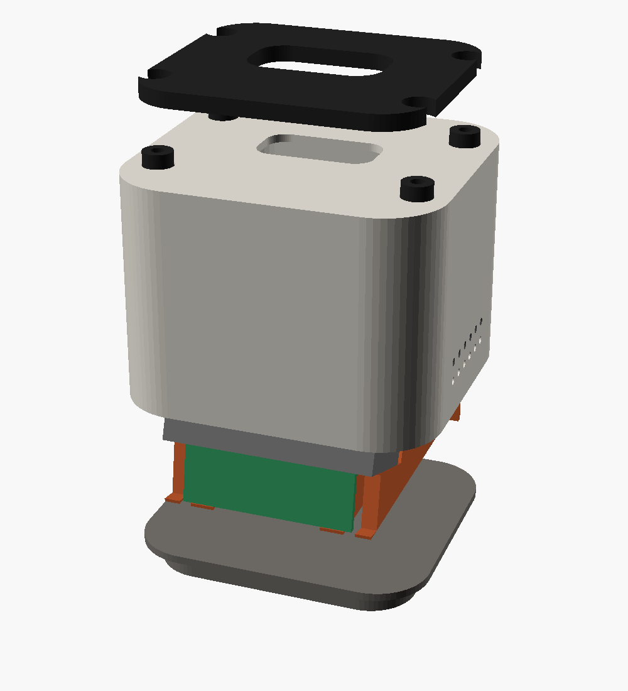

# Printing

All parts come from one parametric OpenSCAD source, [`hardware/cad/marvin.scad`](../hardware/cad/marvin.scad). The STLs in [`hardware/stl/`](../hardware/stl/) are exported already oriented for the print bed, and **none of them needs supports**. Every part fits a 180 × 180 mm bed (Bambu A1 mini and up).

> **Rev F status:** the body half is ready to print (lidar template, body, plinth, sensor sled, TPU parts). The head (face frame, window, lidar ring, knob) comes next, once the 1.69" screen is measured on arrival. The rev E lighthouse parts are archived in [`hardware/archive/rev-e/`](../hardware/archive/rev-e/).

<p align="center"></p>

## Parts

| File | Part | Material | Suggested settings | Notes |
|---|---|---|---|---|
| `0_lidar_template.stl` | Lidar template | PLA | 0.2 mm, 2 walls | About 5 min. **Print this first** and test-fit the lidar on it. |
| `1_body.stl` | Body shell | **PETG**, warm grey + anthracite | 0.2 mm, **4 walls of 0.4 mm = exactly 1.6 mm**, 15 % infill | Printed upside down, deck on the bed. The front wall in front of the radars must stay 1.6 mm and flat. The anthracite band is a filament change (see below). |
| `2_plinth.stl` | Plinth | PETG or PLA, anthracite | 0.2 mm, 3 walls, 20 % | Closes the body from below. The USB-C cable leaves through the notch at the back. |
| `3_sensor_sled.stl` | Sensor sled | PETG | 0.2 mm, 3 walls, 20 % | Printed standing, as installed. Carries the 24 GHz radar at 10° and the 60 GHz radar at 20°; the lever connectors and the amp stick on its back plate. |
| `4_tpu_neck_grommets_feet.stl` | Neck gasket, 4 grommets, 4 feet | **TPU 95A**, black | 0.2 mm, 3 walls, 15 % gyroid, slow (≤ 40 mm/s) | Decouples the head (lidar motor) from the body (heart-rate radar). On the A1, feed it from the external spool holder, not the AMS lite. |

Coming with the head: head shell, face frame (screen + XIAO cradle), lidar ring and knob. The face window is not printed: it is cut from the 2.3 mm smoked acrylic.

## The anthracite band

The body prints upside down, so the band is a filament change at two heights measured **from the bed**:

| From | To | Colour |
|---:|---:|---|
| 0 mm | 14 mm | Warm grey (top of the body) |
| 14 mm | 44 mm | Anthracite (the band) |
| 44 mm | 58 mm | Warm grey (bottom of the body) |

- **Bambu A1 with AMS lite:** in Bambu Studio, right-click the layer slider at 14 mm and at 44 mm and choose "Change filament".
- **Single-extruder printer:** insert a pause (M600 or "Pause print") at those heights and swap the filament by hand.

## Why PETG in front of the radars

At 60 GHz, a 1.6 mm PETG wall is half a wavelength thick, so it lets the signal through almost unchanged, even when the radar looks through it at 20°. At 24 GHz the same wall is thin enough not to matter. Keep the wall at 1.6 mm and flat, and avoid metallic, glitter or carbon-filled filaments on the body. The filament colour does not matter: the band is only there for looks.

## Regenerating files

```bash
# every print-ready STL
hardware/scripts/export_stl.sh

# the exploded view in docs/images (headless Linux: prefix with `xvfb-run -a`)
hardware/scripts/render_previews.sh

# the side section diagram in docs/images (needs matplotlib)
python3 hardware/scripts/section_diagram.py
```

OpenSCAD 2021.01 or newer is required.
