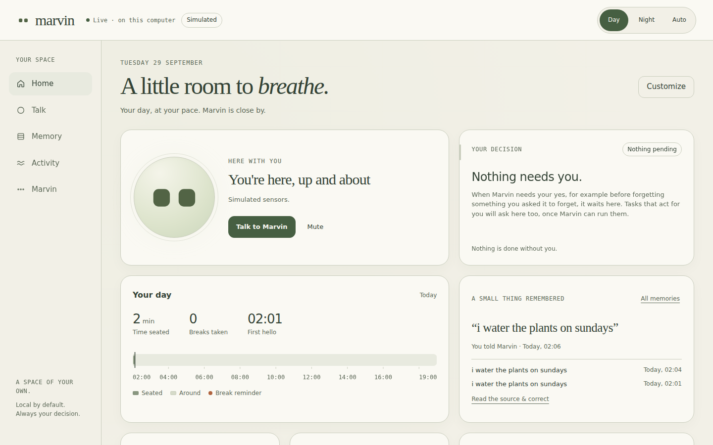
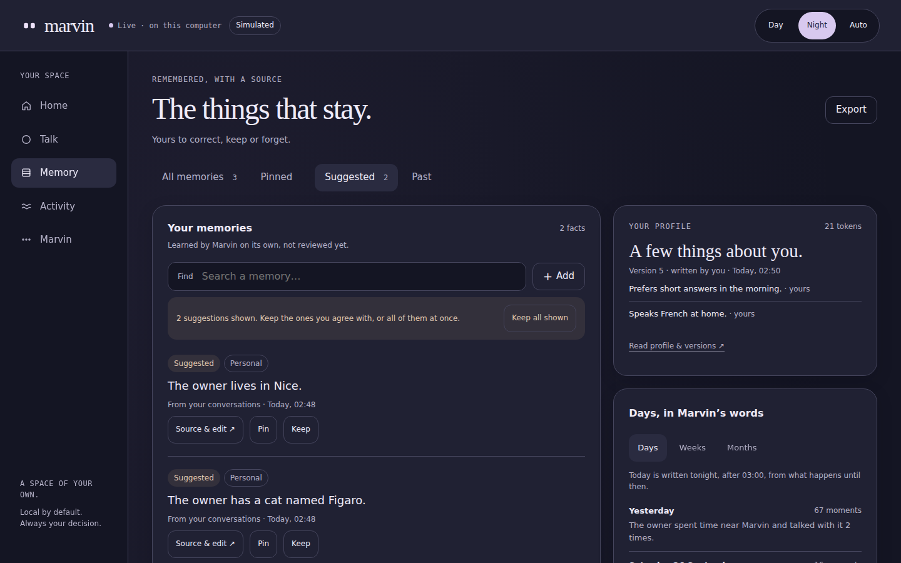
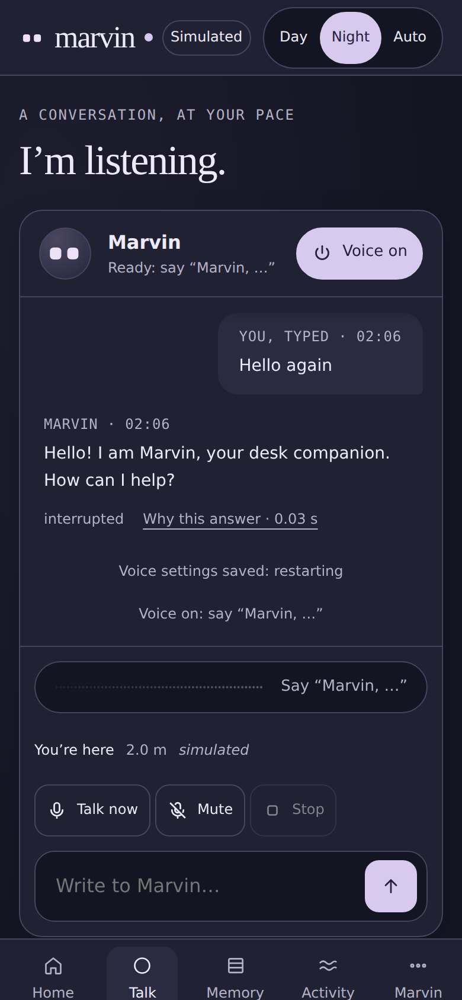
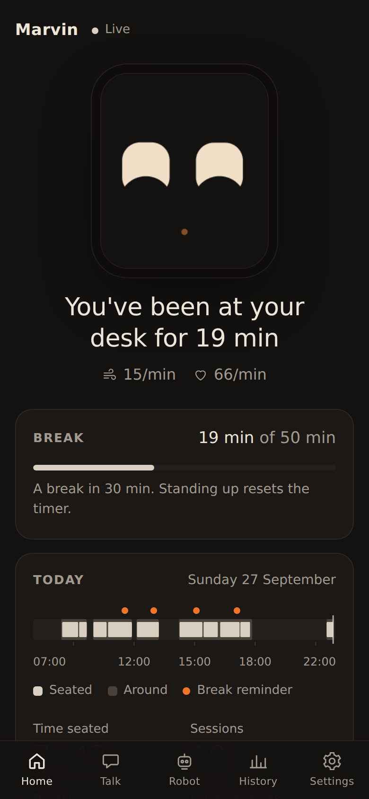
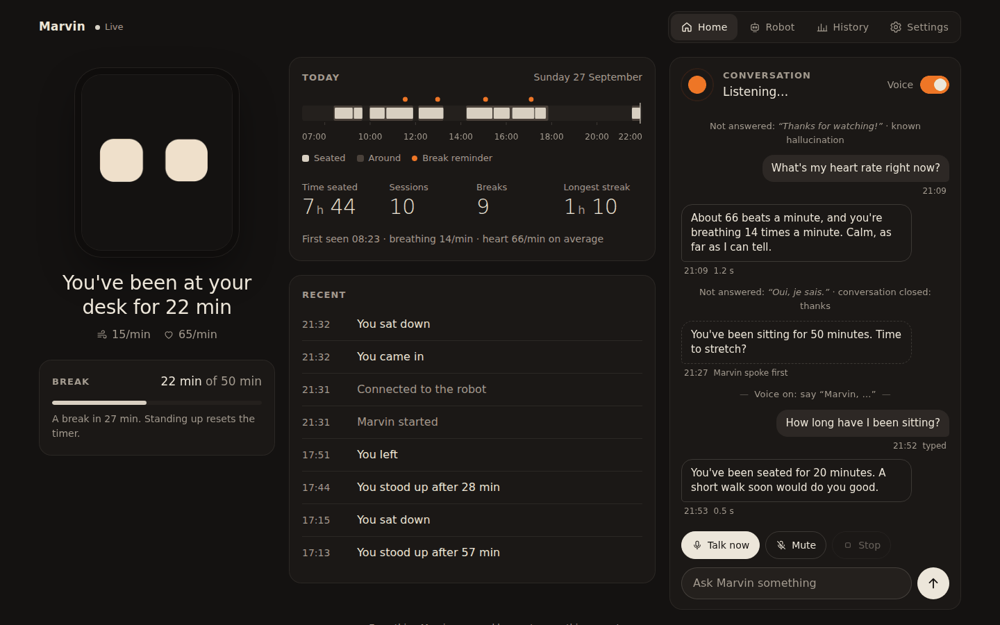
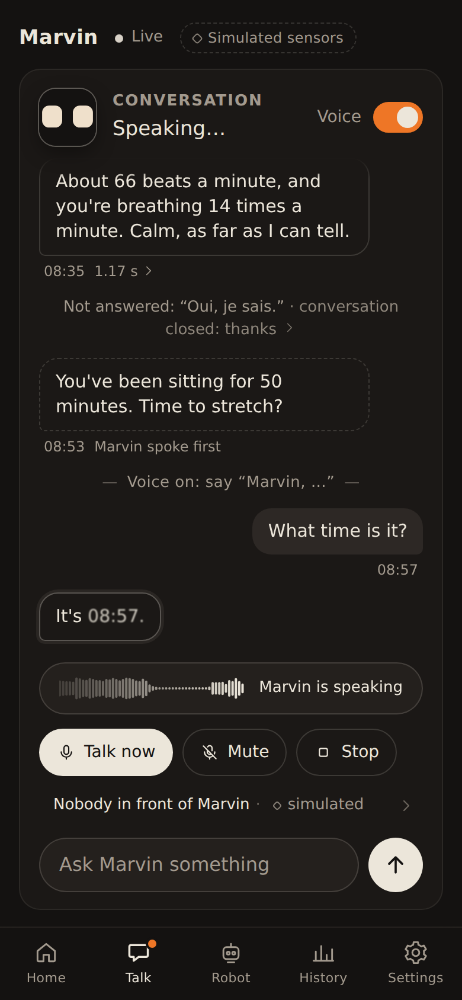
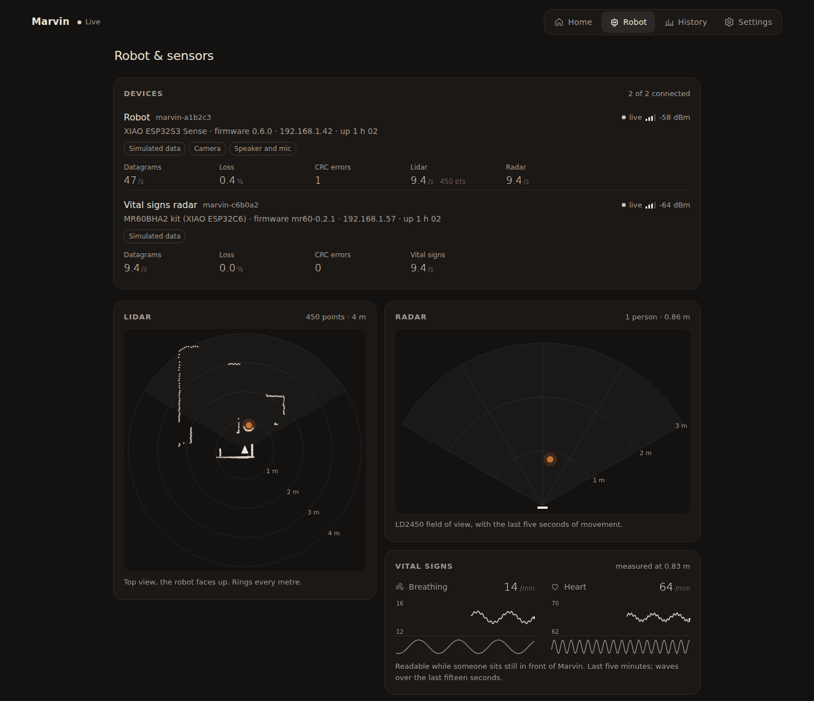

<!-- SPDX-License-Identifier: MIT -->
# Marvin's app

Marvin comes with a small web app that runs on your computer, next to its host. You open it in a browser, on the
computer or on your phone. It is the owner's view and Marvin's control center: how Marvin is doing, how long you have
been sitting, your day, the conversation with Marvin (the voice is turned on, set up and used from here), what Marvin
remembers and where each memory comes from, the robot's devices and sensors, and a log of what happened.

There are two apps, one per host, on the same API:

- **The Java host's app** (`./marvin up`, `./marvin demo`), described below: the current design, with a Day and a
  Night appearance and five destinations. Its files are in
  [`host-java/marvin-adapter-web/src/main/resources/app/`](../host-java/marvin-adapter-web/src/main/resources/app).
- **The Python host's app** (`marvin-host run`, `marvin-host ui`), unchanged: the Python host stays a tool (the
  simulator, the viewer, replays) and keeps its older app, see [The Python host's app](#the-python-hosts-app).

<p align="center">
  
</p>

<p align="center">
  
</p>

<p align="center">
  
</p>

## Try it

```bash
./marvin demo          # a simulated robot and a simulated past week
```

Then open http://localhost:8765/. The demo keeps its own copy of the voice's settings and does not touch yours. With
Ollama running, the voice can be turned on from Talk.

## Layout and appearance

Five destinations: **Home**, **Talk**, **Memory**, **Activity**, **Marvin**. On a phone they are a bar at the bottom,
on a computer a rail on the left; a small count on a destination says something waits for you (on Home: a decision),
a dot on Talk that Marvin is listening or speaking. The top bar has the wordmark with Marvin's eyes, the connection
("Live · on this computer", "Reconnecting", "Robot offline"), a **Simulated** badge when the robot says its sensor
data is simulated (hover, focus or tap it to read what that means), and the appearance.

**Appearance**: **Day** (ivory, olive, matte), **Night** (indigo, lavender) or **Auto**, which follows the device's
light or dark setting, also when it changes while the page is open. Both appearances share the same markup, geometry,
type and behaviour: only colours change. The choice is kept in this browser only (`localStorage`), like the Home
layout; nothing on the host changes.

Every control is reachable with the keyboard (a "Skip to content" link, visible focus rings) and is at least 44 pixels
tall; with reduced motion the eyes only change expression and nothing animates.

## What it shows

| Part | Content |
|---|---|
| **Home** | |
| Here with you | Marvin's eyes, live, in an orb: the robot's own eye geometry (the same expressions as its screen, face.py's table) drawn in the appearance's colours, driven by the robot's expression and, while the voice runs, by the voice (attentive while it listens, glancing up while it thinks, moving with its voice while it speaks). Under them the status sentence ("You've been at your desk for 42 min", "Marvin is offline"), **Talk to Marvin** and **Mute**. |
| Your decision | What waits for your yes, always on Home, whatever you hide. Today: forgetting a memory you asked to forget (by voice or in the app), with **Keep** or **Forget**. When nothing waits: "Nothing needs you." Background tasks and their approvals come later and will wait here too. |
| Your day | Time seated, breaks taken, first hello, and the day's timeline: when you were around, when you were seated, break reminders. |
| A small thing remembered | The latest fact Marvin keeps, with where it comes from and when ("You told Marvin · Today, 11:16"), and the next two; **Read the source & correct** opens it with its sources quoted. |
| Breaks and breathing | The time left before the next break (the bar turns warm when it is time), and breathing per minute with its last ten minutes, marked **Simulated reading** when the sensors are simulated and "no longer live" when the stream stopped. |
| Recent moments | What happened, in plain words. |
| Customize | Show, hide and reorder the modules (buttons, no dragging); kept in this browser; **Reset** restores the suggested layout. It changes only the screen: Marvin keeps sensing and remembering. |
| **Talk** | |
| Conversation | Live: while you speak, your bubble forms with a small wave and the words understood so far, then shimmers while they are understood; Marvin's shows three dots while he thinks, then writes itself word by word as he says it. Typed questions say so; what Marvin said on his own is marked; what it heard but did not answer folds into one discreet line ("3 sounds ignored") that opens to show each one and why, with its loudness. |
| Memory chips | When an answer used a memory tool, a chip under it: "Remembered: …", "Looked in memory", "Waiting for your yes to forget" (which waits on Home). |
| Why this answer | Under each answer, with the time to its first word: the inspector, in a dialog. What Marvin heard (and the raw transcript), what it answered, where the time went (end of speech, recognition, model, tools, first sentence, synthesis), the tools with their arguments and results, the memory that went into the question (the profile's version, each section with its budget and tokens, each candidate with its score, kept or left out, the timings, Ollama's counts), the model and language, and the exact message sent to the model. |
| Controls | **Voice on/off** (remembered for the next start), **Talk now** (a listening window without saying "Marvin"; a line shows the time left), **Mute**, **Stop**, and the text box. Above them the listening strip (the microphone's or Marvin's voice as a scrolling wave, with a word on what is going on) and a line with what Marvin knows right now, which opens the robot's sensors. |
| Here, now | Beside the conversation on a computer: presence, the facts the last answer used, the last answer's timing and model. |
| Problems | If the voice cannot start, the panel says why and how to fix it, with **Try again**. |
| Sounds | Short soft notes played by the browser when listening opens and closes, when Marvin did not catch you, when an answer starts; off in Marvin > Preferences. |
| **Memory** | See also [memory.md](memory.md). |
| Your memories | **All memories**, **Pinned**, **Suggested** (learned by Marvin on its own, not reviewed yet) and **Past** (no longer true, or archived), with their counts and a search. Each row: the fact, its status (Yours, Reviewed, Suggested, Pinned...), its sensitivity, where it comes from and when; **Source & edit**, **Pin** / **Unpin**, **Keep** (a suggestion becomes reviewed; **Keep all shown** for the whole list). **Add** stores your own memory at once. |
| Source & edit | The sources quoted and dated (what you said first), each with **Open that conversation**, which opens History at that line; the correction ("What Marvin should remember", and its sensitivity: a new version, the earlier one kept in the fact's history); **Pin**, **Keep as reviewed**, **Archive** / **Bring back**; how often it was used; its other versions. **Forget this fact** is a second, explicit choice: it says what goes (the fact, its versions, its profile lines, for good) and what stays (the conversation, in History). |
| Your profile | What Marvin reads at the start of every conversation, your own lines marked. **Read profile & versions**: every version with its differences (added, removed), **Use this version again**, and **Edit**: the lines you write or change are yours, and every nightly rewrite keeps them. |
| Days, in Marvin's words | The summaries Marvin writes the night after: days, weeks, months, with how many moments they come from; one being rewritten says so. |
| Memory at work | What waits to be read, the last passes and what they did ("3 new facts, 5 days written, in 1.3 s with ..."), the next night, the models, **Consolidate now** and **Run the nightly pass** (both give way to the voice). When the embedding model is missing, a notice at the top of the screen says so, with the command that fixes it and **Check again**. |
| Memory, on your terms | What Marvin may learn from: **Your conversations**, **What Marvin notices** (switched off, nothing from it reaches memory from that moment); **Settings** (consolidating on its own, after how long away, the nightly hour, how long what Marvin noticed is kept); **The raw log** (everything memory was told, searchable, older pages); **Export** (JSON or Markdown); **Forget everything** (what goes and what stays, then the phrase "forget everything" typed; the request expires after five minutes). |
| **Activity** | |
| Today | **Tasks & approvals**: an honest empty state that says what will appear there (each task and its steps, its budget, your approval on the exact version) and that today only a request to forget waits for you, on Home. Memory at work, today's moments (the latest twelve, **Show all**). |
| History | Any day's timeline and numbers with arrows back in time, and that day **in Marvin's words** (its summary, or when it will be written); the last seven days with the weeks in Marvin's words; the conversations: that day's (read-only, answers still open their inspector) and a search over everything said. |
| **Marvin** | |
| Overview | Robot and voice (connected, simulated or missing; the voice's state and model), Soul and Connections as honest "coming later" entries (no action), and preferences. |
| Robot | A notice when the robot is offline (the views keep its last data), the host does not answer, or the sensors are simulated; each device (board, firmware, address, uptime, Wi-Fi, link, rates, loss), the robot's screen as the host draws it, the lidar's top view with the person the radar follows, the LD2450's field of view, breathing and heart rate over five minutes with their waves. Its stream runs only while this page is open. |
| Voice & models | The voice: language model, speech recognition, speech and voice, language, waiting for "Marvin", the follow-up window, spoken reminders, tools and **Internet**, the home location (**Apply** restarts the voice). Ollama: reachable or not (with its fix), its models and what each is used for. Memory's models: during the day (empty: the voice's), at night, and the embedding model, with its state. |
| System | Each service with its state and, when it is down, why and how to fix it: the database, the robot link, memory, the voice sidecar (**Restart the voice**, the one sidecar the host restarts), Ollama; this computer (version, mode, data folder); the log, filtered by Marvin, Devices, Voice or Warnings and searchable, live. |
| Preferences | Break reminder, quiet hours, 12- or 24-hour clock, sounds, appearance, resetting the Home layout; language, tools and internet, the home place (the voice's settings: saving restarts the voice); where your data is. |

When the host stops answering, every screen says so after a few seconds ("What you see may be out of date") until the
stream is back; lists show a short placeholder while they load, and a panel that cannot be read says why, with **Try
again** where it helps. The old addresses (`#robot`, `#history`, `#settings`, `#activity/log`) still open the right
place.

## Open it on your phone

When it starts, the host (`./marvin up`, or `marvin-host` for the Python host) prints two addresses:

```
Marvin's app: http://localhost:8765/
  on a phone on the same Wi-Fi: http://192.168.1.23:8765/?token=q1w2e3r4t5y6u7i8
```

Open the second one on a phone connected to the same Wi-Fi. The browser remembers the access
key (a cookie), so after the first visit `http://192.168.1.23:8765/` is enough. You can add it to
the home screen; it opens full screen like an app.

If the phone cannot reach it, check that both are on the same network (not a guest Wi-Fi) and
that the computer's firewall lets the host accept incoming connections (macOS asks the first time).

## The terminal

The Java host writes its log to a file (`./marvin logs`). The Python host's `marvin-host run` prints only what you need to know; the app shows the rest:

```
Marvin's app: http://localhost:8765/
  on a phone on the same Wi-Fi: http://192.168.1.23:8765/?token=q1w2e3r4t5y6u7i8
listening for the robot on UDP 47100
+ marvin-a1b2c3 connected (Wemos D1 mini (ESP8266), firmware 0.4.1, simulated sensors) at 192.168.1.40
voice: starting (qwen3:4b-instruct)...
voice: on, say “Marvin, …”
- marvin-a1b2c3 disconnected (nothing received for 6 s)
```

Warnings and errors are printed too (`warning: ...`). `-v` adds the brain's events, the devices'
messages, the conversation (`you: ...`, `marvin: ...` with the time to the first word) and a
sensor summary every second (`--stats`: the summary alone); `-vv` adds debug logs. With `--no-ui`
the terminal is all there is, so it shows the events, the conversation and a summary every 5 s.

## Access key

The app listens on your local network so your phone can reach it. Anyone on the same network
could reach it too, so other devices need the **access key**:

- It is a random key, created on first start and kept in `ui_token` next to the database. Delete
  that file to get a new one (phones will need the new link).
- Your own computer (`localhost`) never needs it.
- `--ui-token off` turns the key off: anyone on the network can then open the app. Only do this
  on a network you trust.
- `--ui-token my-own-key` sets your own.
- `--ui-host 127.0.0.1` makes the app reachable from this computer only.
- `--ui-port 8765` changes the port.

These are the Python host's options; the Java host reads `MARVIN_UI_TOKEN` (`auto`, `off` or your own key),
`MARVIN_BIND` and `MARVIN_PORT` (see the top of [`marvin`](../marvin)).

The app also ignores requests addressed to unknown host names (a protection against web pages
that try to reach services on your computer), and only accepts changes sent by the app itself
(JSON from the same origin): settings, the voice's settings, turning the voice on and off,
questions, Talk now, Mute and Stop. All of these need the access key from another device, like
everything else. Anyone with the key can make Marvin listen and speak: keep it to yourself.

The app has no HTTPS: the key and the data travel unencrypted on your local network, like most
home devices. Do not expose the port to the internet.

## Privacy: your data stays on your computer

- The Java host keeps everything in PostgreSQL on this computer (Docker, or inside the host), memory included:
  what Marvin remembers, with the source of every fact. Marvin > Preferences says where; Memory exports it and
  can forget any of it. The app's appearance and Home layout stay in the browser.
- The Python host keeps everything in one SQLite file on the computer running `marvin-host`:
  `~/.local/share/marvin/marvin.db` (or `$XDG_DATA_HOME/marvin/`, or the folder in
  `MARVIN_DATA_DIR` if you set it). The settings dialog shows where.
- It holds Marvin's events (arrived, sat down, stood up...), one summary per minute (whether
  someone was there, and the average breathing and heart rate when they were measured), the
  conversation with Marvin (what it heard, what it answered, with the context it was given and
  the timings, what it did not answer and why), and your settings. No images, no sound, no raw
  radar data. The log is kept in memory only, for as long as `marvin-host` runs.
- Nothing is sent anywhere. The app loads nothing from the internet (no fonts, no scripts, no
  analytics) and works without an internet connection. The one exception is Marvin's online tools:
  asking about the weather sends the place name to Open-Meteo. Turn **Internet** off in
  Marvin > Voice (Settings > Voice in the Python host's app) to keep Marvin fully offline ([voice.md](voice.md#tools)).
- To erase the history, stop `marvin-host` and delete the folder:
  `rm -r ~/.local/share/marvin`.

## The Python host's app

The Python host (`marvin-host run`, `marvin-host ui`) keeps the older app, on the same API. It has five tabs
(Home, Talk, Robot, History, Settings) and one dark appearance.

<p align="center">
  
</p>

<p align="center">
  
</p>

<p align="center">
  
</p>

<p align="center">
  
</p>

### Try it

```bash
marvin-host ui --demo --open        # a simulated robot and a simulated past week, time 10x faster
marvin-host ui --demo --speed 60    # faster: a minute of sitting per second
```

The demo keeps nothing: its history lives in a temporary folder that is deleted when you stop it
(Ctrl-C).

The demo also plays the robot and the vital signs radar for the Robot panel, and, when there is
no language model to talk to, a scripted conversation (typed questions get canned answers from
the simulated brain; ask about the weather to see a tool call, with made-up demo data, in the inspector), with a few past days of conversation to browse and search in History.
With Ollama and the `voice` extra installed, the demo offers the real voice instead, off until you
turn it on.

With the real robot, the app starts with `marvin-host run` (turn it off with `--no-ui`).
`marvin-host ui` runs the brain and the app without the Rerun viewer, which is lighter for
everyday use.

### Layout

On a phone, a tab bar at the bottom: **Home**, **Talk**, **Robot**, **History**, **Settings**. On a
computer the tabs move to the top; on a wide screen (1200 px and more) Home shows the conversation
beside the face and the day, so the Talk tab disappears.

### What it shows

| Part | Content |
|---|---|
| **Home** | |
| Face | Marvin's eyes, live, drawn by the same code and from the same brain state as the robot's screen. |
| Status | One sentence: "You've been at your desk for 42 min", "You're here, up and about", "Marvin is asleep. Nobody around.", "Marvin is offline". Breathing and heart rate appear under it only while the radar reads them reliably (you are seated and still). |
| Break | How long you have been sitting, against the break reminder (50 minutes by default). The bar turns orange when it is time to stand up. Standing up resets it. |
| Today | A timeline of the day: when you were around (dark), when you were seated (light), and break reminders (orange dots). Below it: time seated, sitting sessions, breaks, longest streak, when you arrived and last left, and your average breathing and heart rate. |
| Recent | What happened, in plain words: you came in, sat down, stood up after 47 minutes, break reminders. |
| Header | The connection ("Live", "Reconnecting", "Robot offline") and, when the robot says its sensor data is simulated (a D1 mini, `marvin-host sim`, the demo), a calm **Simulated sensors** badge: hover, focus or tap it to read that the person, the room and the vital signs come from a simulated scene, not from real sensors. |
| **Talk** | |
| Marvin's eyes | A small live rendering of Marvin's face, drawn in the browser with the same shapes and colours as the robot's screen ([`face.py`](../host/marvin_host/face.py)), at the screen's refresh rate: sleepy while the voice is off, calm and blinking while it waits, attentive and a little wider with your voice while it listens (with a thin orange ring), glancing up and aside while it thinks, moving with its own voice while it speaks. With reduced motion, the eyes only change expression. |
| Listening strip | Above the buttons, a wave of what the microphone hears (orange while Marvin listens, grey while it waits for its name) or of Marvin's own voice while he speaks, with a word on what is going on: "Say “Marvin, …”", "Listening…", "Understanding…", "Thinking…", "Stopped listening" when the listening window closes. |
| Conversation | Live: while you speak, your bubble forms with a small wave and the words understood so far (dashed until it knows you talk to Marvin), then shimmers while the words are understood; Marvin's bubble shows three dots while he thinks, then writes itself word by word as he says it. What Marvin heard (typed questions say so), what it answered, what it said on its own (a break reminder, dashed), and, discreetly, what it heard but did not answer. Consecutive ignored sounds and sentences fold into one line ("3 sounds ignored", "2 sentences not answered", which grows as more come); open it to see each one, why it was not answered ("known hallucination", "own voice", "too quiet", "conversation closed") and how loud it was (dBFS). The conversation is kept with the history: it is still there after a restart. |
| Why Marvin said that | Tap an answer, or the time under it (like `1.2 s`), to open its inspector: what Marvin heard (and the raw transcript when it differs, e.g. with "Marvin," in front), where the time went as a small bar (end of speech, recognition, model, and after a tool call **Tools** (orange stripes) and **Model (again)**, first sentence, synthesis, with the numbers), the tools Marvin used (each call with its arguments, its result or error, and how long it took; see [voice.md](voice.md#tools)), what Marvin knew when it answered (the facts of the context block sent with the question: the time, presence, how long you have been seated, breathing and heart rate, simulated sensors), the model and the language, and the exact message sent to the model. |
| Now | One discreet line above the text box: what Marvin knows right now (you are here or seated for how long, how far, breathing and heart rate when the radar reads them, "simulated" when it is). On a narrow screen the least useful parts go first. Tap it to open the Robot panel. |
| Sounds | Short soft notes played by the browser (synthesised, no audio files): two rising notes when listening opens, two falling ones when it closes without a question, a low blip when Marvin did not catch what you said while listening, a faint tick when an answer starts. Marvin already chimes on the computer's speaker when it starts listening, so the browser's "listening" note only plays when this page pressed **Talk now** (you hear at once that it worked), or when the voice's own chime is turned off (`"chime": false` in `voice.json`); the follow-up window after each answer makes no sound. Browsers allow sound only after a gesture: nothing plays before your first click or key press on the page. On by default; **Settings** turns them off. |
| Controls | **Voice** on and off without restarting `marvin-host` (it is remembered: the voice starts with `marvin-host` next time). **Talk now**: a listening window without saying "Marvin", as if you had just said the name: whatever you say next is the question, even a single word. The button turns orange while Marvin listens, a thin line under the wave shows the time left (it waits while you talk), and pressing it again stops listening. **Mute**: the microphone is ignored (reminders and typed questions still work). **Stop**: Marvin stops talking. The text box asks a question in writing; Marvin answers aloud and in the conversation. |
| Problems | If the voice cannot start, the panel says why and how to fix it: the `voice` extra is not installed (`pip install -e ".[voice]"`), no microphone, Ollama not running (`ollama serve`), the model not pulled (`ollama pull qwen3:4b-instruct`). **Try again** after fixing it. |
| **Robot** | |
| Devices | Each device that said hello: the robot, the MR60BHA2 vital signs radar, the simulator. Board, firmware, address, uptime, Wi-Fi signal (bars and dBm), link (live, or how long since the last packet: a device that sends nothing for 6 s is offline), datagrams per second, loss, CRC errors, lidar scans per second and points, radar frames per second, and what it has (camera, speaker and microphone, simulated data). |
| Lidar | A top view of the last scan (one range per degree), rings every metre, the robot in the middle facing up, and the person the LD2450 follows (orange) with their path over the last five seconds. |
| Radar | The LD2450's field of view (±60°) with the people it tracks and their paths. |
| Vital signs | Breathing and heart rate over the last five minutes, and their waves over the last fifteen seconds, while the MR60BHA2 can read them. |
| Log | The brain's events, the devices' own messages (`LOG`, e.g. "firmware up"), devices connecting and disconnecting, the voice turning on and off, and the host's warnings and errors, newest first. Filter by Marvin, Devices, Voice or Warnings. |
| **History** | |
| Day | Any day's timeline and numbers; the arrows go back in time. |
| Last 7 days | Time seated per day. Tap a day to see its timeline. |
| Conversations | The conversation of the day shown above, with the same bubbles as Talk (read-only; answers still open their inspector), and a search over everything said on any day: each matching line with its date and time; tap one to jump to that day and to the line. |
| **Settings** | |
| Breaks, clock and sounds | Break reminder interval, quiet hours, 12- or 24-hour clock, and the app's sounds (applied at once). |
| Voice | Language model (the models installed in Ollama), speech recognition (MLX or faster-whisper, and the Whisper model), speech (say, Piper, espeak-ng, and the voice: installed Piper voices, a few to download, and the macOS voices), language (auto, French, English), waiting for "Marvin", the follow-up window, spoken break reminders, **Tools** (let Marvin use tools at all, and **Internet**: the online ones; off, Marvin is fully offline), the list of tools and whether each is on, and the **Home location** (at most 80 characters) the weather uses when you don't say where. Saved to `voice.json`, the file `marvin-host talk` reads too; **Apply** restarts the voice with them. See [voice.md](voice.md). |

A few definitions:

- **Time seated** runs from the moment Marvin decides you sat down to the moment you stand up or
  leave (the `sat_down`, `stood_up` and `left` events, see
  [`brain.py`](../host/marvin_host/brain.py)).
- **Sessions** join sittings separated by less than a minute: getting up to grab something does
  not start a new session. **Breaks** are the gaps between sessions; **longest streak** is the
  longest session.
- When Marvin loses contact with the robot, or `marvin-host` stops, the timeline has a hole
  rather than a made-up block. After a crash, the time is counted up to the last sign of life.

## For developers

### The Java host's app

Plain HTML, CSS and JavaScript, no framework, no build step, nothing loaded from elsewhere (no fonts, no CDN): ES
modules served by `AppController` from
[`resources/app/`](../host-java/marvin-adapter-web/src/main/resources/app), under the page's Content Security Policy
(no inline script or style). `AppFilesTest` keeps it that way, and checks that Day and Night define the same
variables; `host-java/e2e/e2e.py` walks it in a browser.

| File | Role |
|---|---|
| `index.html` | The shell and every screen's markup, shared by both appearances |
| `style.css` | The tokens (the Day block, the Night block, nothing else differs), components, screens, the phone and computer layouts, reduced motion |
| `theme.js` | Applies Day, Night or Auto before the page is drawn; Auto follows `prefers-color-scheme` live |
| `app.js` | The shell: navigation (`#view/sub`), the appearance switch, the connection, the one event stream, badges |
| `core.js` | Helpers (DOM, API, formatting, dialog, `localStorage` that may be missing) and the small event bus between modules |
| `face.js` | Marvin's eyes: face.py's expressions, lids and blinks, the spring, in the appearance's colours; one renderer for every face |
| `home.js`, `daycard.js` | Home and its customization; one day's timeline (Home and History) |
| `talk.js`, `convo.js`, `inspector.js` | The live conversation and the voice's controls; conversation entries (Talk and History); the reply inspector |
| `memory.js`, `memdata.js`, `memtools.js` | The Memory screen; a fact's source line and its "Source & edit" dialog (edit, pin, keep, archive, forget); the profile and its versions, export, "forget everything", the raw log, memory's settings |
| `worker.js` | Memory's worker, shown on Memory and Activity |
| `activity.js` | Tasks (empty state), today's moments, History with the days and weeks in Marvin's words |
| `marvin.js`, `system.js` | The overview, the robot's page, voice and models, preferences; System (services, restart, the log) |

Appearance and layout are presentation only: they never switch a sensor or a service. The Home layout lives in
`localStorage` under `marvin.home`, the appearance under `marvin.appearance`.

### The Python host's app

The app is in [`host/marvin_host/ui/`](../host/marvin_host/ui): Python standard library only
(`http.server`, Server-Sent Events, `sqlite3`), and plain HTML, CSS and JavaScript with no build
step. The face is drawn with [`face.py`](../host/marvin_host/face.py) and encoded as PNG without an
imaging library.

| Module | Role |
|---|---|
| `server.py` | `UIServer(brain, host, port, store, token, sink, voice)`: HTTP API, live streams, face, settings, log, voice control |
| `sink.py` | `UISink`: a receiver sink that keeps the latest sensor data and counters (O(1) per frame); devices, rates, link state, sensor mini-views |
| `store.py` | `EventStore`: the SQLite file (events, per-minute samples, the conversation, settings); older files are upgraded in place |
| `stats.py` | Pure functions: intervals and daily statistics from events, the sentences |
| `demo.py` | The simulated robot, devices, past week, past conversations and scripted voice for `--demo` |
| `static/` | The page |

```python
from marvin_host import ui
sink = ui.UISink().start()               # in the receiver's sink chain, after the brain
voice = VoiceController(brain)           # marvin_host.voice.control, optional
server = ui.UIServer(brain, sink=sink, voice=voice).start()      # brain: marvin_host.brain.Brain
...
server.stop()
```

| Endpoint | |
|---|---|
| `GET /` | the app (each host serves its own) |
| `GET /api/state` | `{state, today, settings}`: presence, status sentence, break progress (`state.simulated`: the robot's sensor data is simulated), today's stats |
| `GET /api/day?date=YYYY-MM-DD` | one day's stats and timeline (default: today) |
| `GET /api/history?days=7` | time seated per day, oldest first |
| `GET /api/events?since=ID&limit=50&quiet=1` | recent events, newest first, with a sentence each (`quiet` hides vital-sign events) |
| `GET /api/stream` | Server-Sent Events: `state` (2 per second), `event` (as they happen), `today`, `settings`, `voice` (state and status), `transcript` (one conversation entry), `log` (one log line), `devices` (once a second); while the voice runs, the live signals `level` (microphone loudness, ~16 per second), `utterance` (`start`, `end`, `done`), `partial` (the words understood so far) and `say` (a piece of the reply with its duration and loudness envelope) |
| `GET /face.png` | the face right now (240 × 280 PNG); `503` if it cannot be drawn |
| `GET`, `POST /api/settings` | settings (`break_interval_min`, `quiet_hours`, `clock`, `voice`, `ui_sounds`); POST a JSON object with the fields to change |
| `GET /api/robot` | `{devices, scene}`: the devices, and the sensor mini-views (`lidar.ranges_cm`: 360 ranges, one per degree clockwise from the front; `targets` and `trail` in cm, right and forward; `vitals` with `rates` and `waves`) |
| `GET /api/robot/stream` | Server-Sent Events for the Robot panel, opened only while it is on screen: `scene` 4 times a second (vital sign history once a second), `devices` once a second |
| `GET /api/log?source=brain,device&limit=200&since=ID` | the log, newest first; sources `brain`, `device`, `host`, `voice` |
| `GET /api/voice` | `{voice, settings, transcript}`: state (`off`, `starting`, `on`, `stopping`, `error` with `error` and `fix`, or `unavailable`), status, muted; the voice settings; the conversation (today's last 200 entries: `heard` with `raw`, `reply` with `latency`, `context`, `prompt`, `model` and, after tool calls, `tools`: `[{name, arguments, ok, seconds, result | error}]`, `ignored` with `reason` and `dbfs`, `note`) |
| `GET /api/conversation?day=YYYY-MM-DD` | `{day, entries}`: that day's conversation, oldest first (default: today) |
| `GET /api/conversation?q=text` | `{q, results}`: what was heard or answered containing `text` (case-insensitive, plain text), newest first, at most 100 (`limit`) |
| `GET /api/voice/options` | what the voice settings offer: Ollama's models (or why Ollama cannot be reached), speech recognition backends and models, speech backends (installed or not), Piper and macOS voices, and `tools` (`[{name, description, online}]`) |
| `/api/memory/...` | the Java host's memory: facts, sources, profile, episodes, export, forgetting, the worker ([memory.md](memory.md#the-memory-api)); changes arrive as `memory` messages on the stream |
| `POST /api/voice/on`, `/off` | start or stop the voice (in the background: follow `voice` on the stream) |
| `POST /api/voice/ask` | `{"text": "..."}`: a typed question (at most 500 characters), answered aloud; `409` while the voice is off |
| `POST /api/voice/listen`, `/stop-speaking` | Talk now; Stop |
| `POST /api/voice/mute` | `{"muted": true}` |
| `POST /api/voice/settings` | the voice's settings to change (`llm_model`, `stt`, `stt_model`, `tts`, `tts_voice`, `language`, `wake`, `follow_up_s`, `reminders`, `welcome_back`, `tools`, `internet`, `home_place`); saved to `voice.json`, the voice restarts |

Times are Unix seconds from the computer's clock; days are local calendar days. The break
reminder setting also sets the brain's `still_long_s`, so the robot's own reminder follows it.
Tests: `pytest tests/test_ui.py tests/test_ui_control.py tests/test_ui_conversation.py`.
