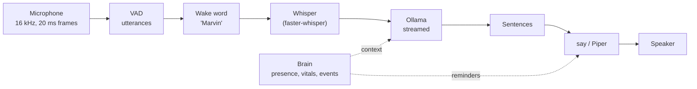

# Voice

Say "Marvin" and ask. Marvin listens with the computer's microphone (the robot's own microphone
later), understands with Whisper, thinks with a local language model through Ollama, and answers
aloud with the system voice. **Nothing leaves the computer**: no cloud API, no account, no
telemetry. Models are downloaded once, then everything works offline.



## Install (Mac)

```bash
cd host
pip install -e ".[voice]"          # sounddevice (PortAudio included), faster-whisper, webrtcvad,
                                    # and on Apple Silicon mlx-whisper (Whisper on the GPU)
brew install ollama                 # or the app from https://ollama.com/download
ollama serve &                      # not needed if the Ollama app is running
ollama pull qwen3:4b-instruct       # 2.5 GB, the default model
```

No Homebrew PortAudio is needed: the `sounddevice` wheel ships it. The first run downloads the
Whisper model into `~/.cache/huggingface` (on Apple Silicon `mlx-community/whisper-large-v3-turbo`,
1.6 GB; elsewhere `small`, 480 MB); after that it loads without touching the network. macOS asks
once for microphone access for your terminal. `mlx-whisper` pulls in PyTorch as a dependency
(a few hundred MB, not used at run time).

Optional, nicer voices: `pip install piper-tts`, then `--tts piper`. The French voice
(`fr_FR-siwis-medium`) and the English one (`en_GB-alan-medium`) are downloaded on first use into
`~/.local/share/marvin/piper` (60 MB each). On macOS the default `say` voices also improve a lot if
you download the "Enhanced" versions of Thomas (French) and Daniel (English) in System Settings >
Accessibility > Spoken Content > System Voice > Manage Voices; Marvin picks them up automatically.

## Use

```bash
marvin-host talk                            # "Marvin, quelle heure est-il ?"
marvin-host talk --lang fr                  # French only (skips language detection)
marvin-host talk --llm-model qwen3:8b       # smarter, slower
marvin-host talk --llm-model qwen3:8b --save-defaults    # ...and remember it
marvin-host talk --duplex                   # with a headset: keeps listening while it speaks
marvin-host talk --no-wake --duplex         # answers everything it hears (headset only)
marvin-host talk --stt faster-whisper --stt-model small  # CPU speech recognition
marvin-host talk --tts piper
marvin-host talk --wav question.wav --out answer.wav    # no microphone, no speakers
marvin-host talk --list-devices             # then --input-device N / --output-device N
marvin-host run --voice                     # with the robot: presence context and break reminders
```

How to talk to it:

- **"Marvin, what's the capital of Peru?"** in one breath: the name is removed, the rest is the question.
- **"Marvin."** alone: a soft two-note chime, then ask within 6 seconds.
- **Follow-up**: for 5 seconds after an answer, ask again without the name.
- **Interrupt**: say "Marvin" while it thinks. While it speaks, only with `--duplex` (see below).
- It answers in the language you speak (French and English are expected; French by default).
  `--lang` forces one.
- It forgets the conversation after 3 minutes of silence.

With `run --voice`, the model also knows what the brain knows, stated as plain facts: whether
someone is there, how long they have been seated, breathing and heart rate while those readings
are reliable, and recent events. "How long have I been sitting?" works. Marvin also speaks first
once in a while: a break reminder on `still_long` (`--voice-no-reminders` to turn it off) and,
if you want it, a "welcome back" after 30 minutes away (`--voice-welcome`). At most one such
sentence every 10 minutes, never during a conversation. `run` takes the same options as `talk`,
prefixed with `--voice-` (`--voice-llm-model`, `--voice-duplex`...).

### Your defaults

`~/.config/marvin/voice.json` (or `$MARVIN_CONFIG_DIR/voice.json`, next to `calibration.json`)
holds your defaults; command-line options override it. `talk ... --save-defaults` writes the
options given on that command line into it, keeping the rest. Example:

```json
{
  "llm_model": "qwen3:8b",
  "stt": "mlx",
  "stt_model": "turbo",
  "tts": "say",
  "language": null,
  "duplex": false,
  "echo_tail_s": 0.8,
  "end_silence_ms": 550,
  "input_device": null,
  "output_device": null
}
```

Other keys: `ollama_host`, `tts_voice`, `default_language`, `wake`, `follow_up_s`,
`listen_window_s`, `speculative_stt`.

## It never answers itself

Without echo cancellation, the microphone hears the speaker. Two layers keep Marvin's own voice
out of the conversation ([`echo.py`](../host/marvin_host/voice/echo.py)):

1. **Half duplex** (default): from its first word until `echo_tail_s` (0.8 s) after the speaker
   has played the last one (plus the output latency the sound card reports), the microphone is
   muted, and an utterance that started meanwhile is dropped. The mute is applied when the sound
   is captured, not when it is analysed, so it holds even when speech recognition is running late.
   The cost: it cannot be interrupted while it speaks.
2. **Transcript filter** (always): anything heard that repeats one of its last two replies
   (the whole reply, a garbled copy, or a contiguous chunk of it) is ignored and logged as
   `(ignored: own voice)`.

`--duplex` removes the first layer for a headset (or, later, the robot with echo cancellation);
the second one stays. In duplex mode "Marvin" interrupts it while it speaks, except while its own
reply contains its name.

Earlier versions had only the transcript filter, and only while speaking. On a laptop the echo
of a reply was captured while Marvin spoke, but Whisper (busy and behind) transcribed it after
the reply had ended, inside the follow-up window where no name is needed: Marvin answered its
own sentence, again and again.

## Models

| Part | Default | Why | Alternatives |
|---|---|---|---|
| Speech to text, Apple Silicon | `mlx-community/whisper-large-v3-turbo` on the GPU (mlx-whisper) | Large-v3 quality for French at a fraction of the cost: a few hundred ms per question on an M-series GPU | `--stt-model small` / `medium` (`mlx-community/whisper-*-mlx`), any MLX Whisper repo |
| Speech to text, elsewhere | Whisper `small`, int8, CPU (faster-whisper) | The smallest model with good French. `tiny` mishears names and short phrases. | `tiny`, `base` (faster), `turbo` / `large-v3` (better, 3-6x slower) |
| Language model | `qwen3:4b-instruct` | Qwen3 4B Instruct 2507: good French and English, non-thinking (Marvin also sends `think: false`, so thinking models answer at once too) | see the table below |
| Speech | macOS `say` (Thomas, Daniel) | Zero install, fast | Piper `fr_FR-siwis-medium`, `en_GB-alan-medium`; `espeak-ng` as a last resort |
| Voice activity | WebRTC VAD | Tiny, fast, no model file | energy threshold (fallback when webrtcvad is missing) |

Choosing the language model (rough expectations on Apple Silicon with Ollama, model loaded and
system prompt cached; M1/M2 at the slow end, M3/M4 Pro/Max at the fast end):

| Size | Examples | Memory | First token | Speed | Quality |
|---|---|---|---|---|---|
| 1.7-4B | `qwen3:4b-instruct` (default), `qwen3:1.7b`, `gemma3:4b` | 2-4 GB | 0.1-0.3 s | 30-80 tokens/s | Good small talk and simple facts; confuses details |
| 7-9B | `qwen3:8b`, `llama3.1:8b` | 5-6 GB | 0.2-0.6 s | 20-45 tokens/s | Noticeably better reasoning and French; still fast enough to feel live |
| 24-32B | `gemma3:27b`, `qwen3:32b`, `mistral-small3.2` | 16-20 GB (32 GB Mac) | 0.6-2 s | 8-20 tokens/s | Clearly smarter; the pause before the first word becomes noticeable |

The first question after starting a model costs its loading time (5-20 s for 27B) and the
processing of the system prompt (several seconds for 27B). Marvin does both at start-up by
rehearsing a real question (same system prompt, same options: `num_ctx` 8192, `think` off,
`keep_alive` 30 min, streamed), then checks that the next one reuses the cached prompt:
`model ... ready (prompt cached) in X s; first token now Y s`. If Y stays high, the log says the
server did not reuse the cache. Options that differ between requests (for instance another app
using the same model with another `num_ctx`) make Ollama reload the model.

## Latency

Every answer logs where the time went, from the moment you stop talking to Marvin's first word:

```
latency: first word 1.35 s after you stopped talking (end of speech 0.55, speech recognition 0.12
  (speculative), model first token 0.25, first chunk 0.40, synthesis 0.20 s)
```

What to expect on an Apple Silicon Mac with the defaults (estimates; the log tells the truth):

| Stage | Time | How it is kept short |
|---|---|---|
| End of speech | 0.55 s | Silence that ends a question (`end_silence_ms`); shorter cuts people off mid-sentence |
| Speech recognition | 0.1-0.7 s left to wait | MLX turbo on the GPU (0.2-0.5 s for a question); it starts speculatively after 0.25 s of silence, so part of it is already done when the question ends |
| Model, first token | 0.1-0.3 s (4B), about 1.4 s (27B, measured) | Model loaded and prompt cached at start-up, kept loaded; the system prompt never changes (the live context is in the question), so Ollama reuses it |
| First chunk | + 0.1-0.4 s | The first clause (3 words, up to a comma) or the first sentence is spoken without waiting for the rest, nor for the space after its punctuation |
| Synthesis of the first chunk | Piper 0.1-0.2 s; `say` 0.9-1.5 s (measured, M3 Max) | Chunks are synthesised by a separate thread and play while the model writes the rest |
| **Total** | **≈ 1.1-1.6 s (4B + Piper)**, + 0.2-0.4 s (8B), about 2.8-3.2 s (27B + Piper), + 0.8-1.3 s with `say` | |

`say` is slow to start: every call is a new process that loads the voice (the Enhanced and
Premium voices are neural and the slowest to load), then renders to a file. Marvin already asks it
for the final format (16 kHz, 16-bit WAV), so there is nothing to convert; the speaking rate does
not change the start-up cost. Piper keeps its voice loaded and synthesises a sentence in about a
tenth of a second, so `auto` picks Piper when it is installed, and Marvin prints a tip at start-up
when it is not. A compact `say` voice (`--tts-voice Thomas` instead of an Enhanced one) is faster
than an Enhanced one, at some cost in quality.

Measured in a 2-core cloud container (CPU only, no GPU): faster-whisper `tiny` 0.3-0.8 s and
`small` 3.7-5 s for a 3-second question, Piper 0.1-0.4 s per chunk; end to end with `tiny` and a
local stub model, 1.15-1.25 s. The owner's first measurement on a Mac, before these changes
(faster-whisper `small` on the CPU, 27B model): speech recognition 2 s, first word 3.9 s, and
7.6 s for the first question (model loading). With MLX turbo and `say` (M3 Max, 27B): speech
recognition 0.7 s, first token 1.4 s, first word 4.4-4.7 s, and 8.4 s for the first question (the
system prompt was not cached yet: fixed by the rehearsal above).

## Things nobody said

Whisper was trained on subtitled videos: on silence, breathing or background noise it readily
"hears" the end of one ("Thank you.", "Thanks for watching!", "I'm going to go.", "Sous-titres
réalisés par la communauté d'Amara.org"). Without a wake word to confirm it (follow-up window,
`--no-wake`), such a phrase would start a turn. Marvin filters in layers
([`filters.py`](../host/marvin_host/voice/filters.py)); each drop is logged as
`heard: ... (ignored: reason)`:

| Layer | Rule |
|---|---|
| Speech evidence, before Whisper | at least 0.3 s of voiced frames, at least 25 % of the utterance voiced, loudest half above -50 dBFS |
| Decoder confidence, per Whisper segment | drop if `no_speech_prob` > 0.6 with `avg_logprob` < -1.0, or `compression_ratio` > 2.4 (repetition), or `avg_logprob` < -1.2; decoding at temperature 0 only, `condition_on_previous_text` off |
| Known hallucinations | a list of English and French phrases, matched on the whole transcript (normalised, exact or 90 % similar), a few markers anywhere ("amara.org", "sous-titrage"...), no letters at all, runaway repetitions. Add new ones to `HALLUCINATIONS` |
| Without a wake word | another language than the conversation's is ignored unless detected with probability >= 0.8 (MLX gives no probability: a switch then needs the name); at least two words, except a question word ("Pourquoi ?"), and "oui"/"non" when Marvin just asked a question; "merci", "ok", "thanks", "au revoir" end the conversation (no answer, no more listening) |

With the wake word, the transcript still goes through the first three layers, and "Marvin. Thank
you." counts as the name alone.

## How it works

The code is in [`host/marvin_host/voice/`](../host/marvin_host/voice):

| Module | Role |
|---|---|
| `io.py` | `MicSource`, `SpeakerSink` (sounddevice), `WavSource`, `WavSink`, `NullSink`; resampling |
| `vad.py` | WebRTC / energy VAD, `Segmenter`: 20 ms frames in, utterances out (300 ms pre-roll, ends after 0.55 s of silence) |
| `wake.py` | `WakeWordDetector` interface, `TranscriptWakeWord`, fuzzy "Marvin" matching |
| `stt.py` | `MlxWhisperSTT` (GPU), `WhisperSTT` (CPU, "Marvin" as a hotword), `make_stt`; language detection restricted to French and English |
| `llm.py` | `OllamaLLM` (`/api/chat`, streamed, standard library only), `FakeLLM` |
| `persona.py` | The system prompt, the brain context, the sentences said without the model |
| `text.py` | Streaming chunker (first clause early, then sentences), markdown and emoji removal |
| `tts.py` | `MacSayTTS`, `PiperTTS`, `EspeakTTS` |
| `echo.py` | `EchoGate` (half duplex), `EchoFilter` (its own words) |
| `filters.py` | What Whisper invents: speech evidence, decoder scores, known hallucinations, follow-up rules |
| `assistant.py` | `VoiceAssistant`: the states (idle, listening, thinking, speaking), barge-in, memory, latency log |
| `proactive.py` | `ProactiveSpeaker`: reminders from brain events |
| `cli.py` | `talk`, `run --voice`, the settings file |

Everything goes through the audio contract in [`audio.py`](../host/marvin_host/audio.py) (16 kHz
mono int16, 20 ms frames), so the robot's microphone and speaker plug in without changes.
`VoiceAssistant` reports `on_status` ("idle", "listening", "thinking", "speaking"),
`on_transcript` and `on_reply` for the face, the viewer and the UI; `say(text)` speaks from code.

## Limits

- **No echo cancellation**: half duplex by default (it cannot be interrupted while it speaks);
  a headset and `--duplex` for a real conversation. `--no-wake` really wants a headset.
- **The wake word costs a Whisper run** per utterance that is loud and long enough. Fine at a
  desk; in a room full of conversation it keeps the GPU (or a CPU core) busy.
- The name must be at the start ("Marvin, ...", "Hey Marvin ...", "Dis Marvin ...") or at the end
  ("..., Marvin?"). In the middle of a sentence it is ignored: talking *about* Marvin is not
  talking *to* it.
- A pause longer than 0.55 s in the middle of a question ends it; raise `end_silence_ms` if you
  speak slowly.
- One speaker at a time, no speaker identification.
- The model has no internet, calendar or tools yet, and says so.

## Future: a real wake-word model

Whisper as a wake-word detector is a pragmatic first step. A dedicated keyword spotter would be
cheaper (always on, a few milliseconds per frame, could even run on the ESP32-S3), more robust
to accents, and would not need to transcribe everything to find the name. Google's Speech
Commands dataset contains about 2 000 recordings of the word "marvin" among 35 words, which
makes it a good ML project: a small CNN on log-mel features, trained on Speech Commands plus a
few hundred recordings of your own voice, then exported to ONNX. It only has to implement
`WakeWordDetector.check(pcm) -> WakeMatch | None`; returning `WakeMatch(query=None)` tells the
assistant to transcribe the utterance itself.
