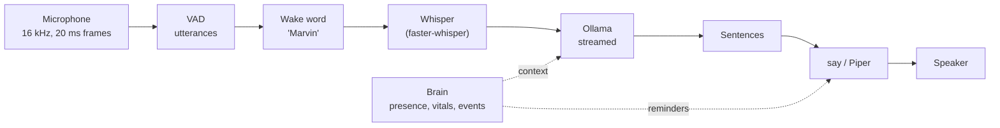

# Voice

Say "Marvin" and ask. Marvin listens with the computer's microphone (the robot's own microphone
later), understands with Whisper, thinks with a local language model through Ollama, and answers
aloud with the system voice. **Nothing leaves the computer**: no cloud API, no account, no
telemetry. Models are downloaded once, then everything works offline.



## Install (Mac)

```bash
cd host
pip install -e ".[voice]"          # sounddevice (PortAudio included), faster-whisper, webrtcvad
brew install ollama                 # or the app from https://ollama.com/download
ollama serve &                      # not needed if the Ollama app is running
ollama pull qwen3:4b-instruct       # 2.5 GB, the default model
```

No Homebrew PortAudio is needed: the `sounddevice` wheel ships it. The first run downloads the
Whisper model (`small`, about 480 MB) into `~/.cache/huggingface`. macOS asks once for microphone
access for your terminal.

Optional, nicer voices: `pip install piper-tts`, then `--tts piper`. The French voice
(`fr_FR-siwis-medium`) and the English one (`en_GB-alan-medium`) are downloaded on first use into
`~/.local/share/marvin/piper` (60 MB each). On macOS the default `say` voices also improve a lot if
you download the "Enhanced" versions of Thomas (French) and Daniel (English) in System Settings >
Accessibility > Spoken Content > System Voice > Manage Voices; Marvin picks them up automatically.

## Use

```bash
marvin-host talk                            # "Marvin, quelle heure est-il ?"
marvin-host talk --lang fr                  # French only (skips language detection)
marvin-host talk --no-wake                  # answers everything it hears (use headphones)
marvin-host talk --stt-model tiny           # faster, less accurate
marvin-host talk --llm-model qwen3:8b       # smarter, slower
marvin-host talk --tts piper
marvin-host talk --wav question.wav --out answer.wav    # no microphone, no speakers
marvin-host talk --list-devices             # then --input-device N / --output-device N
marvin-host run --voice                     # with the robot: presence context and break reminders
```

How to talk to it:

- **"Marvin, what's the capital of Peru?"** in one breath: the name is removed, the rest is the question.
- **"Marvin."** alone: a soft two-note chime, then ask within 6 seconds.
- **Follow-up**: for 5 seconds after an answer, ask again without the name.
- **Interrupt**: say "Marvin" while it talks.
- It answers in the language you speak (French and English are expected; French by default).
  `--lang` forces one.
- It forgets the conversation after 3 minutes of silence.

With `run --voice`, the model also knows what the brain knows, stated as plain facts: whether
someone is there, how long they have been seated, breathing and heart rate while those readings
are reliable, and recent events. "How long have I been sitting?" works. Marvin also speaks first
once in a while: a break reminder on `still_long` (`--voice-no-reminders` to turn it off) and,
if you want it, a "welcome back" after 30 minutes away (`--voice-welcome`). At most one such
sentence every 10 minutes, never during a conversation.

## Models

| Part | Default | Why | Alternatives |
|---|---|---|---|
| Speech to text | Whisper `small`, int8, CPU | The smallest model with good French. `tiny` mishears names and short phrases. | `tiny`, `base` (faster), `turbo` / `large-v3` (better, 3-6x slower) |
| Language model | `qwen3:4b-instruct` | Qwen3 4B Instruct 2507: good French and English, non-thinking (no hidden reasoning before the first word), about 20-40 tokens/s on Apple Silicon | `qwen3:1.7b`, `llama3.2:3b` (lighter); `qwen3:8b`, `gemma3:4b`, `mistral-small3.2` (better) |
| Speech | macOS `say` (Thomas, Daniel) | Zero install, instant | Piper `fr_FR-siwis-medium`, `en_GB-alan-medium`; `espeak-ng` as a last resort |
| Voice activity | WebRTC VAD | Tiny, fast, no model file | energy threshold (fallback when webrtcvad is missing) |

## Latency

From the end of your sentence to the first word of the answer, on an Apple Silicon Mac, expect
roughly 1 to 2 seconds: end-of-speech detection 0.7 s, Whisper `small` 0.3-1 s, first sentence of
the model 0.3-0.8 s, `say` 0.1-0.3 s. The first sentence is spoken while the model writes the
next one. The first question after start-up is slower (models loading). In a 2-core cloud
container, measured: Whisper `tiny` 0.3-0.8 s and `small` 3.7-5 s for a 3-second question, Piper
0.4 s per sentence.

## How it works

The code is in [`host/marvin_host/voice/`](../host/marvin_host/voice):

| Module | Role |
|---|---|
| `io.py` | `MicSource`, `SpeakerSink` (sounddevice), `WavSource`, `WavSink`, `NullSink`; resampling |
| `vad.py` | WebRTC / energy VAD, `Segmenter`: 20 ms frames in, utterances out (300 ms pre-roll, ends after 0.7 s of silence) |
| `wake.py` | `WakeWordDetector` interface, `TranscriptWakeWord`, fuzzy "Marvin" matching |
| `stt.py` | `WhisperSTT` (with "Marvin" as a hotword), language detection restricted to French and English |
| `llm.py` | `OllamaLLM` (`/api/chat`, streamed, standard library only), `FakeLLM` |
| `persona.py` | The system prompt, the brain context, the sentences said without the model |
| `text.py` | Sentence splitting for streamed speech, markdown and emoji removal |
| `tts.py` | `MacSayTTS`, `PiperTTS`, `EspeakTTS` |
| `assistant.py` | `VoiceAssistant`: the states (idle, listening, thinking, speaking), barge-in, memory |
| `proactive.py` | `ProactiveSpeaker`: reminders from brain events |
| `cli.py` | `talk`, `run --voice` |

Everything goes through the audio contract in [`audio.py`](../host/marvin_host/audio.py) (16 kHz
mono int16, 20 ms frames), so the robot's microphone and speaker plug in without changes.
`VoiceAssistant` reports `on_status` ("idle", "listening", "thinking", "speaking"),
`on_transcript` and `on_reply` for the face, the viewer and the UI; `say(text)` speaks from code.

## Limits

- **No echo cancellation.** The microphone hears Marvin too. While it speaks, only an utterance
  starting with "Marvin" counts, and one that repeats what it is saying is ignored. Headphones,
  or speakers away from the microphone, work best; `--no-wake` really wants headphones.
- **The wake word costs a Whisper run** per utterance that is loud and long enough. Fine at a
  desk; in a room full of conversation it keeps a CPU core busy.
- The name must be at the start ("Marvin, ...", "Hey Marvin ...", "Dis Marvin ...") or at the end
  ("..., Marvin?"). In the middle of a sentence it is ignored: talking *about* Marvin is not
  talking *to* it.
- One speaker at a time, no speaker identification.
- The model has no internet, calendar or tools yet, and says so.

## Future: a real wake-word model

Whisper as a wake-word detector is a pragmatic first step. A dedicated keyword spotter would be
cheaper (always on, a few milliseconds per frame, could even run on the ESP32-S3), more robust
to accents, and would not need to transcribe everything to find the name. Google's Speech
Commands dataset contains about 2 000 recordings of the word "marvin" among 35 words, which
makes it a good ML project: a small CNN on log-mel features, trained on Speech Commands plus a
few hundred recordings of your own voice, then exported to ONNX. It only has to implement
`WakeWordDetector.check(pcm) -> WakeMatch | None`; returning `WakeMatch(query=None)` tells the
assistant to transcribe the utterance itself.
