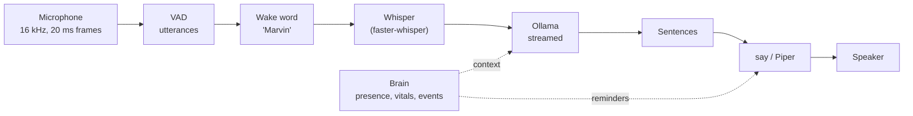
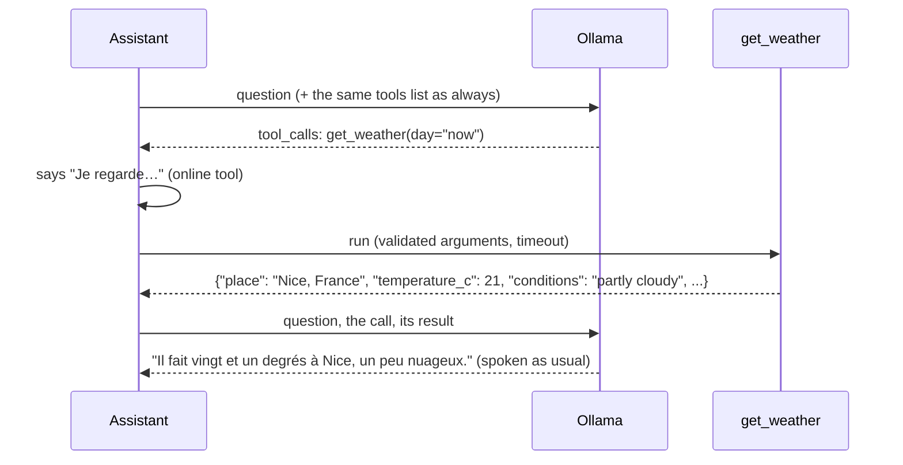

# Voice

Say "Marvin" and ask. Marvin listens with the computer's microphone (the robot's own microphone
later), understands with Whisper, thinks with a local language model through Ollama, and answers
aloud with the system voice. **Nothing leaves the computer**: no cloud API, no account, no
telemetry. Models are downloaded once, then everything works offline. The one exception is
opt-out and explicit: online [tools](#tools) such as the weather send a place name to a free
public service; the **Internet** switch turns them off.



**Two hosts run this voice.** `./marvin up` (the Java host, [host-java](../host-java/README.md))
is the default way to run Marvin: the audio loop below runs in the **voice sidecar** (a Python
process the Java host starts and watches), and the conversation (persona, context, model, tools,
memory) runs in Java; see [The voice sidecar](#the-voice-sidecar). `marvin-host talk` and
`marvin-host run --voice` (the Python host) still run everything in one Python process, and stay
as tools. Both read the same `voice.json`, answer with the same prompts, and keep the same app.

## Install (Mac)

With the Java host, `./marvin up` installs all of this into `host/.venv` the first time (a few
minutes; `./marvin up --no-voice` skips it); only Ollama and its model are yours to install. By
hand, for `marvin-host talk`:

```bash
cd host
pip install -e ".[voice]"          # sounddevice (PortAudio included), faster-whisper, webrtcvad,
                                    # and on Apple Silicon mlx-whisper (Whisper on the GPU)
brew install ollama                 # or the app from https://ollama.com/download
ollama serve &                      # not needed if the Ollama app is running
ollama pull qwen3:4b-instruct       # 2.5 GB, the default model
```

No Homebrew PortAudio is needed: the `sounddevice` wheel ships it. The first run downloads the
Whisper model into `~/.cache/huggingface` (on Apple Silicon `mlx-community/whisper-large-v3-turbo`,
1.6 GB; elsewhere `small`, 480 MB); after that it loads without touching the network. macOS asks
once for microphone access for your terminal. `mlx-whisper` pulls in PyTorch as a dependency
(a few hundred MB, not used at run time).

Optional, nicer voices: `pip install piper-tts`, then `--tts piper`. The French voice
(`fr_FR-siwis-medium`) and the English one (`en_GB-alan-medium`) are downloaded on first use into
`~/.local/share/marvin/piper` (60 MB each). On macOS the default `say` voices also improve a lot if
you download the "Enhanced" versions of Thomas (French) and Daniel (English) in System Settings >
Accessibility > Spoken Content > System Voice > Manage Voices; Marvin picks them up automatically.

## Use

```bash
marvin-host talk                            # "Marvin, quelle heure est-il ?"
marvin-host talk --lang fr                  # French only (skips language detection)
marvin-host talk --llm-model qwen3:8b       # smarter, slower
marvin-host talk --llm-model qwen3:8b --save-defaults    # ...and remember it
marvin-host talk --duplex                   # with a headset: keeps listening while it speaks
marvin-host talk --no-wake --duplex         # answers everything it hears (headset only)
marvin-host talk --stt faster-whisper --stt-model small  # CPU speech recognition
marvin-host talk --tts piper
marvin-host talk --wav question.wav --out answer.wav    # no microphone, no speakers
marvin-host talk --list-devices             # then --input-device N / --output-device N
marvin-host run --voice                     # with the robot: presence context and break reminders
marvin-host run                             # ...or turn the voice on later, from the app
```

How to talk to it:

- **"Marvin, what's the capital of Peru?"** in one breath: the name is removed, the rest is the question.
- **"Marvin."** alone: a soft two-note chime, then ask within 6 seconds.
- **Follow-up**: for 5 seconds after an answer, ask again without the name.
- **Interrupt**: say "Marvin" while it thinks. While it speaks, only with `--duplex` (see below).
- **Take your time**: a short pause does not cut you off. If you go on right after a question,
  before Marvin's first word, it waits and takes both as one question; a sentence that stops on
  "et", "parce que", "and", a comma or a lone "OK" gets a longer pause. See
  [One thought, one question](#one-thought-one-question).
- It answers in the language you speak (French and English are expected; French by default).
  `--lang` forces one.
- It forgets the conversation after 3 minutes of silence.

With `run --voice`, the model also knows what the brain knows, stated as plain facts: whether
someone is there, how long they have been seated, breathing and heart rate while those readings
are reliable, and recent events. "How long have I been sitting?" works. Marvin also speaks first
once in a while: a break reminder on `still_long` (`--voice-no-reminders` to turn it off) and,
if you want it, a "welcome back" after 30 minutes away (`--voice-welcome`). At most one such
sentence every 10 minutes, never during a conversation. `run` takes the same options as `talk`,
prefixed with `--voice-` (`--voice-llm-model`, `--voice-duplex`...).

### From the app

With `./marvin up` (or `marvin-host run`, or `marvin-host ui`), the app's **Talk** panel is the voice's control
center ([ui.md](ui.md)): turn the voice on and off without restarting anything, see what Marvin
heard and said (and what it chose not to answer, and why), how long each answer took, type a
question, open a listening window without the name (**Talk now**), mute the microphone, stop
Marvin mid-sentence. If something is missing (the `voice` extra, a microphone, Ollama, the model),
the panel says what and how to fix it. Turning the voice on in the app is remembered: it starts
with the host next time (`./marvin up`, or `marvin-host run`, as with `--voice`).

**Settings > Voice** changes the model (from the list Ollama has), speech recognition, the speech
backend and voice, the language, the wake word, the follow-up window, spoken break reminders,
tools and the Internet switch, and the home location for the weather.
They are saved to `voice.json` below, so `marvin-host talk` uses them too, and the voice restarts
with them. Options given on the `run` command line (`--voice-llm-model ...`) win over the file for
that session, until the same setting is changed in the app.

### Your defaults

`~/.config/marvin/voice.json` (or `$MARVIN_CONFIG_DIR/voice.json`, next to `calibration.json`)
holds your defaults; command-line options override it. `talk ... --save-defaults` writes the
options given on that command line into it, keeping the rest. Example:

```json
{
  "llm_model": "qwen3:8b",
  "stt": "mlx",
  "stt_model": "turbo",
  "tts": "say",
  "language": null,
  "duplex": false,
  "echo_tail_s": 0.8,
  "end_silence_ms": 550,
  "input_device": null,
  "output_device": null
}
```

Other keys: `ollama_host`, `tts_voice`, `default_language`, `wake`, `follow_up_s`,
`listen_window_s`, `speculative_stt`, `continue_grace_s` (default 1.5, 0 turns merging off),
`end_silence_long_ms` (default 1100, 0 turns the longer pause off), `tools` (default true), `internet` (online tools, default
true), `home_place` (the weather's place when none is said, e.g. `"Nice"`, default empty), and for
`run` only `reminders` (spoken break reminders, default true) and `welcome_back` (default false).

## Tools

The model can call tools for live information the context block does not give. There is one
today: **`get_weather`**, the weather now, today or tomorrow, anywhere. "Marvin, quel temps
fait-il ?", "Will it rain tomorrow in Lyon?".



How it works ([`voice/tools/`](../host/marvin_host/voice/tools), [`assistant.py`](../host/marvin_host/voice/assistant.py)):

- Every request carries the same `tools` list (OpenAI-style function schemas, keys sorted, tools
  sorted by name: the same bytes every time). Ollama renders it into the prompt next to the system
  message, so like the system prompt it is part of what Ollama caches; the warm-up sends it too.
  The list changes only when a setting changes (tools, Internet), which costs one uncached question.
- When the model calls tools (Ollama streams `message.tool_calls`, usually in one chunk with empty
  content), nothing more of that response is spoken. The assistant runs the calls, adds the
  assistant message with its `tool_calls` and one `{"role": "tool", "content": ..., "tool_name": ...}`
  message per call (plus `tool_call_id` when Ollama gave the call an id), and asks again. What the
  model says then is spoken as usual. At most 3 rounds (`max_tool_rounds`); after that further calls
  are ignored and, if the model said nothing, Marvin says it found no answer.
- **No dead air**: while an online tool runs, Marvin says a short filler from `persona.PHRASES`
  ("Je regarde…" / "Let me check…"). Only for tools marked `online` (a network round trip is 0.3 to
  1 s), or any tool created with `filler=True`; offline tools answer in milliseconds and get none.
  The filler is spoken, shown in the conversation, but not kept in the model's history, and not
  counted as the answer's first word.
- **Robustness**: a call to an unknown tool, bad arguments (checked against the schema's required
  keys, types and enums), an exception or a timeout all become an error result the model can talk
  about ("the weather service did not answer in time"); nothing crashes the assistant. Some small
  models write the call as text (a JSON object, `<tool_call>` tags, a code block) instead of a real
  call: a reply that starts like that is held back, read as a tool call when it is one, and JSON is
  never spoken in any case (`clean_for_speech` drops it).
- **Reasoning written into the answer**: after a tool result, Qwen 3.5 models (seen with
  `qwen3.8:27b` on Ollama 0.34) sometimes think in the answer itself even with thinking off, then
  write `</think>` and answer again (it happens without tools too). The answer to a tool result
  is held until it is complete and everything before a lone `</think>` is dropped
  (`text.strip_thinking`); the filler covers the wait. Other answers stream as usual: at the tag,
  if something was already said, its sentence is finished and the repeat after the tag is dropped,
  otherwise only what follows the tag is said. `<think>` tags are never spoken.
- **Home**: with tools on and a home location set, the context tells the model where the owner
  lives, so "what's the weather?" calls the tool instead of asking for a city.
- **History**: the whole exchange (question, calls, results, answer) is kept, so the next question's
  prefix is unchanged; when the history is halved, whole turns go, a tool exchange is never split.
- **Models without tools** (Ollama answers "does not support tools", e.g. `gemma3`): Marvin asks
  again without tools and stops offering them to that model; the persona then says it has no internet.
- **The inspector** (the app's "why did Marvin say that") lists each call with its arguments,
  result or error and duration, and the timing bar gets **Tools** and **Model (again)**.

### The weather

`get_weather(place?, day?)`: `place` is a city or town (default: `home_place`), `day` is `now`
(default: current conditions and today's range), `today` or `tomorrow`. It uses
[Open-Meteo](https://open-meteo.com) (free, no account, no API key): the geocoding API for the
place, then the forecast API. The result has the units in its keys (`temperature_c`, `wind_kmh`,
`rain_chance_percent`) and the weather code in plain English ("light rain"). Places are looked up
once per session and forecasts reused for 10 minutes (one forecast serves now, today and
tomorrow), so "and tomorrow?" costs nothing. Both requests share a 4 s budget. Without a place and
without `home_place`, the tool asks the model to ask the person which city.

**Privacy**: only the place name (to the geocoding API) and its coordinates (to the forecast API)
are sent, nothing about the person, the room or the conversation. **Internet off**
(`"internet": false`, or the switch in Settings > Voice) removes online tools from the list: Marvin
is fully offline again and says it has no internet.

**Latency**: a question that needs the weather costs about one extra model turn plus the requests:
the first token of the call (as usual), 0.3-1 s for Open-Meteo (the filler covers it), then the
second request's first token (the prompt is cached, so it is short). Questions that need no tool
cost nothing more than the tool definitions in the cached prompt.

### Adding a tool

A tool is a function and a description. Write the function (keyword arguments in, a short text or
a small dict out; raise `ToolError` with a message for the model when it cannot answer), describe
it with a `Tool`, and add it to `default_registry` in
[`voice/tools/__init__.py`](../host/marvin_host/voice/tools/__init__.py). An offline example:

```python
from marvin_host.voice.tools import Tool, ToolError

FACTORS = {("km", "mi"): 0.621371, ("mi", "km"): 1.609344, ("kg", "lb"): 2.204623, ("lb", "kg"): 0.453592}

def convert(value: float, from_unit: str, to_unit: str) -> dict:
    factor = FACTORS.get((from_unit, to_unit))
    if factor is None:
        raise ToolError(f"cannot convert {from_unit} to {to_unit}")
    return {"value": round(value * factor, 2), "unit": to_unit}

CONVERT = Tool(
    "convert_units", "Convert a distance or a weight between metric and imperial units.",
    {"type": "object",
     "properties": {"value": {"type": "number"},
                    "from_unit": {"type": "string", "enum": ["km", "mi", "kg", "lb"]},
                    "to_unit": {"type": "string", "enum": ["km", "mi", "kg", "lb"]}},
     "required": ["value", "from_unit", "to_unit"]},
    convert, timeout=1.0)          # online=True if it needs the internet (the Internet switch applies)
```

Keep descriptions short and stable (they are in every prompt), results small (the model reads
them), and put units in the key names. Test it with `ToolRegistry([CONVERT]).call("convert_units",
{...})`, and the whole loop with `FakeLLM([ToolCall("convert_units", {...}), "Ten kilometres is
about six miles."])` (see `tests/test_voice_tools.py`).

## It never answers itself

Without echo cancellation, the microphone hears the speaker. Two layers keep Marvin's own voice
out of the conversation ([`echo.py`](../host/marvin_host/voice/echo.py)):

1. **Half duplex** (default): from its first word until `echo_tail_s` (0.8 s) after the speaker
   has played the last one (plus the output latency the sound card reports), the microphone is
   muted, and an utterance that started meanwhile is dropped. The mute is applied when the sound
   is captured, not when it is analysed, so it holds even when speech recognition is running late.
   The cost: it cannot be interrupted while it speaks.
2. **Transcript filter** (always): anything heard that repeats one of its last two replies
   (the whole reply, a garbled copy, or a contiguous chunk of it) is ignored and logged as
   `(ignored: own voice)`.

`--duplex` removes the first layer for a headset (or, later, the robot with echo cancellation);
the second one stays. In duplex mode "Marvin" interrupts it while it speaks, except while its own
reply contains its name.

Earlier versions had only the transcript filter, and only while speaking. On a laptop the echo
of a reply was captured while Marvin spoke, but Whisper (busy and behind) transcribed it after
the reply had ended, inside the follow-up window where no name is needed: Marvin answered its
own sentence, again and again.

## Models

| Part | Default | Why | Alternatives |
|---|---|---|---|
| Speech to text, Apple Silicon | `mlx-community/whisper-large-v3-turbo` on the GPU (mlx-whisper) | Large-v3 quality for French at a fraction of the cost: a few hundred ms per question on an M-series GPU | `--stt-model small` / `medium` (`mlx-community/whisper-*-mlx`), any MLX Whisper repo |
| Speech to text, elsewhere | Whisper `small`, int8, CPU (faster-whisper) | The smallest model with good French. `tiny` mishears names and short phrases. | `tiny`, `base` (faster), `turbo` / `large-v3` (better, 3-6x slower) |
| Language model | `qwen3:4b-instruct` | Qwen3 4B Instruct 2507: good French and English, non-thinking (Marvin also sends `think: false`, so thinking models answer at once too) | see the table below |
| Speech | macOS `say` (Thomas, Daniel) | Zero install, fast | Piper `fr_FR-siwis-medium`, `en_GB-alan-medium`; `espeak-ng` as a last resort |
| Voice activity | WebRTC VAD | Tiny, fast, no model file | energy threshold (fallback when webrtcvad is missing) |

Choosing the language model (rough expectations on Apple Silicon with Ollama, model loaded and
system prompt cached; M1/M2 at the slow end, M3/M4 Pro/Max at the fast end):

| Size | Examples | Memory | First token | Speed | Quality |
|---|---|---|---|---|---|
| 1.7-4B | `qwen3:4b-instruct` (default), `qwen3:1.7b`, `gemma3:4b` | 2-4 GB | 0.1-0.3 s | 30-80 tokens/s | Good small talk and simple facts; confuses details |
| 7-9B | `qwen3:8b`, `llama3.1:8b` | 5-6 GB | 0.2-0.6 s | 20-45 tokens/s | Noticeably better reasoning and French; still fast enough to feel live |
| 24-32B | `gemma3:27b`, `qwen3:32b`, `mistral-small3.2` | 16-20 GB (32 GB Mac) | 0.6-2 s | 8-20 tokens/s | Clearly smarter; the pause before the first word becomes noticeable |

The first question after starting a model costs its loading time (5-20 s for 27B) and the
processing of the system prompt (several seconds for 27B). Marvin does both at start-up by
rehearsing a real question (same system prompt, same options: `num_ctx` 8192, `think` off,
`keep_alive` 30 min, streamed), then checks that the next one reuses the cached prompt:
`model ... ready (prompt cached) in X s; first token now Y s`. If Y stays high, the log says the
server did not reuse the cache. Options that differ between requests (for instance another app
using the same model with another `num_ctx`) make Ollama reload the model.

## One thought, one question

People pause in the middle of a thought ("Je veux aussi que tu saches que je suis développeur.
[pause] Et j'aime la voile."). Three rules keep Marvin from cutting in, without delaying every
answer ([`engine.py`](../host/marvin_host/voice/engine.py)):

1. **A question that goes on is one question.** When speech starts again less than
   `continue_grace_s` (1.5 s) after a question ended, and Marvin has not made a sound yet, the
   answer waits (the model keeps writing, nothing is played). If the new utterance is real speech,
   the pending answer is cancelled (the core's model request too: `Interrupted` "merged") and both
   texts go as one question; a cough or a "Merci." is ignored and the waiting answer plays at once.
   The log says `joined 2 utterances`, the app shows one bubble, and the reply inspector says the
   question was joined. 1.5 s because pauses inside a turn are mostly under a second, while the
   first word comes 1.5-2.5 s after the end of speech: past 1.5 s Marvin is usually already
   speaking, and the rule below takes over.
2. **Cut to go on.** When a question cuts Marvin's answer (saying "Marvin, ..." in duplex mode,
   or Talk now then speaking) less than `continue_join_s` (6 s) after the question it cuts ended,
   they are joined too, so the model gets the whole thought. What Marvin said stays in the
   conversation, marked interrupted; the cut turn leaves the model's history (the joined question
   says it all again).
3. **The pause that ends a question adapts.** The speculative transcript (started after 0.25 s of
   silence) is read when the pause reaches `end_silence_ms` (0.55 s): if it ends with a comma or an
   ellipsis, a conjunction or connective ("et", "mais", "que", "parce que", "donc", "alors", "and",
   "but", "so", "because"...), a filler ("euh", "um") or is only a lead-in ("OK", "bon", "alors",
   "OK so"), the question ends after `end_silence_long_ms` (1.1 s) instead
   (`filters.announces_more`). A question or an exclamation never waits. The transcript was going to
   be waited for anyway, so a finished question costs nothing more. A lone "OK" in a follow-up
   window is also kept and put in front of what follows within 1.5 s.

**The listening window waits for you.** From the moment you start talking in a listening window
(follow-up, Talk now, "Marvin." alone) until what you said is judged, the window does not run out
(`listen_remaining()` is `None`, `Status.hearing` is set, the app shows "Listening…" instead of the
draining bar); if nothing was asked, it goes on with at least the time it had left (and 1.5 s).

## Latency

Every answer logs where the time went, from the moment you stop talking to Marvin's first word:

```
latency: first word 1.35 s after you stopped talking (end of speech 0.55, speech recognition 0.12
  (speculative), model first token 0.25, first chunk 0.40, synthesis 0.20 s)
```

After a tool call the line also has `tools 0.52, model again 0.21` (seconds in the tools, and to the
second request's first token); "first word" is then the answer's, not the filler's.

What to expect on an Apple Silicon Mac with the defaults (estimates; the log tells the truth):

| Stage | Time | How it is kept short |
|---|---|---|
| End of speech | 0.55 s (1.1 s after "et", "parce que", a lone "OK"...) | Silence that ends a question (`end_silence_ms`); shorter cuts people off mid-sentence. Longer only when the words announce more (see [One thought, one question](#one-thought-one-question)) |
| Speech recognition | 0.1-0.7 s left to wait | MLX turbo on the GPU (0.2-0.5 s for a question); it starts speculatively after 0.25 s of silence, so part of it is already done when the question ends |
| Model, first token | 0.1-0.3 s (4B), about 1.4 s (27B, measured) | Model loaded and prompt cached at start-up, kept loaded; the system prompt never changes (the live context is in the question), so Ollama reuses it |
| First chunk | + 0.1-0.4 s | The first clause (3 words, up to a comma) or the first sentence is spoken without waiting for the rest, nor for the space after its punctuation |
| Synthesis of the first chunk | Piper 0.1-0.2 s; `say` 0.9-1.5 s (measured, M3 Max) | Chunks are synthesised by a separate thread and play while the model writes the rest |
| **Total** | **≈ 1.1-1.6 s (4B + Piper)**, + 0.2-0.4 s (8B), about 2.8-3.2 s (27B + Piper), + 0.8-1.3 s with `say` | |

`say` is slow to start: every call is a new process that loads the voice (the Enhanced and
Premium voices are neural and the slowest to load), then renders to a file. Marvin already asks it
for the final format (16 kHz, 16-bit WAV), so there is nothing to convert; the speaking rate does
not change the start-up cost. Piper keeps its voice loaded and synthesises a sentence in about a
tenth of a second, so `auto` picks Piper when it is installed, and Marvin prints a tip at start-up
when it is not. A compact `say` voice (`--tts-voice Thomas` instead of an Enhanced one) is faster
than an Enhanced one, at some cost in quality.

Measured in a 2-core cloud container (CPU only, no GPU): faster-whisper `tiny` 0.3-0.8 s and
`small` 3.7-5 s for a 3-second question, Piper 0.1-0.4 s per chunk; end to end with `tiny` and a
local stub model, 1.15-1.25 s. The owner's first measurement on a Mac, before these changes
(faster-whisper `small` on the CPU, 27B model): speech recognition 2 s, first word 3.9 s, and
7.6 s for the first question (model loading). With MLX turbo and `say` (M3 Max, 27B): speech
recognition 0.7 s, first token 1.4 s, first word 4.4-4.7 s, and 8.4 s for the first question (the
system prompt was not cached yet: fixed by the rehearsal above).

## Things nobody said

Whisper was trained on subtitled videos: on silence, breathing or background noise it readily
"hears" the end of one ("Thank you.", "Thanks for watching!", "I'm going to go.", "Sous-titres
réalisés par la communauté d'Amara.org"). Without a wake word to confirm it (follow-up window,
`--no-wake`), such a phrase would start a turn. Marvin filters in layers
([`filters.py`](../host/marvin_host/voice/filters.py)); each drop is logged as
`heard: ... (ignored: reason)`:

| Layer | Rule |
|---|---|
| Speech evidence, before Whisper | at least 0.3 s of voiced frames, at least 25 % of the utterance voiced, loudest half above -50 dBFS |
| Decoder confidence, per Whisper segment | drop if `no_speech_prob` > 0.6 with `avg_logprob` < -1.0, or `compression_ratio` > 2.4 (repetition), or `avg_logprob` < -1.2; decoding at temperature 0 only, `condition_on_previous_text` off |
| Known hallucinations | a list of English and French phrases, matched on the whole transcript (normalised, exact or 90 % similar), a few markers anywhere ("amara.org", "sous-titrage"...), no letters at all, runaway repetitions. Add new ones to `HALLUCINATIONS` |
| Without a wake word | another language than the conversation's is ignored unless detected with probability >= 0.8 (MLX gives no probability: a switch then needs the name); at least two words, except a question word ("Pourquoi ?"), and "oui"/"non" when Marvin just asked a question; "merci", "ok", "thanks", "au revoir" end the conversation (no answer, no more listening) |

With the wake word, the transcript still goes through the first three layers, and "Marvin. Thank
you." counts as the name alone.

## How it works

The code is in [`host/marvin_host/voice/`](../host/marvin_host/voice):

| Module | Role |
|---|---|
| `io.py` | `MicSource`, `SpeakerSink` (sounddevice), `WavSource`, `WavSink`, `NullSink`; resampling |
| `vad.py` | WebRTC / energy VAD, `Segmenter`: 20 ms frames in, utterances out (300 ms pre-roll, ends after 0.55 s of silence) |
| `wake.py` | `WakeWordDetector` interface, `TranscriptWakeWord`, fuzzy "Marvin" matching |
| `stt.py` | `MlxWhisperSTT` (GPU), `WhisperSTT` (CPU, "Marvin" as a hotword), `make_stt`; language detection restricted to French and English |
| `llm.py` | `OllamaLLM` (`/api/chat`, streamed, tool calls, standard library only), `ToolCall`, `FakeLLM` (scriptable tool calls) |
| `tools/` | `Tool`, `ToolRegistry` (schemas, validation, safe calls), `get_weather` (Open-Meteo) |
| `net.py` | Verified HTTPS (certifi when installed) for downloads and online tools |
| `persona.py` | The system prompt, the brain context, the sentences said without the model |
| `text.py` | Streaming chunker (first clause early, then sentences), markdown, emoji and JSON removal, tool calls written as text |
| `tts.py` | `MacSayTTS`, `PiperTTS`, `EspeakTTS` |
| `echo.py` | `EchoGate` (half duplex), `EchoFilter` (its own words) |
| `filters.py` | What Whisper invents: speech evidence, decoder scores, known hallucinations, follow-up rules |
| `engine.py` | `VoiceEngine`: the audio machine shared by both voices: the states (idle, listening, thinking, speaking), wake word and listening windows, speculative recognition, echo gate, speaking, barge-in, live signals |
| `assistant.py` | `VoiceAssistant`: `VoiceEngine` answering in process with the model, its tools, the persona, the memory, the latency log |
| `proactive.py` | `ProactiveSpeaker`: reminders from brain events |
| `control.py` | `VoiceController`: the voice on and off at run time for the app, what is missing and how to fix it, settings, the conversation |
| `cli.py` | `talk`, `run --voice`, the settings file |

Everything goes through the audio contract in [`audio.py`](../host/marvin_host/audio.py) (16 kHz
mono int16, 20 ms frames), so the robot's microphone and speaker plug in without changes.
`VoiceAssistant` reports `on_status` ("idle", "listening", "thinking", "speaking"),
`on_transcript` and `on_reply`; `add_listener(fn)` lets several listeners follow everything as
`fn(kind, data)`: "status", "heard" (with `source`: voice or typed), "reply" (with the latency of
each stage, `interrupted`, `proactive`, and `error` / `hint` when the model is down), "ignored"
(with the reason) and "muted". Control from code: `say(text)` (proactive speech), `ask(text)` (a
typed question, answered aloud), `listen_now()` (a listening window without the wake word),
`mute(True)`, `stop_speaking()`.

## The voice sidecar

Marvin's Java core (host-java) keeps the voice's audio loop in Python, in a separate process: the
**voice sidecar**, [`host/marvin_host/sidecar/voice/`](../host/marvin_host/sidecar/voice). It is
the same `VoiceEngine` as above, but it does not call a model: when a question is decided it sends
it to the core, which decides what to answer and streams the text back (docs/design.md, section
4.3). The contract is [`voice.proto`](../host-java/marvin-contracts/src/main/proto/marvin/voice/v1/voice.proto)
(`marvin.voice.v1`), served over gRPC on localhost with the standard health service.

```sh
pip install -e ".[sidecar,voice]"                   # in the host folder
python -m marvin_host.sidecar.voice --port 0        # prints READY port=<port>; logs on stderr
python -m marvin_host.sidecar.voice --fake --say "1:Marvin, quelle heure est-il ?"   # test mode
```

One turn, as the core sees it:

| Core → sidecar | Sidecar → core |
|---|---|
| `Configure` (the `voice.json` keys the audio uses, and the route: computer or robot) | `Status` STARTING, then IDLE (or ERROR with a fix) |
| `RobotLink`, then the robot's `AUDIO_IN` as `AudioFrame`s (robot route) | `RobotAudioCtrl` MIC_START every second |
| | `Level` (~16/s), `Utterance`, `Partial`, `Ignored` |
| | `Heard` (uid, text, language, source, latency so far, `continues`: the questions it goes on from) and `Status` THINKING |
| `ReplyStart` (for that uid), `TextPiece`s as the model writes, `Filler` while a tool runs, `ReplyEnd` | `SayProgress` per piece (text, seconds, mouth envelope), `SpeakerFrame`s paced for the robot (robot route), `Status` SPEAKING |
| | `ReplySpoken` (text said, first_chunk, tts, audio_start, total) or `Interrupted` (barge-in, stop, merged: a `Heard` that continues it follows) |

Commands: `Ask` (a typed question, answered like a heard one), `ListenNow` (Talk now, or stop
listening), `Mute`, `StopSpeaking`, `Say` (proactive speech; skipped with `Interrupted` "busy"
during a conversation unless forced). Text pieces come without reasoning or tool payloads (the core
removes them); the sidecar splits them into sentences, first clause early, and cleans them for
speech. When `ReplyEnd` carries an error and nothing was said, the sidecar says the usual short
sentence ("I can't reach my language model. Is Ollama running?" for `llm_down`). No answer at all for 30 s (`--reply-timeout`)
is treated as an error.

The robot route reuses `robot_audio.py` unchanged: the core relays the datagrams, and the sidecar's
`RobotRelay` stands in for the UDP receiver, so gap filling, microphone restarts, the 150 ms speaker
lead and stream ids behave as in the Python host.

**Test mode** (`--fake`): the computer's microphone is a script (`--say SECONDS:TEXT`, repeated,
at most 15 phrases, `--fake-speed` to play it faster), Whisper is replaced by a recogniser that
knows the script, and the voice is a 220 Hz tone (20 ms per character). Phrase *k* is spoken as a
buzzy tone at 110 + 20 *k* Hz and recognised by its pitch, so a core that relays a robot in a test
can send the same audio as `AUDIO_IN` (`fake.speech(k, seconds)`). The VAD, wake word, listening
windows, echo gate, pacing and every message are the real ones.

### With the Java host

The Java host starts the sidecar with itself (`python -m marvin_host.sidecar.voice --port 0` from
`host/.venv`, or `$MARVIN_PYTHON`), waits for `READY` and the health check, and restarts it with a
backoff (1 s, doubling, at most 60 s) if it stops; its warnings and errors go to the app's Log
panel, and `/api/health` lists it as `voice`. A random token in the sidecar's environment keeps
other local programs out. Turning the voice on opens a session; turning it off closes it (the
process stays, so the settings panel can list the voices, and the next start is quick).

The conversation is the Python host's, ported line for line and checked against it
(`golden/conversation/vectors.json` in marvin-contracts): the same system prompt and context block,
the same history (halved when full, forgotten after 3 minutes), the same model request (Spring AI's
Ollama client: thinking off, `num_ctx` 8192, kept 30 minutes, the same rehearsal at start), the same
tool loop and weather tool, the same handling of reasoning written into the answer and of tool calls
written as text, the same break reminders and "welcome back". What the model streams is cut into
sentences in Java and sent to the sidecar as it comes; the transcript, the latency breakdown and the
reply inspector's data are built from what both sides measured.

**Where it hears and speaks**: `audio_route` in `voice.json`: `computer` (the default: the
computer's microphone and speaker, inside the sidecar), `robot` (the robot's, relayed by the Java
host as `AUDIO_IN` and `AUDIO_OUT`), or `auto` (the robot's when one with a microphone and a
speaker is connected, else the computer's).

`marvin-host run` and `marvin-host talk` do not use the sidecar: they run `VoiceAssistant` in
process, as before.

## Limits

- **No echo cancellation**: half duplex by default (it cannot be interrupted while it speaks);
  a headset and `--duplex` for a real conversation. `--no-wake` really wants a headset.
- **The wake word costs a Whisper run** per utterance that is loud and long enough. Fine at a
  desk; in a room full of conversation it keeps the GPU (or a CPU core) busy.
- The name must be at the start ("Marvin, ...", "Hey Marvin ...", "Dis Marvin ...") or at the end
  ("..., Marvin?"). In the middle of a sentence it is ignored: talking *about* Marvin is not
  talking *to* it.
- A pause longer than 0.55 s in the middle of a question ends it (1.1 s after a word that announces
  more); if you go on within 1.5 s, before Marvin's first word, both parts are joined. Raise
  `end_silence_ms` if you speak slowly. In half duplex, once Marvin speaks it hears nothing: press
  Talk now to go on (the rest is joined within 6 s of the question).
- One speaker at a time, no speaker identification.
- One tool so far (the weather). No calendar, no reminders, no web search.
- How well a model calls tools varies: small models (1.7-4B) sometimes call the weather when they
  should not, or not when they should. Watch the inspector.

## Future: a real wake-word model

Whisper as a wake-word detector is a pragmatic first step. A dedicated keyword spotter would be
cheaper (always on, a few milliseconds per frame, could even run on the ESP32-S3), more robust
to accents, and would not need to transcribe everything to find the name. Google's Speech
Commands dataset contains about 2 000 recordings of the word "marvin" among 35 words, which
makes it a good ML project: a small CNN on log-mel features, trained on Speech Commands plus a
few hundred recordings of your own voice, then exported to ONNX. It only has to implement
`WakeWordDetector.check(pcm) -> WakeMatch | None`; returning `WakeMatch(query=None)` tells the
assistant to transcribe the utterance itself.
