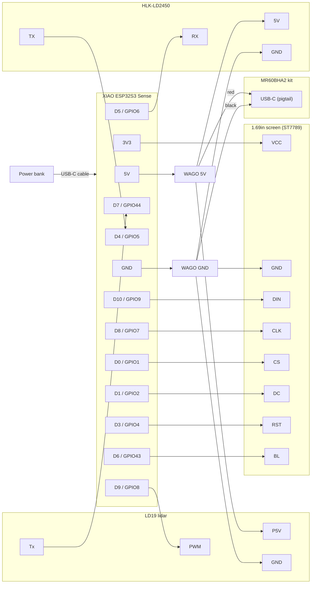

# Wiring

**20 wires, no soldering.** This guide assumes you have never wired electronics before.

## The idea in one paragraph

There are two kinds of wires:

- **Power wires** (5 V and GND) go into one of two WAGO lever connectors. Cut the plug off, strip 10 mm of insulation, lift the lever, insert, and close the lever.
- **Data wires** keep their female Dupont plug and push straight onto a pin of the ESP32.

The power bank plugs into the ESP32's USB-C port. The ESP32's **5V** pin is connected directly to that port's 5 V line, so it feeds the WAGO bus, and the bus powers every sensor.

## Three rules

1. **Read the label, not the colour.** Wire colours differ between sellers. The pin names printed on each board (TX, GND, 5V…) are what count.
2. **5 V never touches a D pin.** 5 V goes only into its WAGO and onto the ESP32 pin marked **5V**. Anywhere else, it can destroy the ESP32.
3. **Connect the power bank last.** Wire everything, re-check the table line by line, then plug in the power bank. If anything gets hot or smells, unplug it.

## Diagram



## Wire-by-wire table

Tick each line as you go.

| # | Wire (name printed on the board) | Goes to | How |
|---:|---|---|---|
| 1 | XIAO **5V** | WAGO 5V | Dupont female on the pin, other end cut and stripped |
| 2 | XIAO **GND** | WAGO GND | Same as above |
| 3 | Lidar **P5V** | WAGO 5V | Cut the Dupont plug off, strip |
| 4 | Lidar **GND** | WAGO GND | Cut, strip |
| 5 | Lidar **PWM** | XIAO **D9** | Push the Dupont plug on. The firmware holds it low (default speed) or drives it for speed control. |
| 6 | Lidar **Tx** | XIAO **D7** | Push the Dupont plug on |
| 7 | LD2450 **5V** | WAGO 5V | Cut, strip |
| 8 | LD2450 **GND** | WAGO GND | Cut, strip |
| 9 | LD2450 **TX** | XIAO **D4** | Push the Dupont plug on |
| 10 | LD2450 **RX** | XIAO **D5** | Push the Dupont plug on |
| 11 | USB-C pigtail **red** | WAGO 5V | Usually pre-stripped. The plug goes into the MR60BHA2 kit. |
| 12 | USB-C pigtail **black** | WAGO GND | Same as above |
| 13 | Screen **VCC** | XIAO **3V3** | Push the Dupont plug on. **3V3, not 5V**: the screen's logic must match the ESP32's 3.3 V. |
| 14 | Screen **GND** | WAGO GND | Cut, strip |
| 15 | Screen **DIN** | XIAO **D10** | Push the Dupont plug on (SPI data) |
| 16 | Screen **CLK** | XIAO **D8** | Push the Dupont plug on (SPI clock) |
| 17 | Screen **CS** | XIAO **D0** | Push the Dupont plug on |
| 18 | Screen **DC** | XIAO **D1** | Push the Dupont plug on |
| 19 | Screen **RST** | XIAO **D3** | Push the Dupont plug on |
| 20 | Screen **BL** | XIAO **D6** | Push the Dupont plug on (backlight, dimmable) |

The screen ships with a cable that ends in 8 labelled Dupont plugs.

When you are done, WAGO 5V holds 4 wires (one port spare) and WAGO GND holds 5 (full). Every XIAO pin is used except D2.

## XIAO pin map

As seen **from below** (pins pointing at you, USB-C at the top). This is how you see the board through the open back of the head.

```
               ┌──[ USB-C ]──┐
         5V  ● │             │ ●  D0
        GND  ● │             │ ●  D1
        3V3  ● │             │ ●  D2      Seen from below, the two sides
        D10  ● │             │ ●  D3      are swapped compared with the
         D9  ● │             │ ●  D4      usual top-view pinout drawings.
         D8  ● │             │ ●  D5
         D7  ● │             │ ●  D6
               └─────────────┘
```

If in doubt, compare with Seeed's official pinout.

## Signal details

| Link | ESP32-S3 peripheral | Settings | Logic level |
|---|---|---|---|
| LD19 → ESP32 | UART0 RX on GPIO44 (D7) | 230 400 baud, 8N1, one-way | 3.3 V |
| LD2450 ↔ ESP32 | UART1, RX on GPIO5 (D4), TX on GPIO6 (D5) | 256 000 baud, 8N1 | 3.3 V |
| LD19 PWM ← ESP32 | GPIO8 (D9), LEDC PWM | Low = default speed | 3.3 V |
| ESP32 → screen | SPI2 (FSPI): SCK GPIO7 (D8), MOSI GPIO9 (D10); CS GPIO1 (D0), DC GPIO2 (D1), RST GPIO4 (D3), BL GPIO43 (D6) | Up to 80 MHz | 3.3 V |
| MR60BHA2 → PC | Its own ESP32-C6 over Wi-Fi | — | — |

The ESP32-S3 console uses native USB, which leaves UART0 free for the lidar. No level shifters are needed, because both sensors use 3.3 V UART levels.

## Power budget

| Load | Average | Peak |
|---|---:|---:|
| XIAO ESP32S3 + camera + Wi-Fi | 300 mA | 450 mA |
| LD19 lidar | 180 mA | 300 mA (motor start) |
| HLK-LD2450 | 120 mA | 200 mA |
| MR60BHA2 kit | 160 mA | 300 mA |
| 1.69" screen (from 3V3) | 60 mA | 90 mA |
| **Total at 5 V** | **≈ 0.9 A** | **≈ 1.4 A** |

The lidar figure is for the LD19. The recommended D500 (STL-19P) draws about 290 mA, which adds roughly 0.1 A.

## Flashing the ESP32

Unplug the power bank, then connect your computer to the same USB-C port. The two sources must never be connected at the same time, because the 5V pin is wired straight to the port. After the first flash, updates go over Wi-Fi (OTA).
