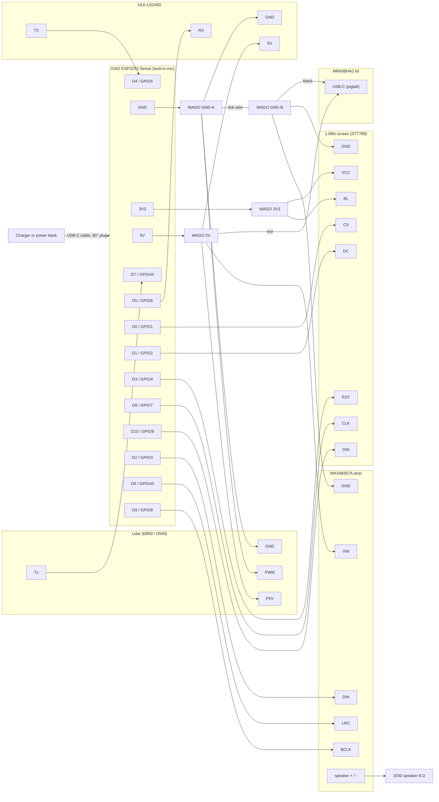

# Wiring

**29 connections, and the only soldering is two header strips.** This guide assumes you have never wired electronics before.

## The idea in one paragraph

There are two kinds of wires:

- **Power wires** (5 V, 3.3 V and GND) go into one of four WAGO lever connectors. Cut the plug off, strip 10 mm of insulation, lift the lever, insert, and close the lever.
- **Data wires** keep their female Dupont plug and push straight onto a pin of the ESP32.

The USB-C cable (charger or power bank at the other end) plugs into the ESP32's USB-C port. The ESP32's **5V** pin is connected directly to that port's 5 V line, so it feeds the WAGO bus, and the bus powers every sensor.

## Where everything sits in the robot

Body heights come from the rev F CAD; head heights are planned until the head CAD lands.

| Part | Place | Height above the desk |
|---|---|---:|
| Lidar | On top of the head, cable down through the lidar ring | ≈ 133 mm |
| XIAO ESP32S3 Sense | Face frame, tilted 20°, camera above the screen | ≈ 113 mm |
| Screen | Face frame, vertical, behind the acrylic window | ≈ 92 mm |
| MR60BHA2 kit | Body, upper part of the sensor sled, tilted 20° | 42 mm |
| **Lever connectors** | Body, stuck on the back plate of the sensor sled | ≈ 20–55 mm |
| **Amp** | Body, back plate of the sensor sled, low down | ≈ 20 mm |
| Speaker | Body, against the dot grille in the right wall | 18 mm |
| HLK-LD2450 | Body, bottom front of the sensor sled, tilted 10° | 16 mm |

Everything between head and body (XIAO power and data, screen, lidar) runs through the neck damper. Every run fits the 20 cm Dupont jumpers. The USB-C power cable enters at the back of the plinth and climbs through the neck to the XIAO.

## Three rules

1. **Read the label, not the colour.** Wire colours differ between sellers. The pin names printed on each board (TX, GND, 5V…) are what count.
2. **5 V never touches a D pin.** 5 V goes only into its WAGO and onto the ESP32 pin marked **5V**. Anywhere else, it can destroy the ESP32.
3. **Connect the power last.** Wire everything, re-check the table line by line, then plug in the charger. If anything gets hot or smells, unplug it.

## Diagram



## Wire-by-wire table

Tick each line as you go.

| # | Wire (name printed on the board) | Goes to | How |
|---:|---|---|---|
| 1 | XIAO **5V** | WAGO 5V | Dupont female on the pin, other end cut and stripped |
| 2 | XIAO **GND** | WAGO GND-A | Same as above |
| 3 | XIAO **3V3** | WAGO 3V3 | Same as above |
| 4 | Link wire | WAGO GND-A ↔ WAGO GND-B | A short stripped wire joining the two GND connectors |
| 5 | Lidar **P5V** | WAGO 5V | Cut the Dupont plug off, strip |
| 6 | Lidar **GND** | WAGO GND-A | Cut, strip |
| 7 | Lidar **PWM** | WAGO GND-A | Yes, to ground: the lidar spins at its default speed |
| 8 | Lidar **Tx** | XIAO **D7** | Push the Dupont plug on |
| 9 | LD2450 **5V** | WAGO 5V | Cut, strip |
| 10 | LD2450 **GND** | WAGO GND-A | Cut, strip |
| 11 | LD2450 **TX** | XIAO **D4** | Push the Dupont plug on |
| 12 | LD2450 **RX** | XIAO **D5** | Push the Dupont plug on |
| 13 | USB-C pigtail **red** | WAGO 5V | Usually pre-stripped. The plug goes into the MR60BHA2 kit. |
| 14 | USB-C pigtail **black** | WAGO GND-B | Same as above |
| 15 | Screen **VCC** | WAGO 3V3 | Cut, strip. **3V3, not 5V**: the screen's logic must match the ESP32's 3.3 V. |
| 16 | Screen **BL** | WAGO 3V3 | Cut, strip. The backlight stays on at full brightness; the eyes dim in software by drawing darker colours. |
| 17 | Screen **GND** | WAGO GND-B | Cut, strip |
| 18 | Screen **DIN** | XIAO **D10** | Push the Dupont plug on (SPI data) |
| 19 | Screen **CLK** | XIAO **D8** | Push the Dupont plug on (SPI clock) |
| 20 | Screen **CS** | XIAO **D0** | Push the Dupont plug on |
| 21 | Screen **DC** | XIAO **D1** | Push the Dupont plug on |
| 22 | Screen **RST** | XIAO **D3** | Push the Dupont plug on |
| 23 | Amp **VIN** | WAGO 5V | Dupont female on the amp pin, other end cut and stripped |
| 24 | Amp **GND** | WAGO GND-B | Same as above |
| 25 | Amp **BCLK** | XIAO **D9** | Dupont female–female |
| 26 | Amp **LRC** | XIAO **D6** | Dupont female–female |
| 27 | Amp **DIN** | XIAO **D2** | Dupont female–female |
| 28 | Speaker **+** | Amp terminal **+** | Screw terminal on the amp |
| 29 | Speaker **−** | Amp terminal **−** | Screw terminal on the amp |

The screen ships with a cable that ends in 8 labelled Dupont plugs. Leave the amp's **GAIN** and **SD** pins unconnected: the defaults give 9 dB of gain and a mono mix.

When you are done:

| Connector | Wires | Ports used |
|---|---|---|
| WAGO 5V | XIAO, lidar, LD2450, MR60, amp | 5 / 5 |
| WAGO GND-A | XIAO, lidar GND, lidar PWM, LD2450, link | 5 / 5 |
| WAGO GND-B | link, MR60, screen, amp | 4 / 5 |
| WAGO 3V3 | XIAO, screen VCC, screen BL | 3 / 5 |

Every XIAO pin is used.

## The only soldering

The standard XIAO ESP32S3 Sense ships with loose header pins, and so do most MAX98357A amp boards. Solder these two header strips (7 + 7 pins on the XIAO, 7 pins on the amp) before wiring. It takes about ten minutes. If you buy both boards pre-soldered, the build needs no soldering at all.

## XIAO pin map

As seen **from the pin side** (pins pointing at you, USB-C at the top). In the head frame this is how you see the board from behind; its USB-C port points to the side.

```
               ┌──[ USB-C ]──┐
         5V  ● │             │ ●  D0
        GND  ● │             │ ●  D1
        3V3  ● │             │ ●  D2      Seen from below, the two sides
        D10  ● │             │ ●  D3      are swapped compared with the
         D9  ● │             │ ●  D4      usual top-view pinout drawings.
         D8  ● │             │ ●  D5
         D7  ● │             │ ●  D6
               └─────────────┘
```

If in doubt, compare with Seeed's official pinout.

## Signal details

| Link | ESP32-S3 peripheral | Settings | Logic level |
|---|---|---|---|
| Lidar → ESP32 | UART0 RX on GPIO44 (D7) | 921 600 baud (D800) or 230 400 baud (D500), 8N1, one-way | 3.3 V |
| LD2450 ↔ ESP32 | UART1, RX on GPIO5 (D4), TX on GPIO6 (D5) | 256 000 baud, 8N1 | 3.3 V |
| ESP32 → screen | SPI2 (FSPI): SCK GPIO7 (D8), MOSI GPIO9 (D10); CS GPIO1 (D0), DC GPIO2 (D1), RST GPIO4 (D3). Backlight tied to 3V3. | Up to 80 MHz | 3.3 V |
| ESP32 → amp | I2S1 TX: BCLK GPIO8 (D9), LRC/WS GPIO43 (D6), DOUT GPIO3 (D2) | 16 kHz – 44.1 kHz, 16-bit | 3.3 V |
| Microphone → ESP32 | Built-in PDM mic on the Sense board: CLK GPIO42, DATA GPIO41, on I2S0 | 16 kHz | internal |
| MR60BHA2 → PC | Its own ESP32-C6 over Wi-Fi | — | — |

The ESP32-S3 console uses native USB, which leaves UART0 free for the lidar. No level shifters are needed, because both sensors use 3.3 V UART levels.

## Power budget

| Load | Average | Peak |
|---|---:|---:|
| XIAO ESP32S3 + camera + Wi-Fi | 300 mA | 450 mA |
| D800 lidar (STL-27L) | ≤ 290 mA | ≈ 350 mA (motor start) |
| HLK-LD2450 | 120 mA | 200 mA |
| MR60BHA2 kit | 160 mA | 300 mA |
| 1.69" screen (from 3V3) | 60 mA | 90 mA |
| MAX98357A + speaker | 20 mA idle | 400 mA (loud sound) |
| **Total at 5 V** | **≈ 1.0 A** | **≈ 1.9 A** |

Pick a charger or power bank that delivers at least 2 A. Keep the speaker volume moderate in the firmware: a 1 W speaker can be overdriven by the amp at 5 V.

## Flashing the ESP32

Unplug the charger and plug the same cable into your computer: it goes straight to the XIAO. The two sources must never be connected at the same time, because the 5V pin is wired straight to the port. After the first flash, updates go over Wi-Fi (OTA).
