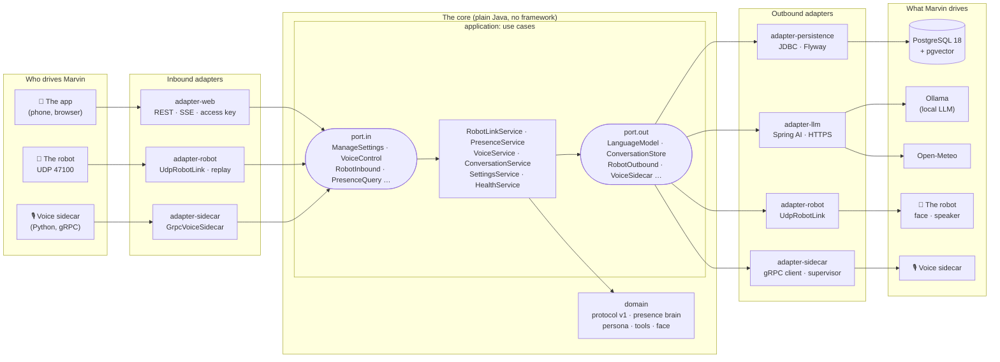
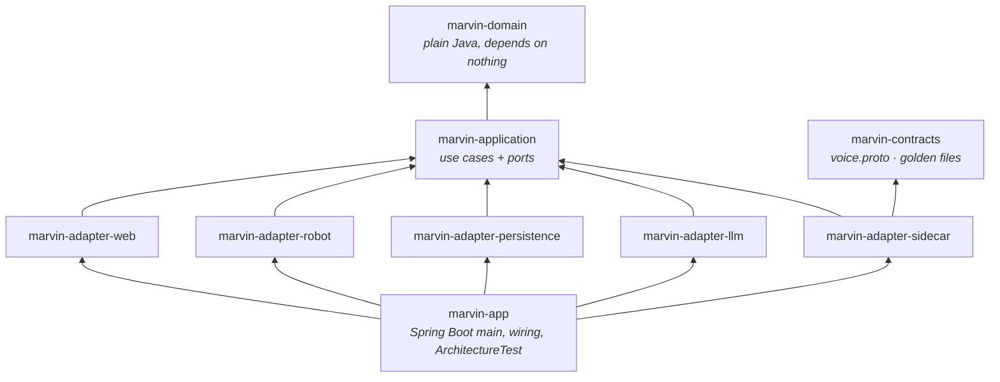
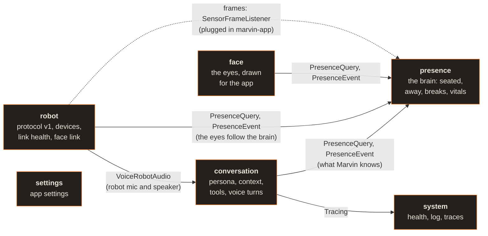
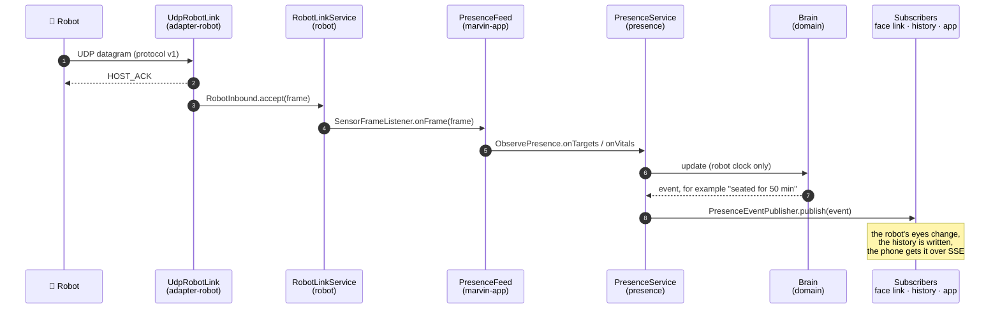
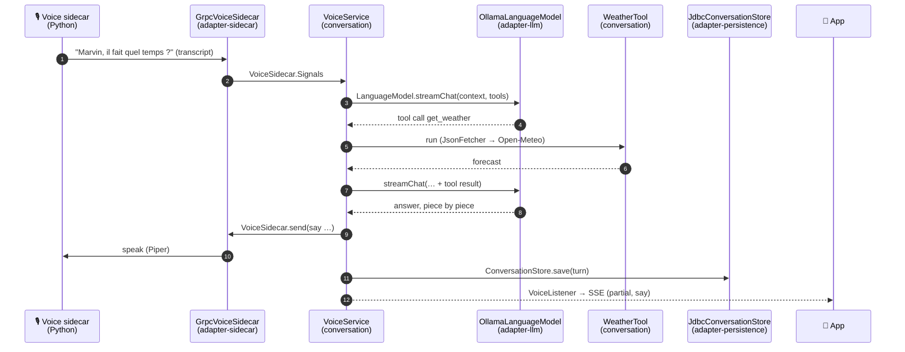

<!-- SPDX-License-Identifier: CC-BY-4.0 -->
# Marvin's host in Java

The next host core for Marvin: Java 25, Spring Boot 4.1, hexagonal, one deployable made of
bounded contexts that could later become services. The design is in
[docs/design.md](../docs/design.md); the engineering log (decisions, deviations, known gaps, per
migration phase) is in [NOTES.md](NOTES.md).

Status: **phase 2b, parity with the Python host**, and the default way to run Marvin (`./marvin up`).
The host owns the robot's UDP port (protocol v1, byte for byte as the Python host), runs the presence
brain on it, feeds the robot's face, records, replays and taps the datagrams, keeps the history in
PostgreSQL, serves the app unchanged with the Python host's API, event streams and access key, and
talks: the conversation (persona, context, Ollama through Spring AI, the tool loop and the weather,
memory, break reminders) runs in Java, the audio loop in the Python voice sidecar it supervises
([docs/voice.md](../docs/voice.md#the-voice-sidecar)). The Python host (`marvin-host`) stays for the
simulator, the Rerun viewer and replays; only one host can own UDP 47100 at a time.

Before relying on it with real boards and a real model, run the manual
[test plan](../docs/test-plan.md); to review the change, start with the
[review guide](../docs/review-guide.md).

## The architecture in four pictures

### 1. The hexagon

The domain and the use cases sit in the middle, in plain Java, and know nothing about HTTP, UDP,
SQL or Ollama. They define **ports** (Java interfaces). **Adapters** on the outside implement or
call those ports. On the left, the adapters that *drive* Marvin call an inbound port. On the right,
the use cases call an outbound port that an adapter implements.



The dependency always points **inward**: an adapter knows the port, the port never knows the
adapter. Replacing PostgreSQL, Ollama or the UDP link means writing another adapter; the core does
not change. `marvin-app` (Spring Boot) is the only place where the two sides are plugged together.

### 2. The Maven modules

Each layer is its own Maven module, so a wrong dependency does not even compile. The Maven
enforcer and ArchUnit check the rest on every build.



No arrow between two adapters: `adapter-web` cannot call `adapter-persistence`, it goes through a
use case.

### 3. The bounded contexts

Six contexts share the core. Each one owns its model and its ports, and the ones that store data own
a PostgreSQL schema. A context uses another only through that context's ports (`port.in`,
`port.out`) or domain events (`domain.<context>.event`), never through its classes or its tables.
That is what lets a context become a service of its own later ([design 10.4](../docs/design.md)).
An arrow reads "uses".



`presence` uses nobody: it is the heart, and everyone reads it. `settings` and `system` are used by
the adapters (the app, the health checks), not by the other contexts.

| Context | PostgreSQL schema | Main use cases |
|---|---|---|
| `robot` | none (the link lives in memory) | `RobotLinkService`, `FaceLinkService`, `RobotAudioService` |
| `presence` | `presence` (events, minute samples) | `PresenceService`, `PresenceHistoryService` |
| `conversation` | `conversation` (turns) | `VoiceService`, `ConversationService`, `WeatherTool` |
| `settings` | `settings` | `SettingsService` |
| `face` | none | `FaceService`, `FaceLinkService` drives the robot's screen |
| `system` | none | `HealthService`, `HostLogService` |

A `platform` schema holds what belongs to no context: the database extensions (pgvector) and the
record of the one-time import from the Python host.

### 4. Two requests, end to end

**A robot frame becomes a presence event.**



**A spoken question becomes a spoken answer.**



## Run it

From the repository root, one command does everything (JDK, build, database, host):

```bash
./marvin doctor     # what this machine has and how to fix what is missing
./marvin up         # PostgreSQL (Docker) + the host + the voice; the app on http://localhost:8765/
./marvin demo       # the same with a simulated robot and a simulated past week
./marvin status     # what runs, and the host's health
./marvin logs       # follow the log (-n 100: the last lines)
./marvin restart    # stop the host and start it again, rebuilt if the code changed (after a git pull)
./marvin down       # stop everything (the data is kept)
```

- **JDK**: a JDK 25 from `MARVIN_JAVA_HOME`, `JAVA_HOME`, `/usr/libexec/java_home` (macOS) or the
  `PATH`; if there is none, `./marvin` downloads Eclipse Temurin 25 into
  `~/.local/share/marvin/jdk` (Adoptium API). Nothing is installed system-wide.
- **PostgreSQL 18 with pgvector**: in Docker (`pgvector/pgvector:pg18`, container
  `marvin-postgres`, volume `marvin-pgdata`, `127.0.0.1:5433`) when Docker runs; otherwise the host
  starts its own PostgreSQL (data in `~/.local/share/marvin/pg`, no pgvector yet). The first choice
  is kept (`~/.local/share/marvin/db_mode`): if the data is in Docker and Docker is not running,
  `./marvin up` starts Docker Desktop (macOS) or says so, rather than opening an empty second
  database. `MARVIN_DB=docker` or `MARVIN_DB=embedded` forces one; `MARVIN_PG_PORT` moves the Docker
  database off 5433.
- **Python**: the voice sidecar runs from `host/.venv`, which `./marvin up` creates with the
  `sidecar` and `voice` extras the first time (a few minutes; `--no-voice` skips it). The demo's
  simulated robot and past week also come from the Python host (`host/.venv` if it exists, else
  `python3` if it can import it, else `./marvin demo` creates `host/.venv` with the base
  dependencies; `./marvin demo --voice` adds the voice). The voice is optional: if its packages cannot
  be installed (offline), Marvin starts without it. The sidecars exit with the host, even when it is
  killed.
- **The voice**: turned on and off in the app (Talk panel), settings in Settings > Voice, saved to
  `~/.config/marvin/voice.json` (shared with `marvin-host talk`). It needs Ollama and its model
  (`ollama pull qwen3:4b-instruct`); the panel says what is missing and how to fix it. The demo works
  on a copy of `voice.json` (in `~/.local/share/marvin/demo/`), remade at each start.
- **The Python host's history**: on first start, `~/.local/share/marvin/marvin.db` (the Python
  host's SQLite file: events, minute samples, settings, conversation) is imported into PostgreSQL,
  once. Both hosts use the same data directory and the same access key (`ui_token`).
- **Build**: `./marvin` builds the jar when it is missing or older than the sources.
- **Memory**: the JVM runs with `-XX:+UseSerialGC -Xmx384m` (about 250 MB resident at idle);
  `MARVIN_JAVA_OPTS` replaces these options. `host.log` is rotated to `host.log.1` past 10 MB.
- **Health and traces**: `/api/health` (the app's), `/actuator/health` with its components
  (`db`, `marvin/database`, `marvin/robot`, `marvin/voice`), `/actuator/health/readiness` (down
  without the database) and `/actuator/health/liveness`. Each question is a trace
  (`marvin.question`, with the latency stages as attributes; trace and span ids in the log lines);
  set `MANAGEMENT_OPENTELEMETRY_TRACING_EXPORT_OTLP_ENDPOINT=http://localhost:4318/v1/traces` to
  export them to an OpenTelemetry collector.

Or by hand, with a PostgreSQL at `MARVIN_DB_URL` (default `jdbc:postgresql://127.0.0.1:5433/marvin`,
user and password `marvin`):

```bash
cd host-java
./mvnw -q -DskipTests package
java -jar marvin-app/target/marvin-host.jar          # MARVIN_MODE=demo for the demo
curl http://localhost:8765/api/health
```

| Variable | Default | |
|---|---|---|
| `MARVIN_PORT`, `MARVIN_BIND` | `8765`, `0.0.0.0` | The app's port and address |
| `MARVIN_MODE` | `live` | `live` or `demo` |
| `MARVIN_DATA_DIR` | `~/.local/share/marvin` | Data (embedded database, run files, logs) |
| `MARVIN_DB_MODE` | `external` | `external` (at `MARVIN_DB_URL`) or `embedded` |
| `MARVIN_DB_URL`, `MARVIN_DB_USER`, `MARVIN_DB_PASSWORD` | Docker's | The external database |
| `MARVIN_UDP_PORT`, `MARVIN_UDP_BIND` | `47100`, `0.0.0.0` | The robot link |
| `MARVIN_TAP` | none | Forward every datagram to this UDP port (or `host:port`) for the Python viewer |
| `MARVIN_RECORD` | none | Also record the datagrams to this `.mvrec` file (`.gz`: compressed) |
| `MARVIN_REPLAY`, `MARVIN_REPLAY_SPEED`, `MARVIN_REPLAY_LOOP` | none, `1.0`, `true` | Play a recording instead of listening (speed 0: as fast as possible) |
| `MARVIN_CALIBRATION` | `~/.config/marvin/calibration.json` | The sensor calibration the Python host writes (`MARVIN_CONFIG_DIR` also works) |
| `MARVIN_UI_TOKEN` | `auto` | The app's access key for other devices: `auto` (kept in `<data dir>/ui_token`), `off`, or the key |
| `MARVIN_TZ` | this computer's | The owner's time zone (days, quiet hours) |
| `MARVIN_IMPORT` | `<data dir>/marvin.db` | The Python host's history to import once (empty: none) |
| `MARVIN_PYTHON`, `MARVIN_REPO` | `host/.venv`, the repository | The Python for the sidecars, and where `host/` is |
| `MARVIN_DEMO_SIMULATOR`, `MARVIN_DEMO_SEED` | `true`, `true` | Demo: the Python simulator as the robot; the simulated past week |
| `MARVIN_CONFIG_DIR` | `~/.config/marvin` | Where `voice.json` is (also `$XDG_CONFIG_HOME/marvin`) |
| `MARVIN_VOICE_SIDECAR`, `MARVIN_VOICE_ARGS` | `true`, none | Start the voice sidecar; more arguments for it (its test mode: `--fake,--say,2:Marvin bonjour`) |

### The app

The app is the Python host's (`host/marvin_host/ui/static`, copied byte for byte, checked by
`AppFilesTest`): same pages, same API, same event streams (`/api/stream`, `/api/robot/stream`), same
rules. From this computer nothing is needed; other devices need the access key, which `./marvin up`
prints in the phone address (`http://<LAN address>:8765/?token=...`); the browser keeps it in a
cookie. `ApiContractIT` replays every request recorded from the Python host (marvin-contracts
`golden/api`) against the Java host and compares status, headers and shapes.

### The demo

`./marvin demo` runs the host on its own database (`marvin_demo`, emptied at every start: the
owner's data is never touched), imports a simulated past week and past conversations made by the
Python host's demo code, and starts the Python simulator as the robot. Time runs at its real pace
(the Python demo runs 10 times faster). The voice is the real one (`./marvin demo --voice` sets it
up); the Python demo's scripted voice is not ported.

### A robot, a simulator, the viewer

The robot finds the host by itself (it broadcasts `HELLO` to UDP 47100): a Wemos D1 mini with
simulated sensors, an ESP32-S3 DevKitC with the face, the MR60BHA2 bridge (a device of its own) all
link with `./marvin up` as they do with `marvin-host run`. Without hardware, the Python simulator
works unchanged against the Java host:

```bash
./marvin up
cd host && python3 -m marvin_host.cli sim --host 127.0.0.1     # or no --host: broadcast
./marvin status                                               # health: robot marvin-53494d (simulator)
```

The Rerun viewer is not ported (design 4.4): start the host with `MARVIN_TAP=47110 ./marvin up`,
then `marvin-host run --port 47110 --no-ui` shows what the Java host receives.

## Build and test

```bash
cd host-java
./mvnw verify          # unit tests, ArchUnit, Testcontainers integration tests (Docker needed)
./mvnw -q test         # unit tests and architecture rules only
```

`*Test` classes run in `test` (surefire), `*IT` classes in `integration-test` (failsafe). The
integration tests use `pgvector/pgvector:pg18` through Testcontainers and are skipped without
Docker; the embedded-database test is skipped when run as root (PostgreSQL refuses root). The voice
tests run the real Python sidecar in its test mode (`pip install -e "host[sidecar]"`) against a
stand-in for Ollama; they are skipped when the sidecar cannot run.

## Modules

| Module | Packages | Holds | May depend on |
|---|---|---|---|
| `marvin-domain` | `marvin.host.domain.<context>` | Model and domain services, plain Java | nothing (Maven enforcer) |
| `marvin-application` | `marvin.host.application.<context>`, `.port.in`, `.port.out` | Use cases and ports, plain Java | domain (Maven enforcer) |
| `marvin-adapter-web` | `marvin.host.adapter.web` | The app, its REST API and SSE (Spring MVC) | application |
| `marvin-adapter-robot` | `marvin.host.adapter.robot` | UDP protocol v1, `.mvrec`, datagram tap | application |
| `marvin-adapter-persistence` | `marvin.host.adapter.persistence` | PostgreSQL, one schema and one Flyway history per context | application |
| `marvin-adapter-llm` | `marvin.host.adapter.llm` | Spring AI's Ollama client (streamed chat, models), the tools' HTTPS requests | application |
| `marvin-adapter-sidecar` | `marvin.host.adapter.sidecar` | The voice sidecar over gRPC, the process supervisor, the demo's simulator | application, contracts |
| `marvin-app` | `marvin.host.app` | Spring Boot main, wiring; `ArchitectureTest` | everything |
| `marvin-contracts` | `marvin.host.contracts.voice.v1` (generated) | Golden files from the Python host, `voice.proto` ([README](marvin-contracts/README.md)) | protobuf, gRPC |

Bounded contexts today: `robot`, `presence`, `conversation`, `settings`, `system`, `face`. A context
reaches another only through its application ports (`application.<context>.port.in|out`) and its
domain events (`domain.<context>.event`); `domain.shared` is the shared kernel. Each context owns a
PostgreSQL schema of the same name.

## Architecture rules

`marvin-app/src/test/java/marvin/host/app/ArchitectureTest.java`, on every build:

- onion architecture: domain, application, adapters; no adapter depends on another;
- the domain uses no framework and no I/O (`org.springframework`, `jakarta`, `javax`, `java.sql`,
  `java.net`, `java.io` except `Serializable`, gRPC, protobuf, Jackson, SLF4J);
- the application layer uses no framework either (Spring wiring lives in `marvin-app`);
- Spring AI only in the LLM and MCP adapters;
- no system clock in the domain and application (`System.currentTimeMillis`, `nanoTime`,
  `Instant.now`, ...): time comes from a `Clock` port or from the robot's frames;
- no cycles between the domain's or the application's contexts; ports are interfaces;
- bounded contexts talk through ports and events only (`ArchitectureRulesBiteTest` checks that
  this rule catches a violation).
